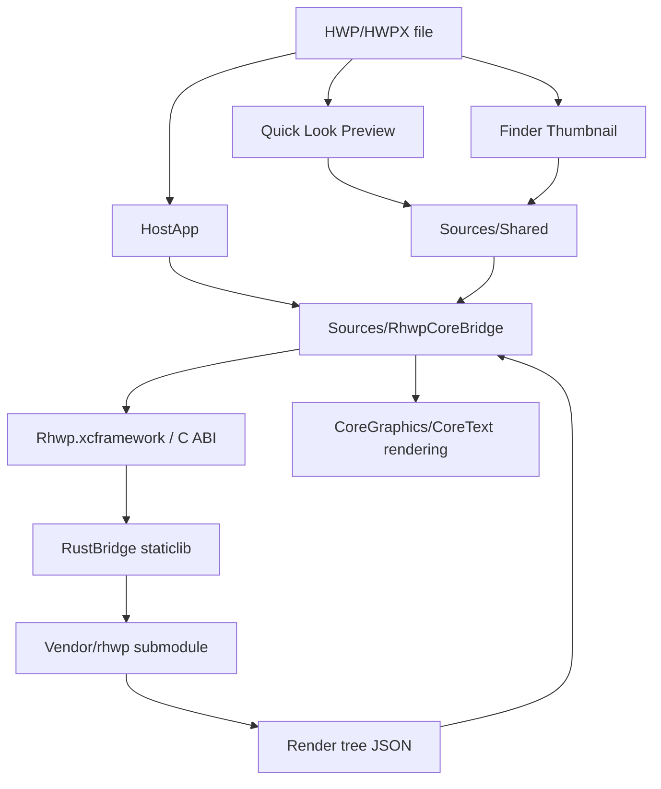

# alhangeul-macos

<p align="center">
  <strong>알한글 for macOS</strong><br/>
  <em>HWP/HWPX Quick Look, Thumbnail, and native viewer app for macOS</em>
</p>

<p align="center">
  <a href="https://github.com/postmelee/alhangeul-macos"></a>
  <a href="https://www.swift.org/"></a>
  <a href="https://www.rust-lang.org/"></a>
  <a href="https://opensource.org/licenses/MIT"></a>
</p>

---

`alhangeul-macos`는 macOS에서 HWP/HWPX 문서를 더 자연스럽게 다루기 위한 네이티브 앱 프로젝트입니다.

현재 목표는 Finder에서 `.hwp`, `.hwpx` 파일을 바로 미리보고, 썸네일로 식별하고, 필요할 때 독립 viewer 앱에서 문서를 열어 확인할 수 있게 하는 것입니다. 장기적으로는 viewer를 넘어 편집과 저장, 그리고 Claude Code나 OpenAI Codex 같은 개발 에이전트가 한컴 문서를 직접 열고 수정하고 다시 확인하는 워크플로우까지 확장하는 것을 목표로 합니다.

이 저장소는 Rust 기반 [`rhwp`](https://github.com/edwardkim/rhwp) core를 직접 vendoring하지 않고 `Vendor/rhwp` git submodule로 고정해 사용합니다. 앱, Quick Look/Thumbnail 확장, Swift bridge, macOS 패키징과 배포 정책은 이 저장소가 소유합니다.

## 현재 구현 상태

현재 구현된 기능은 다음과 같습니다.

- Finder Quick Look preview extension
  - `.hwp`, `.hwpx` 첫 페이지를 PNG preview로 렌더링
  - 50 MB 초과 파일은 텍스트 안내 preview로 fallback
- Finder thumbnail extension
  - 첫 페이지 렌더링 결과를 Finder thumbnail로 사용
  - 파일 확장자 badge 표시
- macOS viewer app
  - HWP/HWPX 파일 열기
  - 다중 페이지 스크롤
  - 확대/축소, 실제 크기
  - 사이드바에서 문서명, 현재 페이지, zoom, extension 등록 상태 표시
  - Finder나 다른 앱에서 파일 열기 요청 수신
- Swift/CoreGraphics 렌더링
  - `rhwp` render tree JSON을 Swift `RenderNode` 모델로 디코딩
  - CoreGraphics/CoreText 기반 페이지 렌더링
  - 텍스트, 이미지, 사각형, 선, 타원, path, page background, table cell clipping 일부 지원
- Rust bridge
  - `RustBridge` staticlib가 `Vendor/rhwp`를 path dependency로 사용
  - `cbindgen`으로 C header/modulemap 생성
  - `Rhwp.xcframework`로 HostApp, Quick Look, Thumbnail에서 공유
  - FFI symbol set은 `rhwp-ffi-symbols.txt`로 고정
- core submodule 운영
  - `postmelee/rhwp`의 `devel`을 현재 사용 기준으로 고정
  - 현재 lock commit은 `rhwp-core.lock`에 기록

아직 정식 릴리스 이전 단계입니다. Finder Quick Look/Thumbnail extension은 실제 Finder 환경에서 추가 smoke test가 필요하며, 배포용 서명/공증/notarization 흐름은 후속 작업 대상입니다.

## 지원 파일 형식

앱과 extension은 다음 UTI를 등록하거나 인식합니다.

- `com.postmelee.rhwpmac.hwp`
- `com.postmelee.rhwpmac.hwpx`
- `com.hancom.hwp`
- `com.hancom.hwpx`
- `com.haansoft.hancomofficeviewer.mac.hwp`
- `com.haansoft.hancomofficeviewer.mac.hwpx`

파일 확장자 기준으로는 `.hwp`, `.hwpx`를 대상으로 합니다.

## 프로젝트 구조

```text
Sources/
├── HostApp/                  # macOS viewer app
│   ├── Services/             # 파일 열기, extension 상태 확인
│   ├── Stores/               # 문서 viewer 상태
│   ├── Support/              # 빌드 정보
│   └── Views/                # SwiftUI/AppKit viewer UI
├── QLExtension/              # Quick Look preview extension
├── ThumbnailExtension/       # Finder thumbnail extension
├── RhwpCoreBridge/           # Swift FFI wrapper와 render tree renderer
└── Shared/                   # HostApp/extension 공통 helper

RustBridge/
├── Cargo.toml                # macOS C ABI staticlib crate
├── cbindgen.toml             # C header 생성 설정
└── src/lib.rs                # rhwp_* FFI entrypoints

Vendor/
└── rhwp/                     # postmelee/rhwp devel submodule

docs/
├── ARCHITECTURE.md           # 소유 경계와 bridge 정책
└── RHWP_CORE_BRIDGE_PLAN.md  # core bridge 운영 계획

scripts/
├── build-rust-macos.sh       # universal staticlib + Rhwp.xcframework 생성
├── check-no-appkit.sh        # RhwpCoreBridge AppKit/UIKit 의존성 검사
├── validate-stage3-render.sh # 렌더링 smoke test
├── package-release.sh        # release zip 생성
└── update-rhwp-core.sh       # submodule 및 rhwp-core.lock 갱신
```

## 아키텍처



소유 경계는 다음과 같습니다.

- `Vendor/rhwp`: HWP/HWPX parser와 core rendering data를 제공하는 Rust core
- `RustBridge`: macOS 앱용 C ABI를 소유하는 이 저장소의 bridge crate
- `Sources/RhwpCoreBridge`: Swift FFI wrapper, render tree decoding, CoreGraphics renderer
- `Sources/HostApp`: viewer 앱 UI와 문서 상태 관리
- `Sources/QLExtension`, `Sources/ThumbnailExtension`: Finder 통합

## Quick Start

### 요구사항

- macOS 12 Monterey 이상
- Xcode 15 이상
- Swift 5.9
- Rust toolchain
- `cbindgen`
- XcodeGen

초기 설정:

```bash
git clone https://github.com/postmelee/alhangeul-macos.git
cd alhangeul-macos

git submodule update --init --recursive
rustup target add aarch64-apple-darwin x86_64-apple-darwin
cargo install cbindgen
brew install xcodegen
```

### 개발 빌드

```bash
./scripts/build-rust-macos.sh
xcodegen generate
xcodebuild -project RhwpMac.xcodeproj \
  -scheme HostApp \
  -configuration Debug \
  -derivedDataPath build/DerivedData \
  CODE_SIGNING_ALLOWED=NO \
  build
```

`project.yml`이 Xcode project의 원본입니다. target, source, bundle identifier, extension 설정을 바꿀 때는 `RhwpMac.xcodeproj`를 직접 수정하지 말고 `project.yml`을 수정한 뒤 `xcodegen generate`를 실행합니다.

### 렌더링 검증

```bash
./scripts/validate-stage3-render.sh
```

기본 샘플:

- `Vendor/rhwp/samples/basic/KTX.hwp`
- `Vendor/rhwp/samples/basic/request.hwp`
- `Vendor/rhwp/samples/exam_kor.hwp`

이 검증은 Swift renderer가 render tree를 디코딩하고 실제 bitmap을 생성할 수 있는지 확인합니다. 출력은 `output/stage3-render/`에 생성됩니다.

### 공유 Swift bridge 의존성 검사

```bash
./scripts/check-no-appkit.sh
```

`Sources/RhwpCoreBridge`는 HostApp과 extension에서 함께 사용되므로 AppKit/UIKit 의존성을 직접 갖지 않는 것을 원칙으로 합니다. AppKit이 필요한 코드는 HostApp, extension, 또는 `Sources/Shared` 경계에 둡니다.

## 실행과 Finder 통합 확인

개발 빌드 후 앱은 다음 경로에 생성됩니다.

```text
build/DerivedData/Build/Products/Debug/알한글.app
```

앱 실행:

```bash
open build/DerivedData/Build/Products/Debug/알한글.app
```

Quick Look과 Thumbnail extension 등록 상태는 앱 사이드바 또는 `pluginkit`으로 확인할 수 있습니다.

```bash
pluginkit -m | grep com.postmelee.rhwpmac
```

Finder/Quick Look 캐시를 갱신해야 할 때:

```bash
qlmanage -r
qlmanage -r cache
```

특정 파일 preview를 강제로 열어볼 때:

```bash
qlmanage -p path/to/sample.hwp
```

## rhwp Core Submodule

이 저장소는 core engine을 직접 개발하는 저장소가 아닙니다. `rhwp` core는 `Vendor/rhwp` submodule로 고정해 소비하고, macOS 앱과 bridge 코드는 이 저장소에서 관리합니다.

현재 기준:

```text
core repo:   https://github.com/postmelee/rhwp.git
core branch: devel
lock file:   rhwp-core.lock
```

core 업데이트 절차:

```bash
./scripts/update-rhwp-core.sh
./scripts/build-rust-macos.sh
./scripts/check-no-appkit.sh
xcodegen generate
xcodebuild -project RhwpMac.xcodeproj \
  -scheme HostApp \
  -configuration Debug \
  -derivedDataPath build/DerivedData \
  CODE_SIGNING_ALLOWED=NO \
  build
./scripts/validate-stage3-render.sh
```

core 변경 원칙:

- 앱 저장소에서 `Vendor/rhwp` 내부를 임시 수정한 채로 남기지 않습니다.
- core API가 필요하면 먼저 `postmelee/rhwp`의 `devel`에 반영합니다.
- 이 저장소에서는 submodule pointer와 `rhwp-core.lock`을 함께 갱신합니다.
- FFI symbol set이 바뀌면 `rhwp-ffi-symbols.txt`, Swift bridge, release note를 함께 검토합니다.

## 릴리스와 배포

릴리스 zip 생성:

```bash
./scripts/package-release.sh 0.1.0
```

산출물:

```text
build/release/rhwp-mac-0.1.0.zip
```

현재 `Casks/rhwp-mac.rb`는 Homebrew Cask 배포를 위한 초안입니다. 첫 공개 릴리스 전에는 다음을 확인해야 합니다.

- GitHub release URL이 현재 저장소명 `postmelee/alhangeul-macos` 기준인지
- zip 파일명과 cask token을 유지할지 변경할지
- SHA256 고정 여부
- Developer ID 서명과 notarization 여부
- Gatekeeper 실행 경고 처리 방식

## 개발 방식

이 프로젝트는 Claude Code와 OpenAI Codex를 함께 사용하는 AI pair programming 방식으로 개발합니다. 단, AI가 아키텍처와 품질 판단을 대신하지 않습니다.

개발 원칙:

- 작업은 GitHub Issue 단위로 추적합니다.
- 새 기능, 버그 수정, 구조 변경은 `이슈 -> 브랜치 -> 계획서 -> 구현 -> 검증 -> 최종 보고서 -> PR` 순서로 진행합니다.
- OpenAI Codex용 규칙은 [`AGENTS.md`](AGENTS.md)에 정리되어 있습니다.
- Claude Code를 사용할 때도 동일한 Issue/문서/검증 중심 흐름을 따릅니다.
- 앱/bridge/문서 변경 PR은 `postmelee/alhangeul-macos`의 `devel`로 생성합니다.
- upstream `edwardkim/rhwp`에는 이 저장소의 macOS 앱 작업 PR을 생성하지 않습니다.

브랜치 예시:

```bash
git switch devel
git fetch origin
git pull --ff-only origin devel
git switch -c local/task{issue}
```

PR 생성 예시:

```bash
git push -u origin local/task{issue}
gh pr create \
  --repo postmelee/alhangeul-macos \
  --base devel \
  --head local/task{issue} \
  --draft \
  --title "Issue #{issue}: 제목"
```

문서는 모두 한국어로 작성합니다. 작업 기록은 `mydocs/` 아래에 보관합니다.

## 로드맵

### M0 - 저장소 분리와 macOS viewer 기반 구축, 현재

완료 또는 진행된 항목:

- `alhangeul-macos` 개인 저장소 분리
- `postmelee/rhwp` core fork를 submodule로 연결
- `RustBridge` staticlib와 `Rhwp.xcframework` 빌드 흐름 구성
- HostApp/QLExtension/ThumbnailExtension target 구성
- HWP/HWPX 파일 열기, 첫 페이지 preview/thumbnail, 다중 페이지 viewer 구현
- render tree JSON 기반 Swift/CoreGraphics 렌더링 경로 복구
- 기본 렌더링 smoke test 구축
- Codex 개발 규칙 `AGENTS.md` 작성

남은 안정화 항목:

- Finder 환경 Quick Look/Thumbnail smoke test 확대
- 다양한 HWP/HWPX 샘플 렌더링 비교
- 앱 번들 서명, notarization, 배포 정책 정리
- Homebrew Cask metadata 정리
- README, 사용자 매뉴얼, troubleshooting 문서 보강

### M1 - Viewer 품질 안정화

목표: macOS에서 신뢰할 수 있는 읽기 전용 HWP/HWPX viewer 제공

- 페이지 렌더링 정확도 개선
- 이미지, 표, 도형, 각주, 머리말/꼬리말 렌더링 품질 확대
- 큰 문서 메모리 사용량과 page cache 정책 개선
- Finder preview/thumbnail 실패 fallback UX 개선
- 샘플 기반 회귀 테스트 확장
- 첫 공개 릴리스와 설치 경로 정리

### M2 - Editing 기반 도입

목표: viewer에서 편집 가능한 macOS HWP/HWPX 앱으로 확장

- 문서 모델 편집 command를 Swift UI에서 호출할 수 있는 bridge 설계
- 텍스트 삽입, 삭제, 선택, 서식 변경의 최소 편집 루프 구현
- HWP/HWPX 저장 경로와 손상 방지 정책 수립
- undo/redo, dirty state, autosave 정책 검토
- 편집 후 재조판과 렌더링 갱신 파이프라인 연결

### M3 - 실사용 Editing

목표: 제한된 문서 편집을 실사용 가능한 수준으로 고도화

- 표 편집, 이미지 삽입/교체, 문단/글자 모양 편집
- 서식 UI와 keyboard shortcut 체계화
- HWP/HWPX round-trip 검증 확대
- PDF 내보내기, 인쇄, 공유 기능 검토
- macOS 문서 기반 앱 경험 강화

### M4 - Agent Plugin과 문서 자동화

목표: Claude Code나 OpenAI Codex 같은 에이전트가 한컴 문서를 직접 편집하고 결과를 확인하는 워크플로우 지원

- 에이전트용 문서 열기, 내용 추출, 검색, 패치 API 설계
- HWP/HWPX 파일을 구조화된 편집 단위로 노출
- 에이전트가 문서를 수정한 뒤 viewer 화면 또는 렌더링 결과를 열어 확인하는 루프 지원
- 실패 시 diff, screenshot, render output을 기반으로 다시 수정하는 검증 루프 구축
- Codex Plugin 또는 Claude Code 연동 도구로 packaging

이 단계의 목표는 단순 파일 변환이 아니라, 에이전트가 실제 문서 화면을 확인하며 수정 품질을 높일 수 있는 자동화 환경입니다.

## 이 저장소가 하지 않는 일

이 저장소는 다음을 직접 제공하지 않습니다.

- npm package 배포
- WebAssembly browser viewer/editor 배포
- Chrome/Edge/Safari browser extension 배포
- upstream `rhwp` core 자체의 공식 release 관리

위 항목은 upstream `rhwp` 또는 별도 파생 프로젝트의 범위입니다. `alhangeul-macos`는 macOS native app과 Finder 통합에 집중합니다.

## 관련 문서

- [AGENTS.md](AGENTS.md) - Codex 작업 규칙
- [docs/ARCHITECTURE.md](docs/ARCHITECTURE.md) - 아키텍처와 소유 경계
- [docs/RHWP_CORE_BRIDGE_PLAN.md](docs/RHWP_CORE_BRIDGE_PLAN.md) - core bridge 운영 계획
- [rhwp-core.lock](rhwp-core.lock) - 현재 고정된 core commit
- [THIRD_PARTY_LICENSES.md](THIRD_PARTY_LICENSES.md) - third-party license

## Notice

본 제품은 한글과컴퓨터의 한글 문서 파일(`.hwp`, `.hwpx`) 공개 문서를 참고하여 개발하는 독립 오픈소스 프로젝트입니다.

## Trademark

"한글", "한컴", "HWP", "HWPX"는 주식회사 한글과컴퓨터의 등록 상표입니다. 본 프로젝트는 한글과컴퓨터와 제휴, 후원, 승인 관계가 없습니다.

"Hangul", "Hancom", "HWP", and "HWPX" are registered trademarks of Hancom Inc. This project is independent and is not affiliated with, sponsored by, or endorsed by Hancom Inc.

## License

[MIT License](LICENSE)
