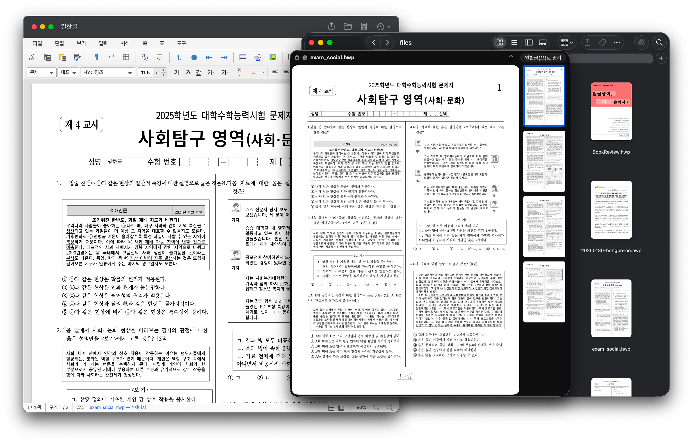
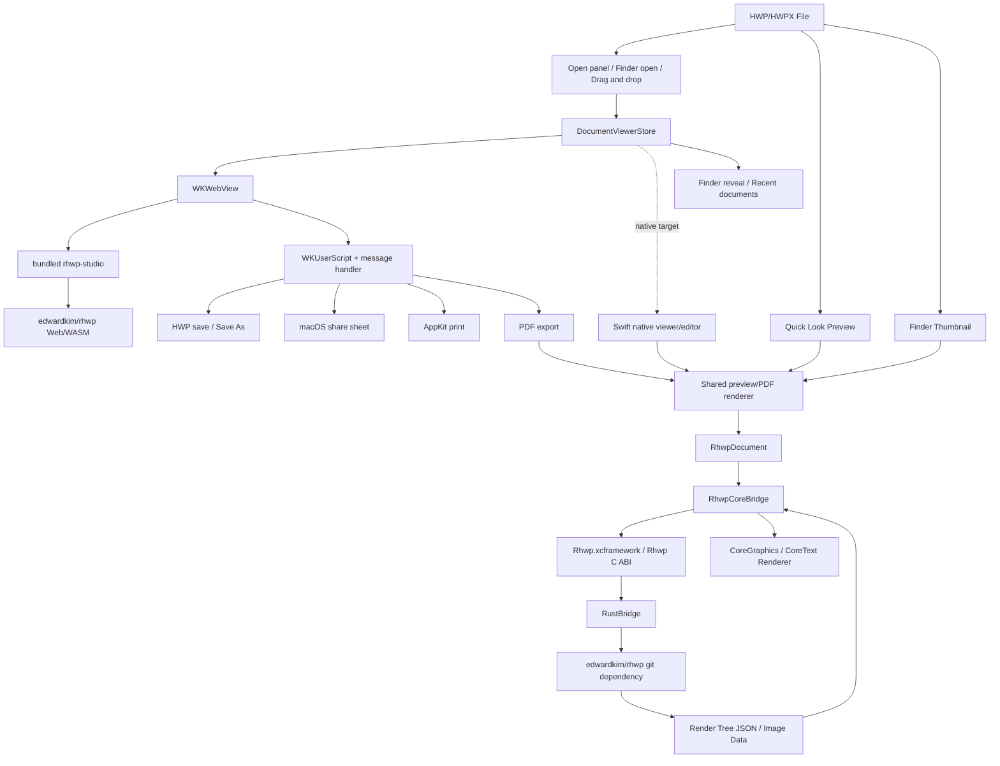

<p align="center">
  
</p>

# <div align="center">Alhangeul</div>

<p align="center">
  <strong>알한글 for macOS</strong><br/>
  <em>오픈소스 HWP/HWPX 유틸리티 앱 </em>
</p>

<p align="center">
  <a href="https://github.com/postmelee/alhangeul-macos"></a>
  <a href="https://www.swift.org/"></a>
  <a href="https://www.rust-lang.org/"></a>
  <a href="https://opensource.org/licenses/MIT"></a>
  <a href="https://github.com/postmelee/alhangeul-macos/releases"></a>
</p>

<h3 align="center">Mac에서 한글 파일은 더 이상 이방인이 아닙니다.</h3>



<p align="center">스페이스바로 미리보고, Finder에서 썸네일로 찾고, 앱에서 열어 저장·공유·PDF 내보내기까지 처리하세요.</p>

---

## 알한글 for macOS

<strong>알한글(alhangeul-macos)</strong>은 HWP/HWPX 파일을 macOS에서 미리보고, 앱에서 열고, 저장하고, 공유하고, PDF로 내보낼 수 있게 하는 오픈소스 데스크톱 앱입니다. 파일을 업로드하지 않고 로컬에서 문서를 다루는 것을 기본값으로 둡니다.
> Rust 기반 [`rhwp`](https://github.com/edwardkim/rhwp) 코어를 macOS 앱, Quick Look preview, Finder thumbnail, Swift bridge로 연결합니다. 첫 viewer는 `rhwp-studio`를 WKWebView로 품고, Finder/Quick Look과 PDF 내보내기에는 이 저장소의 Swift/Rust bridge 렌더링 경로를 함께 사용합니다.
> "닫힌 HWP/HWPX 문서를 더 많은 환경에서 다룰 수 있게 한다"는 [`rhwp`](https://github.com/edwardkim/rhwp)의 방향을 **Mac 네이티브** 경험으로 확장합니다.


## 현재 작업 축

`v0.1.x`는 WebView-backed public release 라인입니다. Finder Quick Look과 썸네일, WKWebView 기반 앱 뷰어, 저장/공유/PDF 내보내기, signed/notarized DMG 배포, Sparkle 업데이트 확인을 안정화하는 데 집중합니다.

장기 방향은 WebView fallback을 유지하면서 Swift native viewer와 editor로 점진적으로 옮겨가는 것입니다. 세부 구현 제약과 날짜가 필요한 판단은 [제품 로드맵 메모](mydocs/tech/product_roadmap_notes.md)에 분리해 둡니다.

## 최신 공개 릴리즈

### v0.1.2

`v0.1.2`는 Sparkle 업데이트 후 Finder thumbnail stale cache를 줄이기 위한 첫 실행 maintenance, 앱 소유 UTI `com.postmelee.alhangeul.*`와 Hancom 계열 UTI 지원, Web viewer runtime 오류의 non-blocking banner 표시, About 창의 bundled `rhwp` provenance 표시, upstream `rhwp v0.7.11` core/studio 반영을 포함하는 최신 public release입니다.

- GitHub Release: [Alhangeul v0.1.2](https://github.com/postmelee/alhangeul-macos/releases/tag/v0.1.2)
- 업데이트 페이지: [알한글 v0.1.2](https://postmelee.github.io/alhangeul-macos/updates/v0.1.2.html)
- Homebrew Cask: `brew install --cask postmelee/tap/alhangeul`
- 포함된 `rhwp`: [`v0.7.11`](https://github.com/edwardkim/rhwp/releases/tag/v0.7.11) (`rhwp-core.lock`, bundled `rhwp-studio` manifest 기준)
- Sparkle update 기준: short version은 `0.1.2`, build는 `8`입니다.

과거 릴리즈 상세와 검증 기록은 `mydocs/release/`의 릴리즈별 문서와 [GitHub Releases](https://github.com/postmelee/alhangeul-macos/releases)에 누적합니다. 사용자용 릴리즈 노트 목록은 [업데이트 페이지](https://postmelee.github.io/alhangeul-macos/updates/)에서 확인할 수 있습니다. README에는 최신 공개 릴리즈 1개만 요약하고, bundled `rhwp` provenance는 한 줄 요약만 표시합니다.

## 이정표

```text
v0.1.x(WebView 첫 배포) -> v0.2(Mac 통합 확장) -> v0.3(변환과 자동화) -> v0.5+(Swift native viewer/editor) -> v2.0(Agent-ready 문서 환경)
```

| 버전 | 단계 | 사용자에게 보이는 변화 | 주요 범위 |
|------|------|------------------------|-----------|
| `v0.1.x` | WebView-backed public release | Finder와 Quick Look에서 HWP/HWPX가 보이고, 앱에서는 `rhwp-studio` 기반 viewer/editor로 문서를 열고 내보냅니다. | Quick Look, thumbnail, WKWebView HostApp, 저장/공유/PDF, signed/notarized DMG, Sparkle |
| `v0.2` | Mac 통합 확장 | 앱 화면 밖에서도 문서 정보와 내용을 더 잘 다룹니다. | 문서 정보/본문 추출, Spotlight/mdimporter 검토, Mac 서비스 연동 기반 |
| `v0.3` | 변환과 자동화 | 여러 HWP/HWPX 문서를 Finder, CLI, Shortcuts 흐름에서 변환합니다. | Text/Markdown/blocks JSON/HWPX 변환, batch 변환, Quick Action, CLI |
| `v0.5+` | Swift native viewer/editor | WebView 의존도를 낮추고 native 문서 보기와 편집 기반을 키웁니다. | native rendering parity, native search/copy, editor interaction, safe editing |
| `v2.0` | Agent-ready Docs | 에이전트가 문서를 열고 수정하고 렌더링 결과로 검증하는 루프를 제공합니다. | structured patch API, page anchor, document diff, render verification |

미래 기능 후보와 장기 제품 방향은 [제품 로드맵 메모](mydocs/tech/product_roadmap_notes.md)에서 관리합니다. README에는 아직 확정되지 않은 버전별 지원 기능 체크리스트를 나열하지 않습니다.

## v0.1.x 구현 범위

현재 공개 릴리즈 라인에서 제공하는 기능과 알려진 제약입니다.

### 제공 기능

- [x] `.hwp`, `.hwpx` Quick Look preview
- [x] 첫 페이지 기반 Finder thumbnail
- [x] WKWebView 기반 HWP/HWPX viewer/editor
- [x] WebView 내부 찾기, 선택, 복사, 기본 편집 UI
- [x] Finder 또는 다른 앱에서 HWP/HWPX 파일 열기
- [x] Finder에서 viewer 영역으로 끌어와서 열기
- [x] 최근 문서 목록과 security-scoped bookmark 기반 재열기
- [x] HWP 저장과 다른 이름으로 저장
- [x] PDF 내보내기
- [x] native 인쇄 flow 연결
- [x] macOS 공유 sheet
- [x] 원본 URL이 있는 문서를 Finder에서 보기
- [x] Quick Look/Thumbnail extension 상태 진단
- [x] signed/notarized DMG 배포 기준
- [x] `v0.1.1`부터 Intel Mac과 Apple Silicon Mac을 위한 단일 universal DMG 배포 기준
- [x] Sparkle 업데이트 확인 경로

### 현재 제한 사항

- 앱 화면의 viewer/editor와 Finder Quick Look/thumbnail, PDF 내보내기, 인쇄는 서로 다른 렌더링 경로를 사용할 수 있습니다.
- Quick Look/Thumbnail smoke 통과는 extension 등록과 기본 렌더 성공을 뜻하며, 모든 문서가 앱 화면과 같은 시각 결과로 보인다는 보장은 아닙니다.
- HWPX 문서는 현재 직접 저장이 제한되어 HWP export 경로를 사용합니다.
- 손상, 대용량, 미지원 문서 fallback은 앱과 extension이 멈추지 않도록 하는 안전장치이며, 파일 복구나 부분 렌더링을 보장하지 않습니다.
- native renderer의 style, image effect/fill, text layout, RawSvg/OLE 등 parity 개선은 Swift native viewer 방향에서 계속 다룹니다.

## Features

### Finder Integration (Finder 통합)

- `.hwp`, `.hwpx` Quick Look preview
- 단일 페이지는 PNG, 다중 페이지는 Quick Look 표시용 PDF preview로 표시
- 첫 페이지 기반 Finder thumbnail과 thumbnail render cache
- `.hwp`, `.hwpx` 및 Hancom 계열 UTI 등록
- 50 MB 초과 파일 preview fallback
- 앱 정보 창에서 Quick Look/Thumbnail extension 번들 포함과 시스템 등록 상태 확인

### WKWebView Viewer (MVP 뷰어)

- macOS SwiftUI 기반 HostApp shell과 WKWebView
- `edwardkim/rhwp` `v0.7.11` snapshot의 `rhwp-studio` viewer 통합
- HWP/HWPX 파일 열기
- WebView 내부 찾기, 복사, 기본 편집 UI
- Finder 또는 다른 앱에서 파일 열기 요청 수신
- Finder에서 viewer 영역으로 끌어와서 열기
- 최근 문서 목록에서 다시 열기
- 로컬 파일을 앱 sandbox 안에서 WebView viewer로 전달
- WebView 기반 스크롤, 확대/축소, 페이지 이동, 오류 상태 표시

### Document Actions (문서 작업)

- 파일 메뉴와 `Command+O/S/Shift+S/P` 단축키를 native 열기, 저장, 다른 이름으로 저장, 인쇄 flow에 연결
- HWP 문서 저장과 다른 이름으로 저장
- PDF로 내보내기 후 저장된 PDF를 Finder에서 표시
- macOS 공유 sheet로 현재 문서 공유
- 원본 URL이 있는 문서를 Finder에서 보기
- HWPX 문서는 현재 bundled `rhwp-studio`의 정책에 따라 직접 저장이 비활성화되어 있으며, 저장 flow는 HWP export 경로를 사용

### Rendering Paths (렌더링 경로)

| 표면 | v0.1 렌더링 경로 | 기준 |
|------|------------------|------|
| HostApp viewer/editor 화면 | `rhwp-studio` Web/WASM rendering in WKWebView | 첫 공개 배포의 기본 viewer/editor 경로 |
| PDF 내보내기 | Rust bridge + Swift native render tree PDF 경로 | 앱 화면과 같은 renderer를 쓰지는 않음 |
| 인쇄 | `rhwp-studio` page payload + 별도 WKWebView/PDFKit/AppKit print operation | PDF 내보내기와 다른 출력 경로 |
| Quick Look preview | Rust bridge + Swift native render tree bitmap/PDF | Finder preview용 경로 |
| Finder thumbnail | Rust bridge + Swift native first-page bitmap/cache | Finder icon/thumbnail용 경로 |

WKWebView 경로는 native parity가 충분해질 때까지 fallback과 비교 기준선으로 유지합니다. native renderer는 Swift native viewer/editor 전환을 위한 장기 기본 경로로 계속 개선하며, Rust core render tree JSON, CoreGraphics, CoreText, 이미지 bin data를 사용합니다.

### Core Bridge (코어 브리지)

- `edwardkim/rhwp`를 git dependency로 사용하는 `RustBridge` crate
- C ABI 기반 `rhwp_*` FFI entrypoint
- `cbindgen` header/modulemap 생성
- universal static library 생성
- `Rhwp.xcframework`를 HostApp, Quick Look, Thumbnail target에서 공유
- FFI symbol set을 `rhwp-ffi-symbols.txt`로 고정
- `rhwp-core.lock`으로 core source provenance와 Rust bridge reference artifact metadata 기록

### Development Workflow (개발 워크플로우)

- XcodeGen 기반 project 생성
- Rust bridge와 Swift renderer 분리
- `check-no-appkit.sh`로 shared Swift bridge의 AppKit/UIKit 의존성 검사
- native renderer 변경은 `validate-stage3-render.sh`로 렌더링 smoke test
- 첫 공개 배포와 WKWebView-backed viewer 작업은 `devel-webview`, Swift native viewer/editor 작업은 `devel` 기준으로 분리
- GitHub Issue 기반 task branch와 한국어 작업 문서

자세한 구조와 bridge 정책은 [아키텍처 문서](mydocs/tech/project_architecture.md)를 참조하세요.

## Release / Install

공개 배포 기준은 Developer ID로 서명하고 Apple notarization을 통과한 DMG입니다. GitHub Release에는 `alhangeul-macos-<version>.dmg`와 checksum을 함께 공개합니다. `v0.1.1`부터 공식 DMG는 앱 본체와 Quick Look/Thumbnail extension 실행 파일이 `arm64 + x86_64` slice를 포함하는 단일 universal DMG 기준으로 검증합니다. Intel Mac과 Apple Silicon Mac 모두 같은 파일을 받으며, 아키텍처별 DMG는 따로 제공하지 않습니다.

Homebrew Cask로 설치할 수도 있습니다.

```bash
brew install --cask postmelee/tap/alhangeul
```

설치 후에는 `Alhangeul.app`을 한 번 실행하세요. macOS가 Quick Look 및 Thumbnail extension을 발견하고 등록한 뒤 Finder에서 `.hwp`, `.hwpx` preview와 thumbnail을 사용할 수 있습니다.

최신 공개 릴리즈는 [GitHub Releases](https://github.com/postmelee/alhangeul-macos/releases/latest)와 [업데이트 페이지](https://postmelee.github.io/alhangeul-macos/updates/)에서 확인합니다. 릴리스가 게시되기 전에는 아래 소스 빌드 절차를 사용하세요. unsigned, ad-hoc signed, rehearsal DMG는 일반 사용자 배포 산출물이 아닙니다.

## Quick Start (소스 빌드)
처음 프로젝트에 참여하는 개발자는 [Project Structure](#project-structure)를 먼저 보고, 세부 경계는 [아키텍처 문서](mydocs/tech/project_architecture.md), 상세한 빌드 및 검증 절차는 [빌드 및 실행 가이드](mydocs/manual/build_run_guide.md)를 확인하세요. 실제 빌드는 Rust bridge 산출물을 만든 뒤 Xcode project를 생성하고 HostApp을 빌드하는 순서입니다.

### Requirements

- macOS 12 Monterey 이상
- Xcode 15 이상
- Swift 5.9
- Rust toolchain
- `cbindgen`
- XcodeGen

### Initial Setup

```bash
git clone https://github.com/postmelee/alhangeul-macos.git
cd alhangeul-macos

rustup target add aarch64-apple-darwin x86_64-apple-darwin
cargo install cbindgen
brew install xcodegen
```

### Build

```bash
./scripts/build-rust-macos.sh
xcodegen generate
xcodebuild -project Alhangeul.xcodeproj \
  -scheme HostApp \
  -configuration Debug \
  -derivedDataPath build.noindex/DerivedData \
  CODE_SIGNING_ALLOWED=NO \
  build
```

### Run

```bash
open build.noindex/DerivedData/Build/Products/Debug/Alhangeul.app
```

### Checks

```bash
./scripts/check-no-appkit.sh
scripts/verify-rhwp-studio-assets.sh
```

- WKWebView viewer 경로를 바꾼 경우: [빌드 및 실행 가이드](mydocs/manual/build_run_guide.md)의 HostApp WKWebView viewer smoke test
- native renderer 경로를 바꾼 경우: `./scripts/validate-stage3-render.sh`
- Core dependency - [core dependency 운영 가이드](mydocs/manual/core_dependency_operation_guide.md)
- CI workflow 역할과 로컬 재현 - [CI workflow 가이드](mydocs/manual/ci_workflow_guide.md)
- release packaging, signing, notarization - [릴리스/배포 가이드](mydocs/manual/release_distribution_guide.md)
- Finder extension 등록 검증 - [빌드 및 실행 가이드](mydocs/manual/build_run_guide.md)
- renderer 비교 디버깅 - [core/native 렌더 비교 가이드](mydocs/manual/render_core_native_compare_guide.md)

## Project Structure

이 저장소는 먼저 macOS 제품 타깃을 나누고, 그 아래에 공통 Swift 계층과 Rust bridge를 둡니다.

```text
Sources/
├── HostApp/                  # macOS WKWebView viewer app
│   ├── Resources/            # bundled rhwp-studio static asset
│   ├── Services/             # 열기/저장/PDF/공유/Finder reveal, WebView resource/document bridge
│   ├── Stores/               # WKWebView viewer 문서 payload와 loading/error 상태
│   ├── Support/              # 빌드 정보
│   └── Views/                # SwiftUI/WebKit viewer UI
├── QLExtension/              # Quick Look preview extension
├── ThumbnailExtension/       # Finder thumbnail extension
├── Shared/                   # HostApp/extension 공통 macOS helper
└── RhwpCoreBridge/           # AppKit/UIKit 없는 Swift FFI wrapper + render tree renderer

RustBridge/                   # edwardkim/rhwp를 C ABI로 노출하는 Rust staticlib crate
├── Cargo.toml                # rhwp git dependency 선언
├── Cargo.lock                # Cargo가 해석한 resolved commit 고정
├── cbindgen.toml             # C header 생성 설정
└── src/lib.rs                # rhwp_* FFI entrypoints

Frameworks/                   # generated Rhwp.xcframework/header/modulemap, git ignore 대상
project.yml                   # Xcode project 원본
rhwp-core.lock                # core provenance + Rust bridge reference artifact metadata
samples/                      # render smoke와 Finder smoke용 HWP/HWPX fixture
scripts/                      # build, lock verify, render smoke, package helper
mydocs/                       # hyper-waterfall 작업 문서와 운영 매뉴얼
```

`project.yml`은 `Alhangeul.xcodeproj`의 원본입니다. target, source 포함 범위, bundle identifier, extension embedding을 바꿀 때는 `project.yml`을 수정한 뒤 `xcodegen generate`를 실행합니다.

타깃 간 소유 경계, 공통 Swift 계층, Rust bridge, 런타임 데이터 흐름은 [아키텍처 문서](mydocs/tech/project_architecture.md)를 참조하세요.

## AI 페어 프로그래밍으로 개발합니다

> 이 섹션의 문제의식과 개발 방법론 설명은 `edwardkim/rhwp` README.md의 ["AI 페어 프로그래밍으로 개발합니다"](https://github.com/edwardkim/rhwp#ai-%ED%8E%98%EC%96%B4-%ED%94%84%EB%A1%9C%EA%B7%B8%EB%9E%98%EB%B0%8D%EC%9C%BC%EB%A1%9C-%EA%B0%9C%EB%B0%9C%ED%95%A9%EB%8B%88%EB%8B%A4) 섹션을 바탕으로 합니다. alhangeul-macos에서는 같은 절차를 Claude Code와 OpenAI Codex에 함께 적용합니다.

**이것은 바이브 코딩이 아닙니다.** AI가 주는 코드를 읽지도 않고 수락하는 것이 아닙니다. 모든 계획은 검토되고, 모든 결과물은 검증되며, 모든 결정의 뒤에는 사람이 있습니다.

바이브 코딩 — AI 출력을 읽지 않고 수락하고, AI에게 아키텍처 결정을 맡기고, 이해하지 못하는 코드를 배포하는 것 — 은 함정입니다. 겉보기에는 동작하지만, 이해하지 못했기 때문에 문제가 생겨도 진단할 수 없는 코드가 만들어집니다.

이 프로젝트는 정반대의 접근을 취합니다. 사람 **작업지시자**가 방향, 품질, 아키텍처 결정의 완전한 소유권을 유지하고, AI는 혼자서는 불가능한 속도와 규모로 구현을 수행합니다. 핵심 차이: **사람은 절대 생각을 멈추지 않습니다.**

### 바이브 코딩 vs. AI 주도 개발

| | 바이브 코딩 | 이 프로젝트 |
|--|-----------|-----------|
| **사람의 역할** | AI 출력 수락 | 지시, 검토, 결정 |
| **계획** | 없음 — "그냥 만들어" | 계획서 작성 → 승인 → 실행 |
| **품질 관문** | 동작하길 바람 | 빌드 + 렌더링 smoke test + 코드 리뷰 |
| **디버깅** | AI에게 AI 버그 수정 요청 | 사람이 진단, AI가 구현 |
| **아키텍처** | 우연히 형성 | 의도적 설계 (core, bridge, app 경계) |
| **문서** | 없음 | `mydocs/` 프로세스 기록 |
| **결과물** | 취약, 유지보수 어려움 | 검증 가능한 변경 단위 |

AI는 배율기입니다. 하지만 배율기는 기존 프로세스를 증폭시킵니다. 프로세스 없음 × AI = 빠른 혼돈. 좋은 프로세스 × AI = 비범한 결과물.

### 개발 프로세스

이 프로젝트는 [**Claude Code**](https://claude.ai/code) 와 [**OpenAI Codex**](https://openai.com/ko-KR/codex/)를 페어 프로그래밍 파트너로 사용하여 개발합니다. 전체 개발 과정은 Issue, branch, 작업 문서, PR에 투명하게 남깁니다.

```text
작업지시자 (사람)                    AI 페어 프로그래머 (Claude Code / Codex)
────────────────                    ─────────────────────────────────────
방향 설정, 우선순위 결정        →    분석, 계획, 구현
계획 검토, 승인                ←    구현 계획서 작성
도메인 피드백 제공              →    디버깅, 테스트, 반복
아키텍처 결정                  →    정밀하게 실행
품질 및 정확성 판단            ←    코드, 문서, 테스트 생성
```

`mydocs/` 디렉토리에 개발 기록이 있습니다: 일일 작업 기록, 구현 계획서, 단계별 완료 보고서, 최종 보고서, 기술 연구 문서, 트러블슈팅 기록.

> `mydocs/`는 코드에 대한 문서만이 아닙니다 — **AI로 소프트웨어를 만드는 방법**에 대한 문서입니다.

**Hyper-Waterfall 방법론** — 거시적 워터폴 + 미시적 애자일, AI가 이 둘을 동시에 가능하게 한다.

### Git 워크플로우

```text
local/task{N}  ──커밋──커밋──┐
                              ├─→ publish/task{N} push
                              ├─→ 통합 브랜치 Open PR + merge
                              ├─→ main merge + 태그 (릴리즈 시점)
```

| 브랜치 | 용도 |
|--------|------|
| `main` | 릴리즈 |
| `devel-webview` | v0.1.x 첫 공개 배포, WKWebView-backed viewer/editor, Finder/Quick Look, PDF/공유/저장, Mac 통합/변환, 배포/문서 작업의 기본 통합 |
| `devel` | Swift native viewer/editor와 장기 native 전환 작업 통합 |
| `local/task{N}` | GitHub Issue 번호 기반 타스크 브랜치 |
| `publish/task{N}` | `devel-webview` 또는 `devel` 대상 PR 생성을 위한 원격 게시 브랜치 |

첫 출시 전후 브랜치 역할과 rename 후보는 [WKWebView/native 브랜치 전략](mydocs/tech/branch_strategy_webview_native.md)을 기준으로 유지합니다.

### 타스크 관리

- **GitHub Issues**로 타스크 번호 자동 채번 — 중복 방지
- 브랜치명: `local/task{issue번호}`
- PR 생성용 원격 브랜치명: `publish/task{issue번호}`
- 오늘할일: `mydocs/orders/yyyymmdd.md`
- 커밋 메시지:
  - 기본형: `Task #{번호}: 내용`
  - 단계 커밋: `Task #{번호} Stage {N}: 내용`
- PR 대상: 작업 범위에 따라 `devel-webview` 또는 `devel`

### 타스크 진행 절차

이슈 → 브랜치 → 오늘할일 → 수행계획서 → 구현계획서 → 구현 → 검증 → 단계 보고 → 최종 보고 → PR 게시 → merge 후 정리.

15단계 상세, 승인 게이트, 커밋 메시지 규칙은 [`task_workflow_guide.md`](mydocs/manual/task_workflow_guide.md)를 참고하세요.

### 디버깅 프로토콜

렌더링 문제:

1. `validate-stage3-render.sh` → 기본 샘플의 native render pipeline smoke 확인
2. `render-debug-compare.sh` → 특정 파일의 render tree JSON, core SVG, native PNG, pixel diff 산출
3. core SVG와 native PNG가 다르면 [core/native 렌더 비교 가이드](mydocs/manual/render_core_native_compare_guide.md)에 따라 Swift renderer 문제와 core 문제를 분리
4. 필요 시 별도 `edwardkim/rhwp` clone 또는 Cargo checkout에서 core rendering data 확인

Finder/Quick Look 통합 문제:

1. `pluginkit -mAvvv | grep com.postmelee.alhangeul` → extension 등록 후보 확인
2. `qlmanage -p` → Finder preview 경로 확인
3. `qlmanage -t -x` → thumbnail 생성 경로 확인
4. 반복 시행착오는 [Finder 통합 검증 시행착오 방지 가이드](mydocs/troubleshootings/finder_integration_validation_pitfalls.md)를 확인

### 문서 생성 규칙

모든 문서는 **한국어**로 작성합니다.

```text
mydocs/
├── orders/           # 오늘 할일 (yyyymmdd.md)
├── plans/            # 수행 계획서, 구현 계획서
│   └── archives/     # 완료된 계획서 보관
├── working/          # 단계별 완료 보고서
├── report/           # 최종 보고서
├── feedback/         # 코드 리뷰 피드백
├── tech/             # 기술 사항 정리 문서
├── manual/           # 매뉴얼, 가이드 문서
├── troubleshootings/ # 트러블슈팅 관련 문서
└── pr/               # 외부 기여자 PR 검토 기록
```

폴더별 역할, 파일명 규칙(`task_{milestone}_{issue}.md` 등), 외부 PR 정책은 [`document_structure_guide.md`](mydocs/manual/document_structure_guide.md)를 참고하세요.

## Architecture



## Contributing

기여 환영합니다. 다음 핵심 사항을 먼저 확인해 주세요:
- PR base는 작업 범위에 따라 다릅니다. 첫 공개 배포, WKWebView-backed viewer/editor, Finder/Quick Look, PDF/공유/저장, Mac 통합/변환, 배포, 문서 작업은 `devel-webview`로 보내고, Swift native viewer/editor 관련 기여는 `devel`로 보냅니다. `main`은 릴리즈 브랜치입니다.
- 이슈 먼저 확인: 동일 영역에 진행 중인 작업이 있는지 [열린 이슈](https://github.com/postmelee/alhangeul-macos/issues) 와 [열린 PR](https://github.com/postmelee/alhangeul-macos/pulls) 을 먼저 확인해 주세요. 중복 작업을 방지합니다.
- 이슈 close 는 메인테이너: 작업 완료 후 PR 만 제출해 주세요. 이슈는 PR 머지 시 메인테이너가 close 합니다.

상세한 기여 절차 (Fork → 브랜치 → 커밋 → PR) 는 [CONTRIBUTING.md](CONTRIBUTING.md) 를, 브랜치 전략의 판단 근거는 [WKWebView/native 브랜치 전략](mydocs/tech/branch_strategy_webview_native.md)을 참고하세요.

## Notice

본 제품은 한글과컴퓨터의 한글 문서 파일(`.hwp`, `.hwpx`) 공개 문서를 참고하여 개발하였습니다.

## Trademark

"한글", "한컴", "HWP", "HWPX"는 주식회사 한글과컴퓨터의 등록 상표입니다. 본 프로젝트는 한글과컴퓨터와 제휴, 후원, 승인 관계가 없는 독립적인 오픈소스 프로젝트입니다.

"Hangul", "Hancom", "HWP", and "HWPX" are registered trademarks of Hancom Inc. This project is an independent open-source project with no affiliation, sponsorship, or endorsement by Hancom Inc.

## License

Alhangeul macOS 저장소 자체 코드는 [MIT License](LICENSE)로 배포되며, 주 저작권자는 Taegyu Lee입니다.

Bundled `rhwp`, `rhwp-studio`, Sparkle, WOFF2 fonts, 앱 아이콘/로고 원본 provenance는 [THIRD_PARTY_LICENSES.md](THIRD_PARTY_LICENSES.md)를 확인하세요. Core/version provenance와 Rust bridge reference artifact metadata는 [rhwp-core.lock](rhwp-core.lock)에, bundled `rhwp-studio` provenance는 [rhwp-studio manifest](Sources/HostApp/Resources/rhwp-studio/manifest.json)에, font 목록과 license는 [FONTS.md](Sources/HostApp/Resources/rhwp-studio/fonts/FONTS.md)에 기록합니다.
