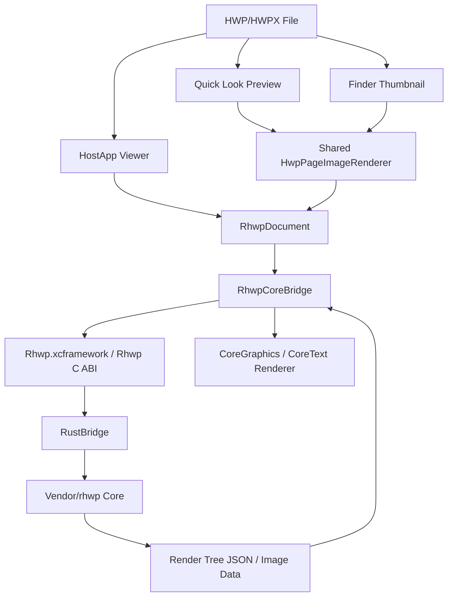

# alhangeul-macos

<p align="center">
  <strong>알한글 for macOS</strong><br/>
  <em>HWP/HWPX Quick Look, Thumbnail, and native viewer app</em>
</p>

<p align="center">
  <a href="https://github.com/postmelee/alhangeul-macos"></a>
  <a href="https://www.swift.org/"></a>
  <a href="https://www.rust-lang.org/"></a>
  <a href="https://opensource.org/licenses/MIT"></a>
</p>

---

HWP/HWPX 파일을 **macOS에서 더 자연스럽게** 열어보세요. Finder에서 미리보고, 썸네일로 식별하고, 필요하면 네이티브 viewer 앱에서 바로 확인할 수 있게 하는 것이 이 프로젝트의 첫 목표입니다.

alhangeul-macos는 Rust 기반 [`rhwp`](https://github.com/edwardkim/rhwp) 코어를 macOS 앱으로 연결하는 오픈소스 프로젝트입니다. 닫힌 포맷의 벽을 깨고, 모든 사람, 모든 AI, 모든 플랫폼에서 한글 문서를 자유롭게 읽고 쓸 수 있게 한다는 `rhwp`의 방향을 macOS 네이티브 환경으로 확장합니다.

이 저장소는 `rhwp` 코어 엔진을 직접 vendoring하지 않고 `Vendor/rhwp` git submodule로 고정해 사용합니다. 앱, Quick Look 확장, Thumbnail 확장, Swift bridge, macOS UX는 이 저장소가 소유합니다.

## 로드맵

먼저 macOS에서 안정적으로 열어보고, 편집으로 확장하고, 에이전트가 직접 다루는 문서 환경으로 완성한다.

```text
0.1 ──── 0.5 ──── 1.0 ──── 2.0
뷰어      안정화    편집      에이전트
```

| 단계 | 방향 | 전략 |
|------|------|------|
| **0.1 → 0.5** | Quick Look/Thumbnail/viewer 기반 안정화 | Finder 통합과 렌더링 품질을 먼저 견고하게 |
| **0.5 → 1.0** | 읽기 전용 viewer 위에 편집 기반 도입 | core command와 Swift UI 사이의 안전한 bridge 구축 |
| **1.0 → 2.0** | AI 문서 자동화와 플러그인 체계 | 에이전트가 문서를 열고 수정하고 화면으로 검증하는 루프 제공 |

> viewer만 만드는 것이 최종 목표가 아닙니다. macOS에서 HWP/HWPX를 읽고, 편집하고, 나중에는 Claude Code나 OpenAI Codex 같은 에이전트가 직접 문서를 수정하고 결과를 확인할 수 있는 환경을 만드는 것이 장기 목표입니다.

## 이정표

### v0.1.0 — macOS Viewer 기반 (현재)

> 저장소 분리, Finder 통합, 읽기 전용 viewer 기반 구축

- `postmelee/alhangeul-macos` 개인 저장소로 분리
- `postmelee/rhwp`의 `devel`을 `Vendor/rhwp` submodule로 연결
- Rust `rhwp` core를 macOS 앱에서 사용할 수 있도록 `RustBridge` staticlib와 `Rhwp.xcframework` 구성
- Finder Quick Look preview extension 구현
- Finder thumbnail extension 구현
- HostApp viewer에서 HWP/HWPX 열기, 다중 페이지 스크롤, 확대/축소 지원
- Swift `RenderNode` 모델과 CoreGraphics/CoreText renderer 구성
- `validate-stage3-render.sh` 기반 렌더링 smoke test 구축
- OpenAI Codex용 `AGENTS.md` 규칙 파일 작성

<details>
<summary>최근 변경 (v0.1.0, 2026-04-25)</summary>

- 앱(HostApp)
  - `AlhangeulMac.app` filesystem 이름은 유지하면서, Dock/Finder/Spotlight에는 `InfoPlist.strings` 기반 현지화 표시명(`알한글` / `AlhangeulMac`)이 노출되도록 정리했습니다.
  - 개발/패키지 산출물을 `build.noindex/` 아래로 이동해 Spotlight 검색 후보에 개발용 앱이 섞이지 않도록 보정했습니다.
- 미리보기(QLExtension)
  - Preview extension도 앱과 같은 현지화 표시명 체계로 맞췄고, Quick Look 등록 검증 기준을 signed/sealed Release package 설치본 중심으로 정리했습니다.
  - Finder 통합 smoke test는 `AlhangeulMac.app` 단일 ASCII 설치 경로 기준으로 확인하도록 운영 기준을 고정했습니다.
- 썸네일(ThumbnailExtension)
  - Finder thumbnail은 embedded preview fast path를 기본 경로에서 제거하고 첫 페이지 직접 렌더링을 사용하도록 바꿨습니다.
  - `group-drawing` 계열 문서의 선/transform 누락을 보정해 Quick Look preview와 thumbnail 렌더링 결과 차이를 줄였습니다.
  - non-ASCII app 경로에서 발생하던 등록 불일치를 피하기 위해 `AlhangeulMac.app` 기준 설치/검증 흐름을 정리했고, 샘플 파일 기준 thumbnail smoke test 통과를 재확인했습니다.
- 코어 브릿지(RhwpCoreBridge)
  - `rhwp-core.lock` v2를 도입해 `librhwp.a`와 generated header의 `sha256`/`size`를 고정하고, `Vendor/rhwp` commit과 함께 provenance를 검증하도록 강화했습니다.
  - `build-rust-macos.sh --update-lock/--verify-lock`과 package 전 lock verify를 추가해 bridge 산출물 불일치를 조기에 차단하도록 했습니다.

</details>

### v0.5.0 — Viewer 안정화

> macOS에서 신뢰할 수 있는 읽기 전용 HWP/HWPX viewer 제공

- 다양한 HWP/HWPX 샘플에 대한 렌더링 회귀 테스트 확대
- 이미지, 표, 도형, 각주, 머리말/꼬리말 렌더링 품질 개선
- 큰 문서의 메모리 사용량과 page cache 정책 개선
- Finder preview/thumbnail 실패 fallback UX 개선
- 문서 열기, zoom, 페이지 이동, extension 상태 표시 UX 정리

### v1.0.0 — Editing 기반

> viewer에서 편집 가능한 macOS HWP/HWPX 앱으로 확장

- `rhwp` document command를 Swift UI에서 호출할 수 있는 bridge 설계
- 텍스트 선택, 삽입, 삭제, 글자/문단 서식 변경의 최소 편집 루프 구현
- 편집 후 재조판과 렌더링 갱신 파이프라인 연결
- undo/redo, dirty state, autosave 정책 수립
- HWP/HWPX 저장 경로와 손상 방지 정책 수립

### v2.0.0 — Agent Plugin과 문서 자동화

> 에이전트가 문서를 직접 편집하고 화면으로 검증하는 단계

- Claude Code와 OpenAI Codex용 문서 열기, 내용 추출, 검색, 패치 API 설계
- HWP/HWPX 파일을 구조화된 편집 단위로 노출
- 에이전트가 문서를 수정한 뒤 viewer 화면 또는 렌더링 결과를 열어 확인하는 루프 지원
- 실패 시 diff, screenshot, render output을 기반으로 다시 수정하는 검증 루프 구축
- Codex Plugin 또는 Claude Code 연동 도구로 packaging

자세한 구조와 bridge 정책은 [아키텍처 문서](mydocs/tech/project_architecture.md)를 참조하세요.

---

## Features

### Finder Integration (Finder 통합)

- `.hwp`, `.hwpx` Quick Look preview
- 첫 페이지 기반 Finder thumbnail
- `.hwp`, `.hwpx` 및 Hancom 계열 UTI 등록
- 50 MB 초과 파일 preview fallback
- 앱 사이드바에서 Quick Look/Thumbnail extension 등록 상태 확인

### Native Viewer (네이티브 뷰어)

- macOS SwiftUI 기반 HostApp
- HWP/HWPX 파일 열기
- Finder 또는 다른 앱에서 파일 열기 요청 수신
- 다중 페이지 스크롤
- 확대, 축소, 실제 크기
- 문서명, 현재 페이지, 전체 페이지 수, zoom 상태 표시

### Rendering (렌더링)

- Rust core render tree JSON 디코딩
- CoreGraphics 기반 page rendering
- CoreText 기반 text run rendering
- 이미지 bin data 조회 및 렌더링
- 페이지 배경, 사각형, 선, 타원, path, 그룹 노드 일부 렌더링
- table cell clipping
- 밑줄, 취소선, 음영 등 일부 text decoration

### Core Bridge (코어 브리지)

- `Vendor/rhwp` submodule을 path dependency로 사용하는 `RustBridge` crate
- C ABI 기반 `rhwp_*` FFI entrypoint
- `cbindgen` header/modulemap 생성
- universal static library 생성
- `Rhwp.xcframework`를 HostApp, Quick Look, Thumbnail target에서 공유
- FFI symbol set을 `rhwp-ffi-symbols.txt`로 고정

### Development Workflow (개발 워크플로우)

- XcodeGen 기반 project 생성
- Rust bridge와 Swift renderer 분리
- `check-no-appkit.sh`로 shared Swift bridge의 AppKit/UIKit 의존성 검사
- `validate-stage3-render.sh`로 렌더링 smoke test
- GitHub Issue 기반 task branch와 한국어 작업 문서

## Quick Start (소스 빌드)

처음 프로젝트에 참여하는 개발자는 온보딩 가이드(추후 추가 예정)를 먼저 읽어보세요. 프로젝트 아키텍처, 디버깅 도구, 개발 워크플로우를 한눈에 파악할 수 있습니다.

### Requirements

- macOS 12 Monterey 이상
- Xcode 15 이상
- Swift 5.9
- Rust toolchain
- `cbindgen`
- XcodeGen

### Initial Setup

```bash
git clone https://github.com/postmelee/alhangeul-macos.git
cd alhangeul-macos

git submodule update --init --recursive
rustup target add aarch64-apple-darwin x86_64-apple-darwin
cargo install cbindgen
brew install xcodegen
```

### Rust Bridge Build

```bash
./scripts/build-rust-macos.sh
```

이 스크립트는 `RustBridge`를 arm64/x86_64 macOS staticlib로 빌드하고, `cbindgen` header를 생성한 뒤 `Frameworks/Rhwp.xcframework`를 만듭니다.

`rhwp-core.lock`에는 core commit과 Rust bridge 산출물의 sha256/size가 기록됩니다. 일반 build는 lock을 수정하지 않습니다.

```bash
./scripts/build-rust-macos.sh --update-lock
./scripts/build-rust-macos.sh --verify-lock
```

`--update-lock`은 현재 산출물 기준으로 lock을 갱신하고, `--verify-lock`은 `Frameworks/universal/librhwp.a`와 `Frameworks/generated_rhwp.h`가 lock 기록과 일치하는지 확인합니다.

### Xcode Project

```bash
xcodegen generate
```

`project.yml`이 Xcode project의 원본입니다. target, source, bundle identifier, extension 설정을 바꿀 때는 `AlhangeulMac.xcodeproj`를 직접 수정하지 말고 `project.yml`을 수정한 뒤 다시 생성합니다.

### Native Build

```bash
xcodebuild -project AlhangeulMac.xcodeproj \
  -scheme HostApp \
  -configuration Debug \
  -derivedDataPath build.noindex/DerivedData \
  CODE_SIGNING_ALLOWED=NO \
  build
```

개발 빌드 후 앱은 내부 산출물 이름으로 다음 경로에 생성됩니다.

```text
build.noindex/DerivedData/Build/Products/Debug/AlhangeulMac.app
```

### Run

```bash
open build.noindex/DerivedData/Build/Products/Debug/AlhangeulMac.app
```

Debug build는 앱 실행과 compile/link 확인용입니다. `CODE_SIGNING_ALLOWED=NO`로 만든 Debug 산출물은 Quick Look/Thumbnail extension 등록 검증에 사용하지 않습니다.

Finder Quick Look/Thumbnail smoke test는 Release package 산출물로 확인합니다. 실제 `.app` 경로는 ExtensionKit lookup 안정성을 위해 ASCII인 `AlhangeulMac.app`을 유지하고, 사용자 표시명은 `InfoPlist.strings`에서 언어별로 제공합니다. 기본 `Info.plist`의 `CFBundleDisplayName`/`CFBundleName`은 실제 bundle filesystem name과 맞추고, 한국어 표시명 `알한글`은 `ko.lproj/InfoPlist.strings`에서 제공합니다.

개발 build 산출물은 Spotlight 앱 검색 결과에 섞이지 않도록 `build.noindex/` 아래에 둡니다. 사용자가 실행하거나 Finder/Spotlight에서 확인할 기준 앱은 표준 설치 경로의 `~/Applications/AlhangeulMac.app`입니다.

```bash
./scripts/package-release.sh 0.1.0
mkdir -p ~/Applications
ditto build.noindex/release/AlhangeulMac.app ~/Applications/AlhangeulMac.app
pluginkit -a ~/Applications/AlhangeulMac.app
pluginkit -mAvvv | grep com.postmelee.alhangeulmac
```

Quick Look 캐시를 갱신해야 할 때:

```bash
qlmanage -r
qlmanage -r cache
```

thumbnail smoke test:

```bash
mkdir -p /tmp/alhangeul-ql
qlmanage -t -x -s 512 -o /tmp/alhangeul-ql path/to/sample.hwp
```

특정 파일 preview를 강제로 열어볼 때:

```bash
qlmanage -p path/to/sample.hwp
```

### Render Smoke Test

```bash
./scripts/validate-stage3-render.sh
```

기본 샘플:

- `samples/basic/KTX.hwp`
- `samples/basic/request.hwp`
- `samples/exam_kor.hwp`

기본 render smoke fixture는 앱 저장소 루트의 `samples/`가 소유합니다. core submodule 내부 샘플 경로는 기본 검증 문서와 스크립트에서 직접 참조하지 않습니다.

### Shared Bridge Check

```bash
./scripts/check-no-appkit.sh
```

`Sources/RhwpCoreBridge`는 HostApp과 extension에서 함께 사용되므로 AppKit/UIKit 의존성을 직접 갖지 않는 것을 원칙으로 합니다. AppKit이 필요한 코드는 HostApp, extension, 또는 `Sources/Shared` 경계에 둡니다.

### rhwp Core Update

```bash
./scripts/update-rhwp-core.sh
./scripts/build-rust-macos.sh --update-lock
./scripts/check-no-appkit.sh
```

`rhwp` core는 `postmelee/rhwp`의 `devel` 브랜치를 기준으로 고정합니다. 현재 고정 commit과 Rust bridge 산출물 provenance는 [rhwp-core.lock](rhwp-core.lock)에 기록합니다.

## Project Structure

```text
Sources/
├── HostApp/                  # macOS viewer app
│   ├── Services/             # 파일 열기, extension 상태 확인
│   ├── Stores/               # 문서 viewer 상태
│   ├── Support/              # 빌드 정보
│   └── Views/                # SwiftUI/AppKit viewer UI
├── QLExtension/              # Quick Look preview extension
├── ThumbnailExtension/       # Finder thumbnail extension
├── RhwpCoreBridge/           # Swift FFI wrapper와 render tree renderer
└── Shared/                   # HostApp/extension 공통 helper

RustBridge/
├── Cargo.toml                # macOS C ABI staticlib crate
├── cbindgen.toml             # C header 생성 설정
└── src/lib.rs                # rhwp_* FFI entrypoints

Vendor/
└── rhwp/                     # postmelee/rhwp devel submodule

mydocs/                       # 한국어 작업 문서
├── orders/                   # 오늘 할일
├── plans/                    # 수행 계획서, 구현 계획서
├── working/                  # 단계별 완료 보고서
├── report/                   # 최종 보고서
├── tech/                     # 기술 조사, 구조 분석, 스펙 정리
│   └── project_architecture.md
├── manual/                   # 개발/운영 가이드
├── feedback/                 # 피드백과 리뷰 기록
├── troubleshootings/         # 트러블슈팅 기록
└── pr/                       # 외부 기여 PR 검토 기록

scripts/
├── build-rust-macos.sh       # universal staticlib + Rhwp.xcframework 생성
├── check-no-appkit.sh        # RhwpCoreBridge AppKit/UIKit 의존성 검사
├── validate-stage3-render.sh # 렌더링 smoke test
└── update-rhwp-core.sh       # submodule 및 rhwp-core.lock 갱신
```

## AI 페어 프로그래밍으로 개발합니다

> 출처: 이 섹션의 문제의식과 개발 방법론 설명은 upstream [`edwardkim/rhwp` README.md](https://github.com/edwardkim/rhwp/blob/main/README.md)의 "AI 페어 프로그래밍으로 개발합니다" 섹션을 바탕으로 합니다. alhangeul-macos에서는 같은 절차를 Claude Code와 OpenAI Codex에 함께 적용합니다.

> **이것은 바이브 코딩이 아닙니다.** AI가 주는 코드를 읽지도 않고 수락하는 것이 아닙니다. 모든 계획은 검토되고, 모든 결과물은 검증되며, 모든 결정의 뒤에는 사람이 있습니다.

바이브 코딩 — AI 출력을 읽지 않고 수락하고, AI에게 아키텍처 결정을 맡기고, 이해하지 못하는 코드를 배포하는 것 — 은 함정입니다. 겉보기에는 동작하지만, 이해하지 못했기 때문에 문제가 생겨도 진단할 수 없는 코드가 만들어집니다.

이 프로젝트는 정반대의 접근을 취합니다. 사람 **작업지시자**가 방향, 품질, 아키텍처 결정의 완전한 소유권을 유지하고, AI는 혼자서는 불가능한 속도와 규모로 구현을 수행합니다. 핵심 차이: **사람은 절대 생각을 멈추지 않습니다.**

### 바이브 코딩 vs. AI 주도 개발

| | 바이브 코딩 | 이 프로젝트 |
|--|-----------|-----------|
| **사람의 역할** | AI 출력 수락 | 지시, 검토, 결정 |
| **계획** | 없음 — "그냥 만들어" | 계획서 작성 → 승인 → 실행 |
| **품질 관문** | 동작하길 바람 | 빌드 + 렌더링 smoke test + 코드 리뷰 |
| **디버깅** | AI에게 AI 버그 수정 요청 | 사람이 진단, AI가 구현 |
| **아키텍처** | 우연히 형성 | 의도적 설계 (core, bridge, app 경계) |
| **문서** | 없음 | `mydocs/` 프로세스 기록 |
| **결과물** | 취약, 유지보수 어려움 | 검증 가능한 변경 단위 |

AI는 배율기입니다. 하지만 배율기는 기존 프로세스를 증폭시킵니다. 프로세스 없음 × AI = 빠른 혼돈. 좋은 프로세스 × AI = 비범한 결과물.

### 개발 프로세스

이 프로젝트는 **[Claude Code](https://claude.ai/code)** 와 **OpenAI Codex**를 페어 프로그래밍 파트너로 사용하여 개발합니다. 전체 개발 과정은 Issue, branch, 작업 문서, PR에 투명하게 남깁니다.

```text
작업지시자 (사람)                    AI 페어 프로그래머 (Claude Code / Codex)
────────────────                    ─────────────────────────────────────
방향 설정, 우선순위 결정        →    분석, 계획, 구현
계획 검토, 승인                ←    구현 계획서 작성
도메인 피드백 제공              →    디버깅, 테스트, 반복
아키텍처 결정                  →    정밀하게 실행
품질 및 정확성 판단            ←    코드, 문서, 테스트 생성
```

`mydocs/` 디렉토리에 개발 기록이 있습니다: 일일 작업 기록, 구현 계획서, 단계별 완료 보고서, 최종 보고서, 기술 연구 문서, 트러블슈팅 기록.

> `mydocs/`는 코드에 대한 문서만이 아닙니다 — **AI로 소프트웨어를 만드는 방법**에 대한 문서입니다.

**Hyper-Waterfall 방법론** — 거시적 워터폴 + 미시적 애자일, AI가 이 둘을 동시에 가능하게 한다.

### Git 워크플로우

```text
local/task{N}  ──커밋──커밋──┐
                              ├─→ publish/task{N} push
                              ├─→ devel draft PR + merge
                              ├─→ main merge + 태그 (릴리즈 시점)
```

| 브랜치 | 용도 |
|--------|------|
| `main` | 릴리즈 |
| `devel` | 개발 통합 |
| `local/task{N}` | GitHub Issue 번호 기반 타스크 브랜치 |
| `publish/task{N}` | `devel` 대상 PR 생성을 위한 원격 게시 브랜치 |

### 타스크 관리

- **GitHub Issues**로 타스크 번호 자동 채번 — 중복 방지
- 브랜치명: `local/task{issue번호}`
- PR 생성용 원격 브랜치명: `publish/task{issue번호}`
- 오늘할일: `mydocs/orders/yyyymmdd.md`
- 커밋 메시지:
  - 기본형: `Task #{번호}: 내용`
  - 단계 커밋: `Task #{번호} Stage {N}: 내용`
- PR 대상: `postmelee/alhangeul-macos`의 `devel`

### 타스크 진행 절차

1. `gh issue create` → GitHub Issue 등록
2. `origin/devel` 기준으로 `local/task{issue번호}` 브랜치 생성
3. 수행계획서 작성 → 구현 계획서 작성 → 구현 → 검증
4. 단계별 완료 보고서와 최종 보고서 작성
5. `publish/task{issue번호}`로 push 후 `.github/pull_request_template.md` 기준으로 `devel` 대상 draft PR 생성
6. PR merge 후 이슈, 오늘할일 상태, merge 완료된 `publish/task{issue번호}` 원격 브랜치 정리

### 디버깅 프로토콜

1. `validate-stage3-render.sh` → 기본 샘플 렌더링 확인
2. `pluginkit -m` → Quick Look/Thumbnail extension 등록 확인
3. `qlmanage -p` → Finder preview 경로 확인
4. 필요 시 `Vendor/rhwp`의 dump/export 도구로 core rendering data 확인

### 문서 생성 규칙

모든 문서는 **한국어**로 작성합니다.

```text
mydocs/
├── orders/           # 오늘 할일 (yyyymmdd.md)
├── plans/            # 수행 계획서, 구현 계획서
│   └── archives/     # 완료된 계획서 보관
├── working/          # 단계별 완료 보고서
├── report/           # 최종 보고서
├── feedback/         # 코드 리뷰 피드백
├── tech/             # 기술 사항 정리 문서
├── manual/           # 매뉴얼, 가이드 문서
└── troubleshootings/ # 트러블슈팅 관련 문서
```

| 문서 유형 | 위치 | 파일명 규칙 |
|----------|------|------------|
| 오늘 할일 | `orders/` | `yyyymmdd.md` |
| 수행 계획서 | `plans/` | `task_{milestone}_{issue}.md` |
| 구현 계획서 | `plans/` | `task_{milestone}_{issue}_impl.md` |
| 완료 보고서 | `working/` | `task_{milestone}_{issue}_stage{N}.md` |
| 최종 보고서 | `report/` | `task_{milestone}_{issue}_report.md` |

## Architecture



## HWPUNIT

- 1 inch = 7,200 HWPUNIT
- 1 inch = 25.4 mm
- 1 HWPUNIT ≈ 0.00353 mm

## Contributing

See [CONTRIBUTING.md](CONTRIBUTING.md) for guidelines.

## Notice

본 제품은 한글과컴퓨터의 한글 문서 파일(`.hwp`, `.hwpx`) 공개 문서를 참고하여 개발하였습니다.

## Trademark

"한글", "한컴", "HWP", "HWPX"는 주식회사 한글과컴퓨터의 등록 상표입니다. 본 프로젝트는 한글과컴퓨터와 제휴, 후원, 승인 관계가 없는 독립적인 오픈소스 프로젝트입니다.

"Hangul", "Hancom", "HWP", and "HWPX" are registered trademarks of Hancom Inc. This project is an independent open-source project with no affiliation, sponsorship, or endorsement by Hancom Inc.

## License

[MIT License](LICENSE)
