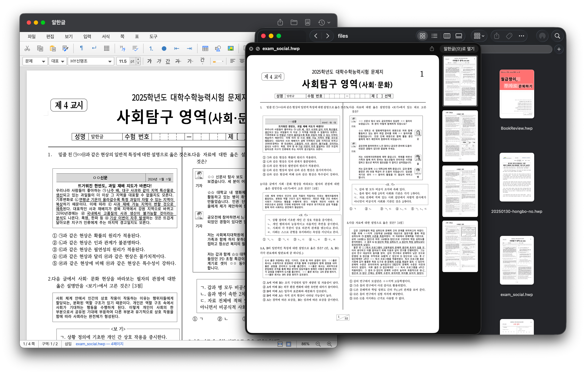
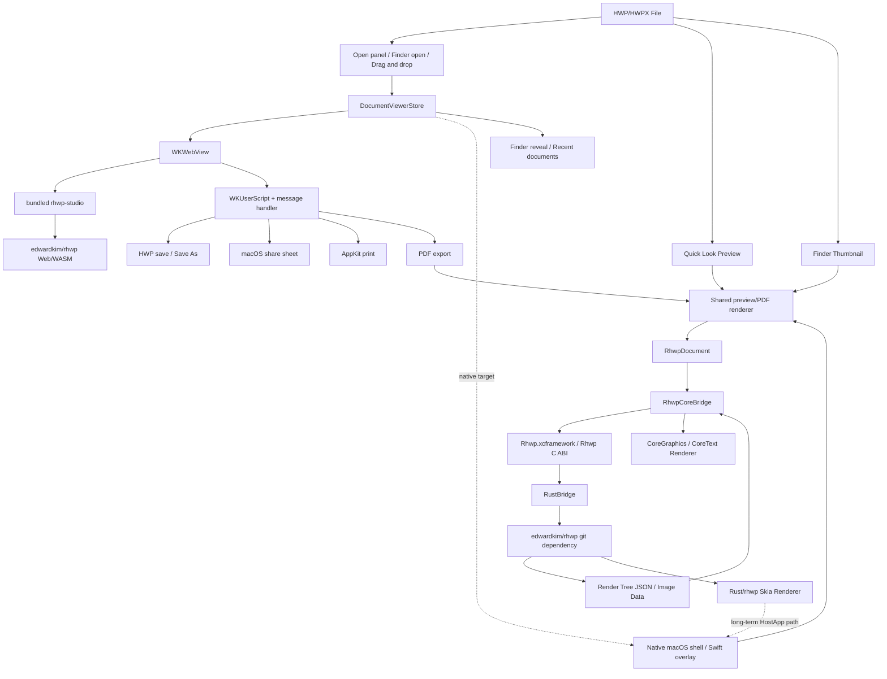

<p align="center">
  
</p>

# <div align="center">Alhangeul</div>

<p align="center">
  <strong>알한글 for macOS</strong><br/>
  <em>오픈소스 HWP/HWPX 유틸리티 앱 </em>
</p>

<p align="center">
  <a href="https://github.com/postmelee/alhangeul-macos"></a>
  <a href="https://www.swift.org/"></a>
  <a href="https://www.rust-lang.org/"></a>
  <a href="https://opensource.org/licenses/MIT"></a>
  <a href="https://github.com/postmelee/alhangeul-macos/releases"></a>
</p>

<h3 align="center">Mac에서 한글 파일은 더 이상 이방인이 아닙니다.</h3>



<p align="center">스페이스바로 미리보고, Finder에서 썸네일로 찾고, 앱에서 열어 저장·공유·PDF 내보내기까지 처리하세요.</p>

---

## 알한글 for macOS

<strong>알한글(alhangeul-macos)</strong>은 HWP/HWPX 파일을 macOS에서 미리보고, 앱에서 열고, 저장하고, 공유하고, PDF로 내보낼 수 있게 하는 오픈소스 데스크톱 앱입니다. 파일을 업로드하지 않고 로컬에서 문서를 다루는 것을 기본값으로 둡니다.
> Rust 기반 [`rhwp`](https://github.com/edwardkim/rhwp) 코어를 macOS 앱, Quick Look preview, Finder thumbnail, Swift bridge로 연결합니다. 첫 viewer는 `rhwp-studio`를 WKWebView로 품고, Finder/Quick Look은 Swift/Rust bridge native renderer를, PDF/인쇄는 현재 editor의 page SVG를 격리된 native 출력 경로에서 사용합니다.
> "닫힌 HWP/HWPX 문서를 더 많은 환경에서 다룰 수 있게 한다"는 [`rhwp`](https://github.com/edwardkim/rhwp)의 방향을 **Mac 네이티브** 경험으로 확장합니다.

## Support
Maintained with support from **OpenAI’s [Codex for Open Source](https://developers.openai.com/community/codex-for-oss)** program.
> _Support is provided to the maintainer and does not imply endorsement._

## 현재 작업 축

`v0.1.x`는 WebView-backed public release 라인입니다. Finder Quick Look과 썸네일, WKWebView 기반 앱 뷰어, 저장/공유/PDF 내보내기, signed/notarized DMG 배포, Sparkle 업데이트 확인을 안정화하는 데 집중합니다.

장기 방향은 WebView fallback을 유지하면서 native macOS viewer/editor shell로 점진적으로 옮겨가는 것입니다. 이 경로는 Swift가 HWP renderer 전체를 재구현하는 것이 아니라, Rust/rhwp Skia renderer와 Swift 편집 UI/오버레이를 결합하는 방향으로 둡니다. 세부 구현 제약과 날짜가 필요한 판단은 [제품 로드맵 메모](mydocs/tech/product_roadmap_notes.md)에 분리해 둡니다.

> [!NOTE]
> **메인테이너 현재 결정(2026-06-01)**: 당분간 새 편집 기능을 빠르게 넓히기보다 upstream `rhwp` Skia renderer의 시각 정합성을 높이고, 그 결과를 Quick Look/Thumbnail/PDF/native viewer preview 정확도로 연결하는 것으로 결정했습니다. 앱의 기본 preview 경로는 안정성 gate가 통과될 때까지 현행 fallback을 유지하며, Skia 경로는 visual diff와 성능 검증을 거쳐 단계적으로 확대합니다. 다만 이는 앱 배포나 upstream `rhwp` release 반영을 멈춘다는 뜻이 아니며, 안정적인 `rhwp` release tag가 나오면 core, bundled `rhwp-studio`, provenance, smoke 검증을 맞춰 계속 반영하고 필요한 patch release도 이어갑니다. 자세한 배경과 기여 방향은 [Discussion #325](https://github.com/postmelee/alhangeul-macos/discussions/325)에 정리했습니다.

### 기여자 브랜치 전환 안내

> [!IMPORTANT]
> 2026-05-14에 제품 개발 기본 브랜치가 `devel-webview`에서 `devel`로 전환되었고, 2026-05-16에 `devel-webview`에 남아 있던 #243 변경까지 `devel`에 병합되었습니다. 전환 전 fork나 오래된 clone을 기준으로 새 기여를 시작하려는 경우, 브랜치 이력이 크게 바뀌었으므로 저장소를 새로 fork/clone한 뒤 최신 `devel`에서 작업 브랜치를 다시 만들어 주세요.

> 기존 `devel`에 있던 native viewer/editor 장기 작업은 `native-viewer-editor` 브랜치로 보존했습니다. 이 브랜치는 이제 Swift native macOS shell, Rust/rhwp Skia renderer 연동, Swift 편집 UI/오버레이 실험 라인으로 취급합니다. `devel-webview`는 퇴역한 legacy alias이며 신규 PR 대상이나 자동화 기준으로 사용하지 않습니다.

## 릴리즈 안내

### v0.1.11 (공개 준비)

`v0.1.11 (17)`은 `rhwp v0.8.6`의 문서 조판·저장 호환성과 한글 입력·표 편집 개선을 반영하는 패치 릴리즈 후보입니다. 암호 문서·HWP3 원본 덮어쓰기 차단, PDF 한글 선택·검색·복사, PDF·인쇄 재실행, 파일 열기 실패 복구와 글자색·형광펜 선택기 표시·위치 보정을 포함합니다. 암호를 유지하는 저장·새 암호 설정과 HWP3 원형 저장은 지원하지 않으며, 안내 뒤 새 평문 또는 변환 복사본으로만 저장합니다.

- 포함된 `rhwp`: [`v0.8.6`](https://github.com/edwardkim/rhwp/releases/tag/v0.8.6), core·bundled Studio commit `f1f9c6ae58344ee9368996d3543f76b9345cf227`
- 후보 기록: [v0.1.11 릴리즈 기록](mydocs/release/v0.1.11.md), [배포용 업데이트 문서](docs/updates/v0.1.11.html)
- 배포 예정: [GitHub Release v0.1.11](https://github.com/postmelee/alhangeul-macos/releases/tag/v0.1.11). 아직 공개되지 않았으며 앱·서명 설치본 검증을 진행할 예정입니다.

현재 최신 공개 릴리즈와 Homebrew Cask는 [v0.1.10 (16)](https://github.com/postmelee/alhangeul-macos/releases/tag/v0.1.10)입니다. HWP/HWPX 형식별 저장, 전체 페이지 PDF·인쇄와 `rhwp v0.8.4`를 포함합니다.

> **현재 공개 v0.1.10 저장 주의:** HWP3 저장 시 원본이 HWP5 bytes로 바뀌거나, 보호 문서 저장 시 보호가 제거된 평문으로 원본을 덮어쓸 수 있습니다([#482](https://github.com/postmelee/alhangeul-macos/issues/482), [#480](https://github.com/postmelee/alhangeul-macos/issues/480)). v0.1.11 공개 전까지 HWP3·암호 문서는 먼저 사본을 만들고 native 저장을 사용하지 마세요.

과거 릴리즈와 검증 기록은 [릴리즈 인덱스](mydocs/release/index.md), [GitHub Releases](https://github.com/postmelee/alhangeul-macos/releases)와 [업데이트 페이지](https://postmelee.github.io/alhangeul-macos/updates/)에서 확인할 수 있습니다.

## 이정표

```text
v0.1.x(WebView 첫 배포) -> v0.2(Mac 통합 확장) -> v0.3(변환과 자동화) -> v0.5+(native macOS viewer/editor shell) -> v2.0(Agent-ready 문서 환경)
```

| 버전 | 단계 | 사용자에게 보이는 변화 | 주요 범위 |
|------|------|------------------------|-----------|
| `v0.1.x` | WebView-backed public release | Finder와 Quick Look에서 HWP/HWPX가 보이고, 앱에서는 `rhwp-studio` 기반 viewer/editor로 문서를 열고 내보냅니다. | Quick Look, thumbnail, WKWebView HostApp, 저장/공유/PDF, signed/notarized DMG, Sparkle |
| `v0.2` | Mac 통합 확장 | 앱 화면 밖에서도 문서 정보와 내용을 더 잘 다룹니다. | 문서 정보/본문 추출, Spotlight/mdimporter 검토, Mac 서비스 연동 기반 |
| `v0.3` | 변환과 자동화 | 여러 HWP/HWPX 문서를 Finder, CLI, Shortcuts 흐름에서 변환합니다. | Text/Markdown/blocks JSON/HWPX 변환, batch 변환, Quick Action, CLI |
| `v0.5+` | Native macOS viewer/editor shell | WebView 의존도를 낮추고 Mac-native 문서 보기와 편집 상호작용 기반을 키웁니다. | Rust/rhwp Skia renderer 연동, native search/copy, Swift overlay, editor safety gates |
| `v2.0` | Agent-ready Docs | 에이전트가 문서를 열고 수정하고 렌더링 결과로 검증하는 루프를 제공합니다. | structured patch API, page anchor, document diff, render verification |

미래 기능 후보와 장기 제품 방향은 [제품 로드맵 메모](mydocs/tech/product_roadmap_notes.md)에서 관리합니다. README에는 아직 확정되지 않은 버전별 지원 기능 체크리스트를 나열하지 않습니다.

## v0.1.x 구현 범위

공개 릴리즈 라인의 기능과 개발 브랜치의 v0.1.11 후보에 반영된 저장 보호·PDF 개선을 함께 설명합니다. 현재 설치 가능한 공개 버전의 차이는 위 릴리즈 안내를 확인하세요.

### 제공 기능

- [x] `.hwp`, `.hwpx` Quick Look preview
- [x] 첫 페이지 기반 Finder thumbnail
- [x] WKWebView 기반 HWP/HWPX viewer/editor
- [x] WebView 내부 찾기, 선택, 복사, 기본 편집 UI
- [x] Finder 또는 다른 앱에서 HWP/HWPX 파일 열기
- [x] Finder에서 viewer 영역으로 끌어와서 열기
- [x] 최근 문서 목록과 security-scoped bookmark 기반 재열기
- [x] 평문 HWP5/HWPX 형식별 저장과 다른 이름으로 저장, HWP3 변환 복사본 저장
- [x] PDF 내보내기
- [x] native 인쇄 flow 연결
- [x] macOS 공유 sheet
- [x] 원본 URL이 있는 문서를 Finder에서 보기
- [x] Quick Look/Thumbnail extension 상태 진단
- [x] signed/notarized DMG 배포 기준
- [x] `v0.1.1`부터 Intel Mac과 Apple Silicon Mac을 위한 단일 universal DMG 배포 기준
- [x] Sparkle 업데이트 확인 경로

### 현재 제한 사항

- 앱 화면의 viewer/editor와 Finder Quick Look/thumbnail, PDF 내보내기, 인쇄는 서로 다른 렌더링 경로를 사용할 수 있습니다.
- Quick Look/Thumbnail smoke 통과는 extension 등록과 기본 렌더 성공을 뜻하며, 모든 문서가 앱 화면과 같은 시각 결과로 보인다는 보장은 아닙니다.
- 평문 HWP3 문서는 열 수 있지만 HWP3 원형으로 다시 저장할 수는 없습니다. 저장 전 형식 변환을 알리고, 원본과 기존 파일을 덮어쓰지 않는 새 HWP5 또는 HWPX 변환 복사본만 저장합니다. 자세한 추적은 [Issue #482](https://github.com/postmelee/alhangeul-macos/issues/482)를 참조하세요.
- 암호로 보호된 HWP/HWPX 문서는 열 수 있지만 현재 native 저장 경로는 암호 보호를 유지하거나 새 암호를 설정할 수 없습니다. 저장 전 보호 해제를 알리고 원본과 다른 새 경로의 평문 복사본만 허용합니다. 자세한 추적은 [Issue #480](https://github.com/postmelee/alhangeul-macos/issues/480)을 참조하세요.
- HWP5/HWPX 저장은 형식별 exporter와 container signature를 확인하지만, upstream exporter가 모든 문서 요소를 의미론적으로 완전 무손실 보존한다고 보장하지 않습니다.
- v0.1.11 후보의 PDF/인쇄 경로는 허가된 앱 내장 Noto fallback으로 한글 text layer의 Unicode mapping을 보강합니다. 다만 positioned SVG의 읽기·드래그 선택 순서는 viewer마다 다를 수 있고, Hanja·일부 수식/기호의 system font, 이미지·스캔·도형 안 글자는 완전한 선택을 보장하지 않으며 OCR을 제공하지 않습니다.
- 손상, 대용량, 미지원 문서 fallback은 앱과 extension이 멈추지 않도록 하는 안전장치이며, 파일 복구나 부분 렌더링을 보장하지 않습니다.
- CoreGraphics/CoreText 기반 native renderer의 style, image effect/fill, text layout, RawSvg/OLE 등 parity gap은 현재 Quick Look/Thumbnail과 fallback/diagnostic 경로에서 계속 다룹니다. HostApp 장기 native 경로는 Rust/rhwp Skia renderer와 Swift overlay를 결합하는 방향으로 분리합니다.

## Features

### Finder Integration (Finder 통합)

- `.hwp`, `.hwpx` Quick Look preview
- 단일 페이지는 PNG, 다중 페이지는 Quick Look 표시용 PDF preview로 표시
- 첫 페이지 기반 Finder thumbnail과 thumbnail render cache
- `.hwp`, `.hwpx` 및 Hancom 계열 UTI 등록
- 50 MB 초과 파일 preview fallback
- 앱 정보 창에서 Quick Look/Thumbnail extension 번들 포함과 시스템 등록 상태 확인

### WKWebView Viewer (MVP 뷰어)

- macOS SwiftUI 기반 HostApp shell과 WKWebView
- 개발 브랜치 기준 `edwardkim/rhwp` `v0.8.6`의 `rhwp-studio` viewer/editor 통합
- HWP/HWPX 파일 열기
- WebView 내부 찾기, 복사, 기본 편집 UI
- Finder 또는 다른 앱에서 파일 열기 요청 수신
- Finder에서 viewer 영역으로 끌어와서 열기
- 최근 문서 목록에서 다시 열기
- 로컬 파일을 앱 sandbox 안에서 WebView viewer로 전달
- WebView 기반 스크롤, 확대/축소, 페이지 이동, 오류 상태 표시

### Document Actions (문서 작업)

- 파일 메뉴와 `Command+O/S/Shift+S/P` 단축키를 native 열기, 저장, 다른 이름으로 저장, 인쇄 flow에 연결
- 평문 HWP5/HWPX 형식별 저장과 다른 이름으로 저장, 저장 결과 재열기
- 평문 HWP3는 원본을 보존하고 새 HWP5/HWPX 변환 복사본으로만 저장
- 암호 문서는 열 수 있지만 native 저장에서는 암호 보호를 유지하지 않으며, 사용자 확인 뒤 새 평문 복사본으로만 저장
- PDF로 내보내기 후 저장된 PDF를 Finder에서 표시
- macOS 공유 sheet로 현재 문서 공유
- 원본 URL이 있는 문서를 Finder에서 보기
- HWPX로 저장한 문서는 같은 URL과 HWPX 형식을 유지한 후속 `Command+S` 경로 사용

### Rendering Paths (렌더링 경로)

| 표면 | v0.1 렌더링 경로 | 기준 |
|------|------------------|------|
| HostApp viewer/editor 화면 | `rhwp-studio` Web/WASM rendering in WKWebView | 첫 공개 배포의 기본 viewer/editor 경로 |
| PDF 내보내기 | `rhwp-studio` page SVG + 전용 WKWebView/PDFKit native PDF 경로 | 현재 편집 상태의 전체 페이지, 앱 소유 한글 fallback과 searchable text 반영 |
| 인쇄 | PDF 내보내기와 같은 page SVG renderer + PDFKit/AppKit print operation | page geometry를 공유하고 native print panel 사용 |
| Quick Look preview | Rust bridge + Swift CoreGraphics/CoreText render tree bitmap/PDF | Finder preview용 경로 |
| Finder thumbnail | Rust bridge + Swift CoreGraphics/CoreText first-page bitmap/cache | Finder icon/thumbnail용 경로 |

WKWebView viewer/editor 경로는 native macOS shell이 충분히 안정화될 때까지 fallback과 비교 기준선으로 유지합니다. Quick Look/Thumbnail의 native bitmap 경로는 Rust core render tree JSON, CoreGraphics, CoreText, 이미지 bin data를 사용하고, PDF/인쇄는 현재 editor의 page SVG를 별도 script-disabled WebView에서 변환합니다. HostApp 장기 native 경로는 Swift macOS shell, Rust/rhwp Skia renderer, Swift 편집 UI/오버레이를 결합하는 방향으로 둡니다.

### Core Bridge (코어 브리지)

- `edwardkim/rhwp`를 git dependency로 사용하는 `RustBridge` crate
- C ABI 기반 `rhwp_*` FFI entrypoint
- `cbindgen` header/modulemap 생성
- universal static library 생성
- `Rhwp.xcframework`를 HostApp, Quick Look, Thumbnail target에서 공유
- FFI symbol set을 `rhwp-ffi-symbols.txt`로 고정
- `rhwp-core.lock`으로 core source provenance와 Rust bridge reference artifact metadata 기록

### Development Workflow (개발 워크플로우)

- XcodeGen 기반 project 생성
- Rust bridge, Swift renderer, Swift app shell 소유 경계 분리
- `check-no-appkit.sh`로 shared Swift bridge의 AppKit/UIKit 의존성 검사
- native renderer 변경은 `validate-stage3-render.sh`로 렌더링 smoke test
- 제품 기능과 배포 후보 작업은 `devel`, HostApp native macOS shell과 Swift overlay 실험 작업은 `native-viewer-editor` 기준으로 분리
- GitHub Issue 기반 task branch와 한국어 작업 문서

자세한 구조와 bridge 정책은 [아키텍처 문서](mydocs/tech/project_architecture.md)를 참조하세요.

## Release / Install

공개 배포 기준은 Developer ID로 서명하고 Apple notarization을 통과한 DMG입니다. GitHub Release에는 `alhangeul-macos-<version>.dmg`와 checksum을 함께 공개합니다. `v0.1.1`부터 공식 DMG는 앱 본체와 Quick Look/Thumbnail extension 실행 파일이 `arm64 + x86_64` slice를 포함하는 단일 universal DMG 기준으로 검증합니다. Intel Mac과 Apple Silicon Mac 모두 같은 파일을 받으며, 아키텍처별 DMG는 따로 제공하지 않습니다.

Homebrew Cask를 사용하는 경우 아래 명령으로 같은 signed/notarized universal DMG를 설치할 수 있습니다.

```bash
brew install --cask postmelee/tap/alhangeul
```

Homebrew가 untrusted tap 정책으로 설치를 거부하면 `brew trust --cask postmelee/tap/alhangeul`을 한 번 실행한 뒤 다시 설치하세요.

설치 후에는 `Alhangeul.app`을 한 번 실행하세요. macOS가 Quick Look 및 Thumbnail extension을 발견하고 등록한 뒤 Finder에서 `.hwp`, `.hwpx` preview와 thumbnail을 사용할 수 있습니다.

최신 공개 릴리즈는 [GitHub Releases](https://github.com/postmelee/alhangeul-macos/releases/latest)와 [업데이트 페이지](https://postmelee.github.io/alhangeul-macos/updates/)에서 확인합니다. 릴리스가 게시되기 전에는 아래 소스 빌드 절차를 사용하세요. unsigned, ad-hoc signed, rehearsal DMG는 일반 사용자 배포 산출물이 아닙니다.

## 개인정보 및 익명 사용 추이

알한글은 최초 실행과 버전 전환 추이를 파악하기 위한 익명 이벤트 공유를 기본으로 활성화합니다. 전송 데이터는 이벤트별 임시 ID, 실제 발생 UTC 날짜, 이벤트 유형, 이전·현재 버전과 확인 가능한 업데이트 경로로 제한하며 문서 내용·파일명·경로, 계정, 기기·사용자·설치 식별자를 포함하지 않습니다. 이 값은 전체 설치 수나 고유 사용자 수가 아니라 네트워크 연결 환경에서 수집 서버에 도달한 관측 이벤트입니다.

수집 요청은 Cloudflare Worker를 통해 처리하지만 요청의 IP·지역·header를 알한글 분석 저장소에 보관하지 않습니다. 앱은 OS·언어 정보를 드러내지 않는 고정 request header를 사용하고 redirect를 따르지 않습니다. macOS `설정… > 개인정보`에서 `익명 사용 추이 공유`를 끌 수 있으며, 끄면 보관 중인 이벤트와 전송 상태를 즉시 삭제합니다. 자세한 데이터·오프라인 보관·재시도 계약은 [익명 실행 이벤트 계약](mydocs/tech/task_m040_453_app_execution_analytics_contract.md)을 참조하세요.

## Quick Start (소스 빌드)
처음 프로젝트에 참여하는 개발자는 [Project Structure](#project-structure)를 먼저 보고, 세부 경계는 [아키텍처 문서](mydocs/tech/project_architecture.md), 상세한 빌드 및 검증 절차는 [빌드 및 실행 가이드](mydocs/manual/build_run_guide.md)를 확인하세요. 실제 빌드는 Rust bridge 산출물을 만든 뒤 Xcode project를 생성하고 HostApp을 빌드하는 순서입니다.

### Requirements

- macOS 12 Monterey 이상
- Xcode 15 이상
- Swift 5.9
- Rust toolchain
- `cbindgen`
- XcodeGen

### Initial Setup

```bash
git clone https://github.com/postmelee/alhangeul-macos.git
cd alhangeul-macos

rustup target add aarch64-apple-darwin x86_64-apple-darwin
cargo install cbindgen
brew install xcodegen
```

### Build

```bash
./scripts/build-rust-macos.sh
xcodegen generate
xcodebuild -project Alhangeul.xcodeproj \
  -scheme HostApp \
  -configuration Debug \
  -derivedDataPath build.noindex/DerivedData \
  CODE_SIGNING_ALLOWED=NO \
  build
```

### Run

```bash
open build.noindex/DerivedData/Build/Products/Debug/Alhangeul.app
```

### Checks

```bash
./scripts/check-no-appkit.sh
scripts/verify-rhwp-studio-assets.sh
```

- WKWebView viewer 경로를 바꾼 경우: [빌드 및 실행 가이드](mydocs/manual/build_run_guide.md)의 HostApp WKWebView viewer smoke test
- native renderer 경로를 바꾼 경우: `./scripts/validate-stage3-render.sh`
- Core dependency - [core dependency 운영 가이드](mydocs/manual/core_dependency_operation_guide.md)
- CI workflow 역할과 로컬 재현 - [CI workflow 가이드](mydocs/manual/ci_workflow_guide.md)
- release packaging, signing, notarization - [릴리스/배포 가이드](mydocs/manual/release_distribution_guide.md)
- Finder extension 등록 검증 - [빌드 및 실행 가이드](mydocs/manual/build_run_guide.md)
- renderer 비교 디버깅 - [core/native 렌더 비교 가이드](mydocs/manual/render_core_native_compare_guide.md)

## Project Structure

이 저장소는 먼저 macOS 제품 타깃을 나누고, 그 아래에 공통 Swift 계층과 Rust bridge를 둡니다.

```text
Sources/
├── HostApp/                  # macOS WKWebView viewer app
│   ├── Resources/            # bundled rhwp-studio static asset
│   ├── Services/             # 열기/저장/PDF/공유/Finder reveal, WebView resource/document bridge
│   ├── Stores/               # WKWebView viewer 문서 payload와 loading/error 상태
│   ├── Support/              # 빌드 정보
│   └── Views/                # SwiftUI/WebKit viewer UI
├── QLExtension/              # Quick Look preview extension
├── ThumbnailExtension/       # Finder thumbnail extension
├── Shared/                   # HostApp/extension 공통 macOS helper
└── RhwpCoreBridge/           # AppKit/UIKit 없는 Swift FFI wrapper + render tree renderer

RustBridge/                   # edwardkim/rhwp를 C ABI로 노출하는 Rust staticlib crate
├── Cargo.toml                # rhwp git dependency 선언
├── Cargo.lock                # Cargo가 해석한 resolved commit 고정
├── cbindgen.toml             # C header 생성 설정
└── src/lib.rs                # rhwp_* FFI entrypoints

Frameworks/                   # generated Rhwp.xcframework/header/modulemap, git ignore 대상
project.yml                   # Xcode project 원본
rhwp-core.lock                # core provenance + Rust bridge reference artifact metadata
samples/                      # render smoke와 Finder smoke용 HWP/HWPX fixture
scripts/                      # build, lock verify, render smoke, package helper
mydocs/                       # hyper-waterfall 작업 문서와 운영 매뉴얼
```

`project.yml`은 `Alhangeul.xcodeproj`의 원본입니다. target, source 포함 범위, bundle identifier, extension embedding을 바꿀 때는 `project.yml`을 수정한 뒤 `xcodegen generate`를 실행합니다.

타깃 간 소유 경계, 공통 Swift 계층, Rust bridge, 런타임 데이터 흐름은 [아키텍처 문서](mydocs/tech/project_architecture.md)를 참조하세요.

## AI 페어 프로그래밍으로 개발합니다

> 이 섹션의 문제의식과 개발 방법론 설명은 `edwardkim/rhwp` README.md의 ["AI 페어 프로그래밍으로 개발합니다"](https://github.com/edwardkim/rhwp#ai-%ED%8E%98%EC%96%B4-%ED%94%84%EB%A1%9C%EA%B7%B8%EB%9E%98%EB%B0%8D%EC%9C%BC%EB%A1%9C-%EA%B0%9C%EB%B0%9C%ED%95%A9%EB%8B%88%EB%8B%A4) 섹션을 바탕으로 합니다. alhangeul-macos에서는 같은 절차를 Claude Code와 OpenAI Codex에 함께 적용합니다.

**이것은 바이브 코딩이 아닙니다.** AI가 주는 코드를 읽지도 않고 수락하는 것이 아닙니다. 모든 계획은 검토되고, 모든 결과물은 검증되며, 모든 결정의 뒤에는 사람이 있습니다.

바이브 코딩 — AI 출력을 읽지 않고 수락하고, AI에게 아키텍처 결정을 맡기고, 이해하지 못하는 코드를 배포하는 것 — 은 함정입니다. 겉보기에는 동작하지만, 이해하지 못했기 때문에 문제가 생겨도 진단할 수 없는 코드가 만들어집니다.

이 프로젝트는 정반대의 접근을 취합니다. 사람 **작업지시자**가 방향, 품질, 아키텍처 결정의 완전한 소유권을 유지하고, AI는 혼자서는 불가능한 속도와 규모로 구현을 수행합니다. 핵심 차이: **사람은 절대 생각을 멈추지 않습니다.**

### 바이브 코딩 vs. AI 주도 개발

| | 바이브 코딩 | 이 프로젝트 |
|--|-----------|-----------|
| **사람의 역할** | AI 출력 수락 | 지시, 검토, 결정 |
| **계획** | 없음 — "그냥 만들어" | 계획서 작성 → 승인 → 실행 |
| **품질 관문** | 동작하길 바람 | 빌드 + 렌더링 smoke test + 코드 리뷰 |
| **디버깅** | AI에게 AI 버그 수정 요청 | 사람이 진단, AI가 구현 |
| **아키텍처** | 우연히 형성 | 의도적 설계 (core, bridge, app 경계) |
| **문서** | 없음 | `mydocs/` 프로세스 기록 |
| **결과물** | 취약, 유지보수 어려움 | 검증 가능한 변경 단위 |

AI는 배율기입니다. 하지만 배율기는 기존 프로세스를 증폭시킵니다. 프로세스 없음 × AI = 빠른 혼돈. 좋은 프로세스 × AI = 비범한 결과물.

### 개발 프로세스

이 프로젝트는 [**Claude Code**](https://claude.ai/code) 와 [**OpenAI Codex**](https://openai.com/ko-KR/codex/)를 페어 프로그래밍 파트너로 사용하여 개발합니다. 전체 개발 과정은 Issue, branch, 작업 문서, PR에 투명하게 남깁니다.

```text
작업지시자 (사람)                    AI 페어 프로그래머 (Claude Code / Codex)
────────────────                    ─────────────────────────────────────
방향 설정, 우선순위 결정        →    분석, 계획, 구현
계획 검토, 승인                ←    구현 계획서 작성
도메인 피드백 제공              →    디버깅, 테스트, 반복
아키텍처 결정                  →    정밀하게 실행
품질 및 정확성 판단            ←    코드, 문서, 테스트 생성
```

`mydocs/` 디렉토리에 개발 기록이 있습니다: 일일 작업 기록, 구현 계획서, 단계별 완료 보고서, 최종 보고서, 기술 연구 문서, 트러블슈팅 기록.

> `mydocs/`는 코드에 대한 문서만이 아닙니다 — **AI로 소프트웨어를 만드는 방법**에 대한 문서입니다.

**Hyper-Waterfall 방법론** — 거시적 워터폴 + 미시적 애자일, AI가 이 둘을 동시에 가능하게 한다.

### Git 워크플로우

```text
local/task{N}  ──커밋──커밋──┐
                              ├─→ publish/task{N} push
                              ├─→ 통합 브랜치 Open PR + merge
                              ├─→ main merge + 태그 (릴리즈 시점)
```

| 브랜치 | 용도 |
|--------|------|
| `main` | 릴리즈 |
| `devel` | v0.1.x 첫 공개 배포, WKWebView-backed viewer/editor, Finder/Quick Look, PDF/공유/저장, Mac 통합/변환, 배포/문서 작업의 기본 통합 |
| `native-viewer-editor` | native macOS viewer/editor shell, Rust/rhwp Skia renderer 연동, Swift 편집 UI/오버레이 장기 작업 통합 |
| `devel-webview` | 퇴역한 legacy alias. 신규 작업과 자동화 기준으로 사용하지 않음 |
| `local/task{N}` | GitHub Issue 번호 기반 타스크 브랜치 |
| `publish/task{N}` | `devel` 또는 `native-viewer-editor` 대상 PR 생성을 위한 원격 게시 브랜치 |

제품 브랜치와 native 전환 브랜치 역할은 [WKWebView/native 브랜치 전략](mydocs/tech/branch_strategy_webview_native.md)을 기준으로 유지합니다.

### 타스크 관리

- **GitHub Issues**로 타스크 번호 자동 채번 — 중복 방지
- 브랜치명: `local/task{issue번호}`
- PR 생성용 원격 브랜치명: `publish/task{issue번호}`
- 오늘할일: `mydocs/orders/yyyymmdd.md`
- 커밋 메시지:
  - 기본형: `Task #{번호}: 내용`
  - 단계 커밋: `Task #{번호} Stage {N}: 내용`
- PR 대상: 작업 범위에 따라 `devel` 또는 `native-viewer-editor`

### 타스크 진행 절차

이슈 → 브랜치 → 오늘할일 → 수행계획서 → 구현계획서 → 구현 → 검증 → 단계 보고 → 최종 보고 → PR 게시 → merge 후 정리.

15단계 상세, 승인 게이트, 커밋 메시지 규칙은 [`task_workflow_guide.md`](mydocs/manual/task_workflow_guide.md)를 참고하세요.

### 디버깅 프로토콜

렌더링 문제:

1. `validate-stage3-render.sh` → 기본 샘플의 native render pipeline smoke 확인
2. `render-debug-compare.sh` → 특정 파일의 render tree JSON, core SVG, native PNG, pixel diff 산출
3. core SVG와 native PNG가 다르면 [core/native 렌더 비교 가이드](mydocs/manual/render_core_native_compare_guide.md)에 따라 Swift renderer 문제와 core 문제를 분리
4. 필요 시 별도 `edwardkim/rhwp` clone 또는 Cargo checkout에서 core rendering data 확인

Finder/Quick Look 통합 문제:

1. `pluginkit -mAvvv | grep com.postmelee.alhangeul` → extension 등록 후보 확인
2. `qlmanage -p` → Finder preview 경로 확인
3. `qlmanage -t -x` → thumbnail 생성 경로 확인
4. 반복 시행착오는 [Finder 통합 검증 시행착오 방지 가이드](mydocs/troubleshootings/finder_integration_validation_pitfalls.md)를 확인

### 문서 생성 규칙

모든 문서는 **한국어**로 작성합니다.

```text
mydocs/
├── orders/           # 오늘 할일 (yyyymmdd.md)
├── plans/            # 수행 계획서, 구현 계획서
│   └── archives/     # 완료된 계획서 보관
├── working/          # 단계별 완료 보고서
├── report/           # 최종 보고서
├── feedback/         # 코드 리뷰 피드백
├── tech/             # 기술 사항 정리 문서
├── manual/           # 매뉴얼, 가이드 문서
├── troubleshootings/ # 트러블슈팅 관련 문서
└── pr/               # 외부 기여자 PR 검토 기록
```

폴더별 역할, 파일명 규칙(`task_{milestone}_{issue}.md` 등), 외부 PR 정책은 [`document_structure_guide.md`](mydocs/manual/document_structure_guide.md)를 참고하세요.

## Architecture


```mermaid
graph TB
    HWP[HWP/HWPX File] --> Open[Open panel / Finder open / Drag and drop]
    Open --> Store[DocumentViewerStore]
    Store --> WebView[WKWebView]
    WebView --> Studio[bundled rhwp-studio]
    Studio --> WebCore[edwardkim/rhwp Web/WASM]
    Store -. native target .-> NativeViewer[Native macOS shell / Swift overlay]
    WebView --> HostBridge[WKUserScript + message handler]
    HostBridge --> Save[HWP save / Save As]
    HostBridge --> Share[macOS share sheet]
    HostBridge --> Print[AppKit print]
    HostBridge --> PDF[PDF export]
    Store --> Reveal[Finder reveal / Recent documents]
    HWP --> Preview[Quick Look Preview]
    HWP --> Thumbnail[Finder Thumbnail]
    PDF --> Shared[Shared preview/PDF renderer]
    Preview --> Shared
    Thumbnail --> Shared
    NativeViewer --> Shared
    Shared --> Doc[RhwpDocument]
    Doc --> Bridge[RhwpCoreBridge]
    Bridge --> XC[Rhwp.xcframework / Rhwp C ABI]
    XC --> RustBridge[RustBridge]
    RustBridge --> Core[edwardkim/rhwp git dependency]
    Core --> Data[Render Tree JSON / Image Data]
    Data --> Bridge
    Bridge --> CG[CoreGraphics / CoreText Renderer]
    Core --> Skia[Rust/rhwp Skia Renderer]
    Skia -. long-term HostApp path .-> NativeViewer
```

## Contributing

기여 환영합니다. 다음 핵심 사항을 먼저 확인해 주세요:
- PR base는 작업 범위에 따라 다릅니다. 첫 공개 배포, WKWebView-backed viewer/editor, Finder/Quick Look, PDF/공유/저장, Mac 통합/변환, 배포, 문서, Skia 공통 기반 작업은 `devel`로 보내고, HostApp native macOS shell과 Swift overlay 관련 기여는 `native-viewer-editor`로 보냅니다. `main`은 릴리즈 브랜치입니다.
- 이슈 먼저 확인: 동일 영역에 진행 중인 작업이 있는지 [열린 이슈](https://github.com/postmelee/alhangeul-macos/issues) 와 [열린 PR](https://github.com/postmelee/alhangeul-macos/pulls) 을 먼저 확인해 주세요. 중복 작업을 방지합니다.
- 이슈 close 는 메인테이너: 작업 완료 후 PR 만 제출해 주세요. 이슈는 PR 머지 시 메인테이너가 close 합니다.

상세한 기여 절차 (Fork → 브랜치 → 커밋 → PR) 는 [CONTRIBUTING.md](CONTRIBUTING.md) 를, 브랜치 전략의 판단 근거는 [WKWebView/native 브랜치 전략](mydocs/tech/branch_strategy_webview_native.md)을 참고하세요.

## Notice

본 제품은 한글과컴퓨터의 한글 문서 파일(`.hwp`, `.hwpx`) 공개 문서를 참고하여 개발하였습니다.

## Trademark

"한글", "한컴", "HWP", "HWPX"는 주식회사 한글과컴퓨터의 등록 상표입니다. 본 프로젝트는 한글과컴퓨터와 제휴, 후원, 승인 관계가 없는 독립적인 오픈소스 프로젝트입니다.

"Hangul", "Hancom", "HWP", and "HWPX" are registered trademarks of Hancom Inc. This project is an independent open-source project with no affiliation, sponsorship, or endorsement by Hancom Inc.

## License

Alhangeul macOS 저장소 자체 코드는 [MIT License](LICENSE)로 배포되며, 주 저작권자는 Taegyu Lee입니다.

Bundled `rhwp`, `rhwp-studio`, Sparkle, WOFF2 fonts, 앱 아이콘/로고 원본 provenance는 [THIRD_PARTY_LICENSES.md](THIRD_PARTY_LICENSES.md)를 확인하세요. Core/version provenance와 Rust bridge reference artifact metadata는 [rhwp-core.lock](rhwp-core.lock)에, bundled `rhwp-studio` provenance는 [rhwp-studio manifest](Sources/HostApp/Resources/rhwp-studio/manifest.json)에, font 목록과 license는 [FONTS.md](Sources/HostApp/Resources/rhwp-studio/fonts/FONTS.md)에 기록합니다.
