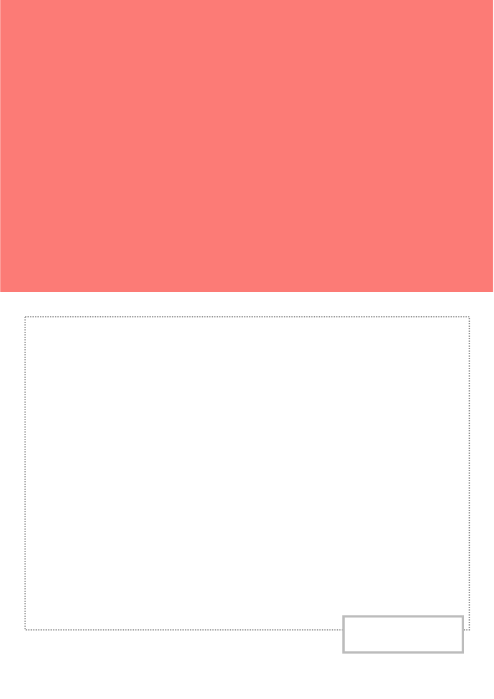
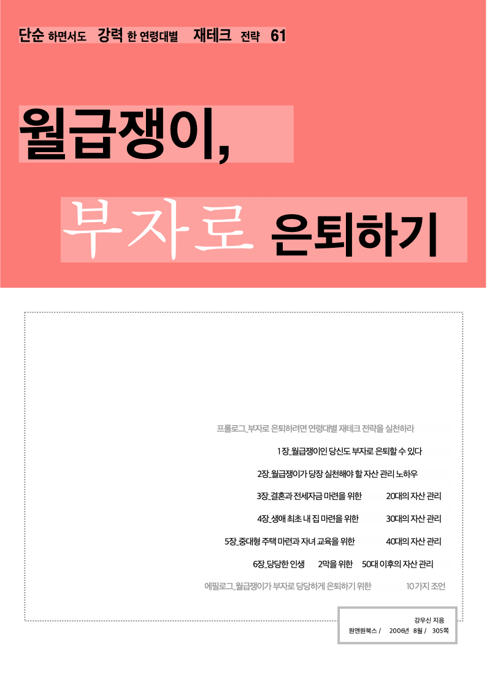

# Task M015 #108 최종 보고서

## 작업 개요

- 이슈: #108 Swift native renderer 도형 children 렌더링 보강
- 마일스톤: M015 (`첫 출시 전 Swift 렌더 보강`)
- 브랜치: `local/task108`
- 핵심 변경: `CGTreeRenderer`가 `Rectangle`, `Line`, `Ellipse`, `Path`, `Image` 노드를 그린 뒤 children을 순회하도록 보강
- 기준 샘플: `samples/basic/BookReview.hwp`

## 완료 내용

`BookReview.hwp`에서 텍스트가 보이지 않던 원인은 core text export 문제가 아니라 Swift native renderer의 도형 children 미순회 문제로 확인했다.

render tree에는 `TextRun` 66개와 `HangulRuns` 28개가 존재했고, core SVG에도 `<text>` 요소 247개가 있었다. 그러나 기존 Swift renderer는 `Rectangle` 노드를 그린 뒤 children을 순회하지 않아 `Rectangle` children 아래의 `TextLine`/`TextRun`에 도달하지 못했다.

`Sources/RhwpCoreBridge/CGTreeRenderer.swift`에서 다음 node type이 자기 자신을 렌더한 뒤 `renderChildren(node, in: ctx)`를 호출하도록 변경했다.

- `Rectangle`
- `Line`
- `Ellipse`
- `Path`
- `Image`

draw order는 core PageLayerTree builder와 맞춰 own node draw 후 children draw로 정리했다.

## 변경 파일

- `Sources/RhwpCoreBridge/CGTreeRenderer.swift`
- `mydocs/plans/task_m015_108.md`
- `mydocs/plans/task_m015_108_impl.md`
- `mydocs/working/task_m015_108_stage1.md`
- `mydocs/working/task_m015_108_stage2.md`
- `mydocs/working/task_m015_108_stage3.md`
- `mydocs/working/task_m015_108_stage4.md`
- `mydocs/report/task_m015_108_report.md`
- `mydocs/report/assets/task_m015_108/bookreview-before-native.png`
- `mydocs/report/assets/task_m015_108/bookreview-after-native.png`
- `mydocs/orders/20260501.md`

## 검증 요약

### 렌더 전후 스크린샷

변경 전 Swift native renderer는 도형만 그리고 도형 children 아래 텍스트를 방문하지 못했다.



변경 후 Swift native renderer는 도형 children 아래 `TextLine`/`TextRun`까지 렌더한다.



### Stage 1 기준 재현

```text
RenderTreeJSONBytes: 100010
CoreSVGBytes: 70430
NativePNGSize: 794x1123
NativeNonWhitePixels: 377463
TextRuns: 66
HangulRuns: 28
MissingHangulGlyphs: 0
```

native PNG에서는 상단 도형과 하단 테두리는 보였지만 텍스트가 보이지 않았다.

### Stage 3 변경 후 검증

```text
RenderTreeJSONBytes: 100010
CoreSVGBytes: 70430
NativePNGSize: 794x1123
NativeNonWhitePixels: 390859
TextRuns: 66
HangulRuns: 28
MissingHangulGlyphs: 0
```

native PNG에서 다음 텍스트 표시를 확인했다.

- `단순 하면서도 강력한 연령대별 재테크 전략 61`
- `월급쟁이, 부자로 은퇴하기`
- 본문 목차
- `강우신 지음`, `원앤원북스 / 2006년 8월 / 305쪽`

### Stage 4 통합 검증

```text
./scripts/check-no-appkit.sh
OK: shared Swift code has no AppKit/UIKit dependencies
```

```text
xcodebuild -project AlhangeulMac.xcodeproj -scheme HostApp -configuration Debug -derivedDataPath build.noindex/DerivedData CODE_SIGNING_ALLOWED=NO build
** BUILD SUCCEEDED ** [4.841 sec]
```

```text
./scripts/render-debug-compare.sh /private/tmp/rhwp-task108-final samples/basic/BookReview.hwp
NativeNonWhitePixels: 390859
TextRuns: 66
HangulRuns: 28
MissingHangulGlyphs: 0
```

`git diff --check`도 통과했다.

## 제한 사항

- 이번 작업은 도형 children 순회 누락만 고쳤다.
- 이미지 `crop/effect/brightness/contrast` 보강은 #106 범위다.
- PageLayerTree 전환은 별도 마일스톤 `PageLayerTree 렌더 경로 전환` 범위다.
- Equation/RawSvg/FormObject/Placeholder 보강은 이번 작업 범위가 아니다.
- core SVG rasterize는 로컬 `qlmanage` sandbox 오류로 실패해 pixel diff를 생성하지 못했다.

## 잔여 위험

- 도형 내부 clipping 일반화는 하지 않았으므로, 도형 bbox 밖 children이 있는 문서에서는 core SVG와 차이가 남을 수 있다.
- `Line`, `Ellipse`, `Path`, `Image` children 순회는 이번 대표 샘플에서 직접 exercise되지 않았다. 후속 샘플 smoke/diff 정리는 #107에서 넓히는 것이 맞다.

## 결론

Issue #108의 목표인 `BookReview.hwp` 텍스트 누락은 해결됐다.

Swift native renderer가 도형 계열 node의 children을 순회하게 되면서, render tree와 core SVG에 존재하던 텍스트가 native PNG에도 표시된다. HostApp Debug build와 bridge 경계 검증도 통과했다.
