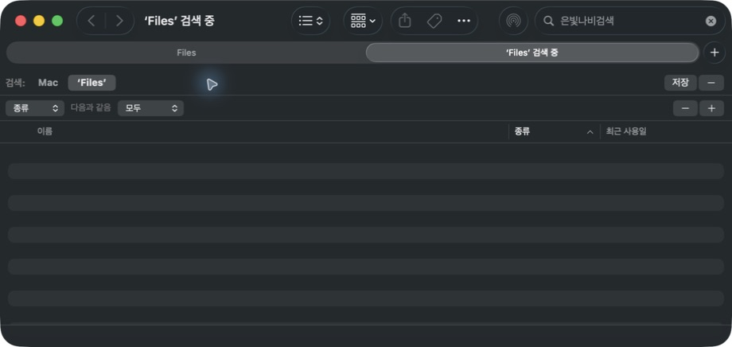
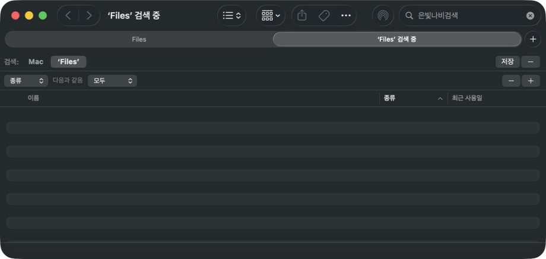
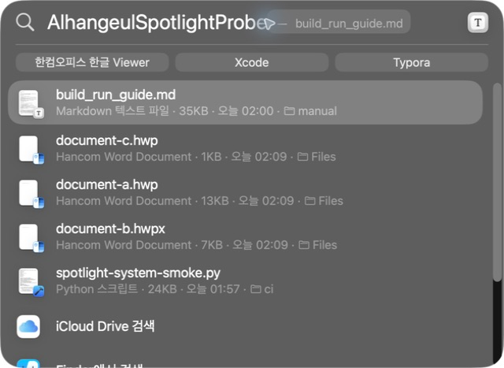
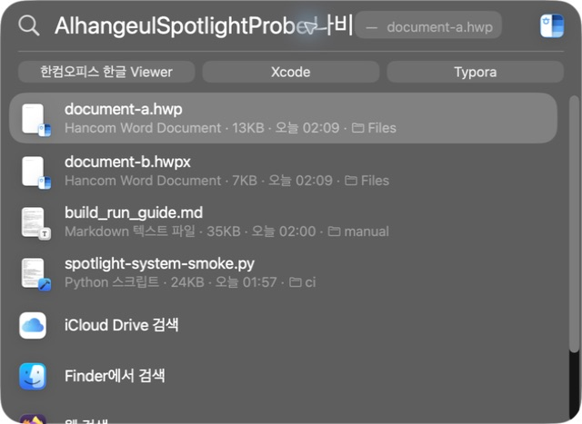

# Task M020 #342 최종 결과보고서

## 작업 요약

**2026-09-09 현재: 실제 본문 검색·변경·삭제 검증 통과, 최초 설치 자동 발견 검증은 미완료.** Stage 5에서 일반 txt 대조, HWP3/HWP5/HWPX 실제 검색과 Spotlight 화면·결과 열기를 확인했다. 동일 경로 앱 교체 후 후보 앱을 종료한 상태에서도 검색됐다. 새 경로 최초 설치에서 importer가 발견되지 않은 문제가 남아 Stage 6에서 계속 추적한다. #342 전체 완료와 v0.2.0 출시 완료를 의미하지 않는다.

최신 판정은 [Stage 5 보고서](../working/task_m020_342_stage5.md)와 [검색 결과 JSON](assets/task_m020_342/post-reboot-results.json)에 있다. 아래 기존 실행의 실패 관찰과 화면은 당시 기록으로 보존한다.

## 변경 파일과 영향

| 영역 | 영향 |
|---|---|
| RustBridge/examples/spotlight_fixtures.rs | 사용자 문서 없이 HWP3/HWP5/HWPX 및 보호·손상·한도 corpus 생성 |
| scripts/ci/spotlight-system-smoke.py | 소유한 새 경로의 설치/추출/색인/전환/교체/정리, 정확한 결과 집합 대기 |
| scripts/ci/test-spotlight-system-smoke.py, PR CI | 경로·symlink·환경 대조·반복 출력·본문 판정·목록 정리 회귀 |
| mydocs/manual/build_run_guide.md | 실제 설치본 판정과 실패 후에도 수행할 표준 cleanup |
| 계획/Stage/증거/orders | 검증 결과, 실제 화면과 사용자 리뷰 인계 |

## 기존 실행 기록 (2026-09-07~08)

macOS 26.5.2, Xcode 26.6, Apple Silicon, min target 12.0. core v0.8.6 pin을 유지했다. #341 작업의 universal Release 개발 패키지를 임의 식별자 하위 폴더에 설치했다. 기존 앱은 덮어쓰지 않았다.

초기 일반 등록/첫 실행은 importer를 발견하지 못했다. timestamp 갱신과 Xcode 방식 개발 등록 후 실제 mdimport가 격리 앱 내부 importer를 선택했다. 같은 후보를 로컬 교체하고 timestamp를 갱신한 뒤에는 일반 등록/첫 실행으로 재발견했다. 공개 신규 사용자 최초 설치나 Sparkle 업데이트와 같다고 간주하지 않는다.

재현 명령은 [빌드·실행 가이드](../manual/build_run_guide.md#spotlight-설치색인-smoke), 기계 판정은 [결과 JSON](assets/task_m020_342/results.json)에 있다.

## 기존 검증 결과

| 검증 | 결과 |
|---|---|
| HWP3/HWP5/HWPX 실제 importer/본문 | OK — 70/70/36 UTF-8 bytes, 한컴 계열 UTI |
| 수정 본문 / 암호·빈 HWPX / 손상·DRM·배포용·대형 HWP | OK — metadata 전환, 이전 본문 미제공 |
| 40만 한글 문자 출력 | OK — 1,048,575 bytes, UTF-8 경계 보존 |
| 앱 교체·timestamp·첫 실행 재발견 | OK — 동일 버전 개발 패키지 |
| 앱 미실행 metadata 추출 | OK |
| 일반 txt 실제 색인 대조 | FAIL — 두 번의 60초 대기, Data 볼륨 indexing unknown |
| 본문 검색·수정/삭제 전파·Finder 양성 결과 | MISS — 환경 복구 후 재검증 필요 |
| 원래 앱 hash와 provider 선택/경로 보존 | OK |
| 시험 앱/문서/프로세스·importer 목록 정리 | OK — 비동기 대기 후 cleaned |
| 전체 등록 위생 helper | MISS — 기존 두 설치본 및 과거 개발 등록 레코드 |
| 운영 회귀 / bundle 회귀 | OK — 8 / 3 tests (2026-09-08 보완) |
| no-AppKit / core build info / YAML / diff | OK |
| macOS 12·Intel runtime / 공개 공증·Sparkle 업데이트 | MISS |

## 기존 실제 화면

동일한 Files 범위와 파일명에 없는 `은빛나비검색`을 사용했다. **두 화면 모두 결과 0건이며 기능 성공의 전후 비교가 아니다.** 일반 txt 대조도 실패한 현재 환경을 기록했다.

| 설치 전 | 설치·추출 후 |
|---|---|
|  |  |

## 최신 실제 화면

파일명에 없는 본문 표식 검색에서 HWP3/HWP5/HWPX 3개, `나비`를 함께 입력한 검색에서 HWP5/HWPX 2개가 확인됐다. 검색 결과의 `document-a.hwp`를 열면 기존 기본 연결 앱인 한컴 뷰어에 동일 본문이 표시됐다. 기본 앱 연결은 바꾸지 않았다.

| 본문 표식 검색 | 한글 단어를 함께 검색 |
|---|---|
|  |  |

이 표는 두 검색 조건의 실제 양성 결과이며, 위의 과거 0건 화면과 동일 조건의 Before/After 비교가 아니다.

## 남은 위험과 리뷰 인계

재시동 이후 실제 검색·수정/보호/빈/손상/크기 전환·삭제 전파와 앱 교체/종료 후 재검색을 확인했다. 일반 txt 비교에 맞춰 한글 fixture를 독립 단어로 보완했다. 기존 연결어 검색 실패를 importer 실패 또는 성공으로 일괄 판정하지 않는다.

개발용 ad-hoc 후보의 새 경로 최초 발견 실패가 남아 있다. 동일 경로 교체 후 성공을 일반 최초 설치나 공개 Sparkle 업데이트의 성공으로 간주하지 않는다. macOS 12 실행 환경이 없으며 공개 서명·공증과 실제 Sparkle 업데이트는 별도 릴리스 검증이다. 기존 설치 두 개의 선택을 보존했으므로 전체 환경이 단일 provider라는 보장은 하지 않는다.

PR은 devel 대상이며 선행 PR 미병합으로 누적 diff를 포함한다. PR merge·이슈 close·v0.2.0 상향·공개 배포는 수행하지 않았다.
