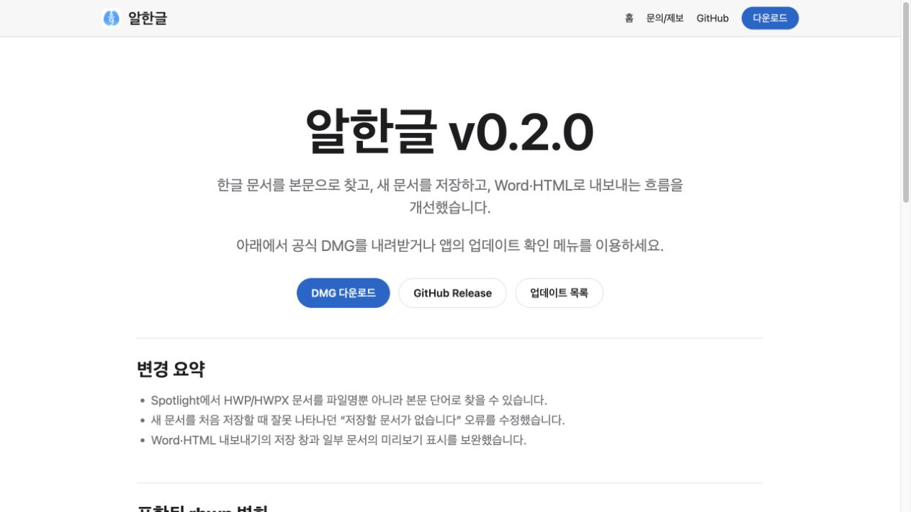

# Task M900 #520 릴리스 준비 결과보고서

## 결과와 범위

[PR #521](https://github.com/postmelee/alhangeul-macos/pull/521)에서 v0.2.0/18 후보 준비와 검증한 동일 DMG를 공개하는 자동화를 구현했다. **준비 PR 결과이며 릴리스 완료 보고가 아니다.** 최종 후보 SHA/tag, 서명·공증 DMG와 실제 최초 설치 결과는 아직 없다. #520, #513, #337 은 열어 둔다.

기준은 devel 41efb1770ae7a464c9cf766fe001c2da79a95823, 직전 공개 v0.1.11/17이다. core/Studio v0.8.6은 유지하며 PR #517 까지 포함한다. 변경 근거와 사용자 문구는 [v0.2.0 기록](../release/v0.2.0.md)에 정리했다.

## 구현

- draft builder는 기존 Release 교체와 직접 공개를 거부한다.
- 새 승격 workflow는 후보 artifact 및 최신 validation attempt의 arm64/Intel PASS, 실제 자동 검색/앱 종료/33개 lifecycle/cleanup을 확인한다.
- Release DMG/checksum bytes를 검사하고 같은 DMG의 Sparkle 서명/Pages를 준비한다. 공개 직전에 tag·회차·자산을 재확인하고 draft 상태만 변경한다. 더 최신 release로의 downgrade를 거부하며 동일 public 자산의 Pages 재시도는 허용한다.
- Pages 확인부터 배포까지 docs-only workflow와 직렬화하고, draft/prerelease 공개 문구 조기 배포를 차단한다.
- 4개 bundle 버전, 릴리스 분석/문구, 사용자 Pages와 운영 매뉴얼을 정렬했다. README/Cask의 공개 기준은 현재 v0.1.11이다.

## 검증과 증거

| 검증 | 결과 |
|---|---|
| 최초 설치 helper 회귀 | 11 tests PASS |
| 승격 gate 회귀 | 12 tests PASS — 후보/회차/증거/자산 교체·재시도와 모의 GitHub API/실제 ZIP CLI 연결 포함 |
| actionlint 전체 workflow | PASS |
| 4 bundle contract/version | PASS, 0.2.0/18 |
| v0.2.0 release notes 생성/template/body | PASS, 검증용 가상 hash 사용 |
| Pages artifact/XML/banner 검사 | PASS, 공개 실행 없음 |
| 브라우저 실제 페이지 | DOM/viewport 확인, 아래 캡처 |
| PR CI macOS build/release helper | [PR #521 Checks](https://github.com/postmelee/alhangeul-macos/pull/521/checks)와 PR 본문에서 최종 head 결과를 추적한다. 실제 배포 검증과 구분한다 |

## 남은 작업과 종료 조건

1. 준비 PR 리뷰·병합 후 최종 main/tag SHA와 포함 PR 분석을 확정한다.
2. 승인된 draft 생성과 같은 tag에서 양 macOS 15 최초 설치를 실행한다. source run/artifact, validation run/attempt, DMG hash와 version/build를 고정한다.
3. 실제 Mac의 Spotlight 화면/Finder/Thumbnail을 동일 서명 후보로 확인하고 기존 설치본을 보존·복원한다. macOS 12 환경 부재는 별도 출시 판단이 필요하다.
4. 위 증거와 공개할 정확한 DMG를 제시한 뒤 최종 공개 승인을 받아 승격한다. 공개 다운로드/appcast/Pages와 실제 Sparkle 업데이트 후 본문 검색·확장을 확인한다.
5. 이 결과로 #513 / #337 종료를 판단하고 README/Cask/릴리스 기록의 공개 기준을 정렬한다. 준비 PR 병합만으로 이슈를 닫지 않는다.

배포 자동화는 로컬 회귀/정적 검사만으로 실제 GitHub 권한·서명·설치 성공을 보장하지 않는다. 실제 실행에서 드러난 문제는 후보와 증거를 보존해 보완한다. 새 산출물을 이전 PASS로 승인하지 않는다.
