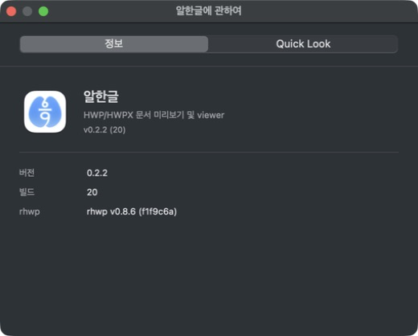

# Task M900 #549 최종 구현·배포 검증 보고서

## 결과

Homebrew tap 0.2.2를 공개했고 **0.1.11 → 0.2.2 업그레이드·제거·새 설치가 모두 통과**했다. 최종 `/Applications/Alhangeul.app`과 Homebrew receipt는 0.2.2(20)이다. 공개 DMG SHA256은 `8d8b8cbd24376fcd2c7ebd48343be44edc1f0f154a1e75282714798806ed4b90`이며 기존에 수용한 앱 bytes와 일치한다. [tap PR #1](https://github.com/postmelee/homebrew-tap/pull/1), main `5844bad4bdf6c3b314957a337d53957ce33284e3`.

Cask style·일반 audit·참고 new audit, 서명·About·Finder 제공자·번들 계약·실제 importer·기존 본문 검색·등록 hygiene가 통과했다. 실제 명령과 화면은 [Stage 2](../working/task_m900_549_stage2.md), [구조화 결과](assets/task_m900_549/homebrew-validation.json)에 보존했다.

README/Pages/Release와 릴리즈 기록의 이전 Homebrew 0.1.11 안내를 바로잡았다. 공개 Release 본문은 이미 반영·재조회했으며 Pages 문구는 main PR 병합 후 배포된다. 첫 시도는 기존 v0.2.0 페이지의 미공개 v0.2.1 다운로드 링크 때문에 실제 배포가 생략됐고, [Stage 3.1](../working/task_m900_549_stage3_1.md)에서 이전 페이지 링크를 보정한다. [Stage 3](../working/task_m900_549_stage3.md)의 로컬 검사와 기존 public appcast byte 보존 검사는 PASS다. runbook의 모든 경로별 수용 근거와 예외는 [v0.2.2 기록](../release/v0.2.2.md)에 모았다.

## 병합 후 종료 조건과 정리

main PR CI·검토·병합, 실제 Pages 갱신·appcast 보존, devel 인계를 확인한 뒤 정리한다. 실행 전에는 삭제 완료로 표기하지 않는다. **실제 공개 배포 확인과 삭제 완료 영수증의 최종 기록은 [#549 완료 코멘트](https://github.com/postmelee/alhangeul-macos/issues/549)다.**

[정리 목록](assets/task_m900_549/cleanup-plan.json)의 완료 작업 산출물 30개는 조사 시 약 12.68 GiB다. 여기에 이번 작업의 앱 백업·전용 Homebrew cache·새 core tap, 완료된 #513 detached worktree와 #515/#517 검토 브랜치를 더한다. 실행 직전 프로세스·등록·git 상태를 재확인한다. #523/PR #527의 worktree와 브랜치, native-viewer-editor, 사용자 문서/설정/기본 연결, #525 복구 후보, 추적 보고서/화면, 공개 tag/Release/실패 후보는 보존한다. 일반 Homebrew 전체 cleanup이나 Spotlight 전역 초기화는 하지 않는다.

## 검증 범위

현재 Mac의 brew 제거·새 설치는 설치 이력이 없는 OS 시험이 아니다. 동일 DMG의 macOS 15.7.9 ARM/Intel 새 VM 최초·재설치와 macOS 26.5.2 실제 Sparkle 0.2.0 → 0.2.2·문서/Finder/Spotlight GUI는 #539에서 수용했다. macOS 12 실행과 Intel 실기기 GUI는 환경이 없어 미검증이며 #525는 별도다. Homebrew 설치만으로 기존 검증 한계를 해소했다고 주장하지 않는다.

