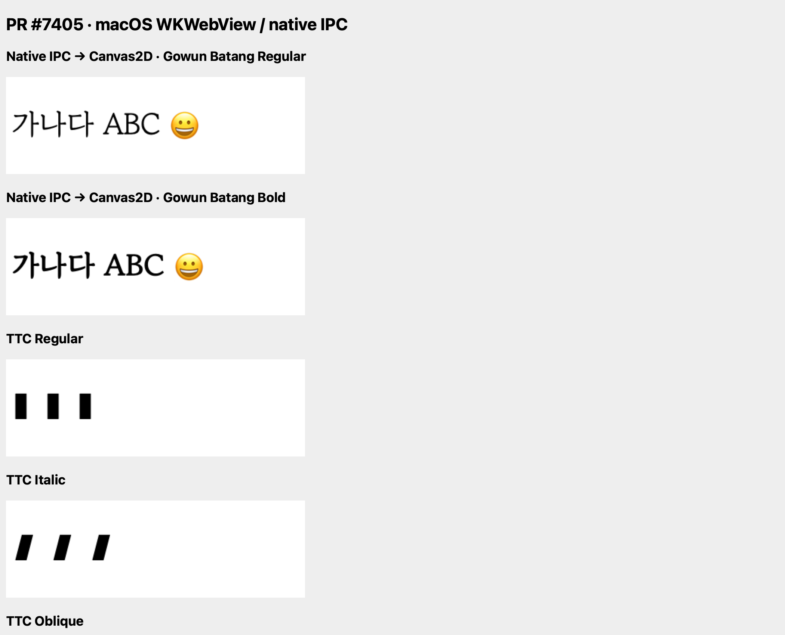
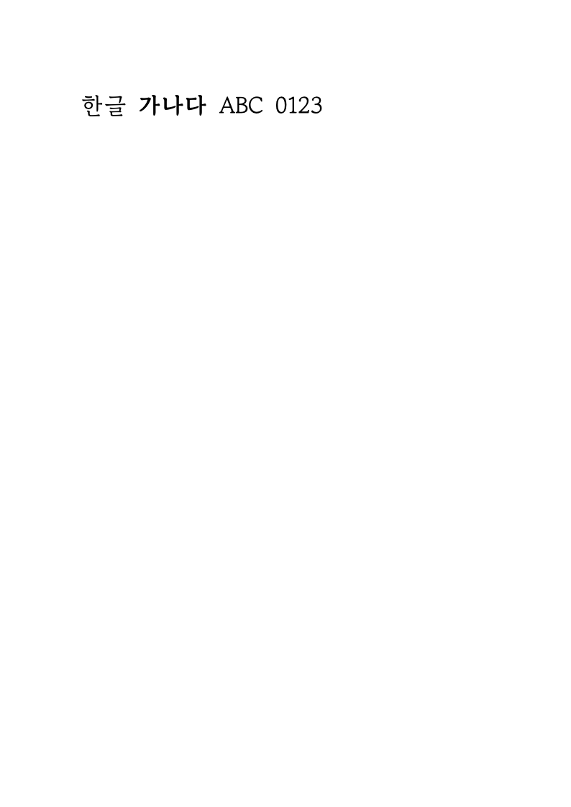
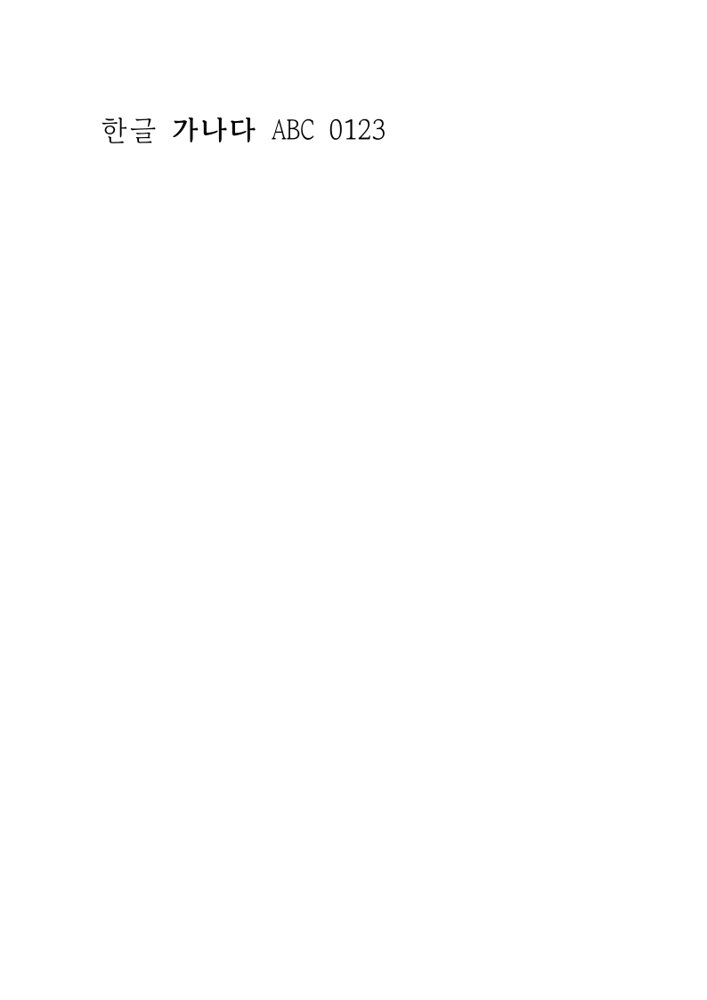

# #567 — upstream #7405 다운스트림 적합성 검증

## 결론과 범위

지정 head의 **화면용 호스트 글꼴 공급 계약은 알한글에 연결할 수 있다. 이번에 실행한 범위에서는 upstream 병합 전 blocker를 발견하지 않았다.** 실제 알한글 IPC + PR의 Canvas2D/CanvasKit 구현을 연결한 격리 probe에서 29개 검사가 통과했다. WebKit에서 실제 Apple GPU WebGL 2.0 실행도 확인했다. WebGPU는 요청해도 WebGL로 fallback하므로 **미지원**으로 판정한다.

이는 정식 PR 승인이나 #567 제품 기능 완료 판정이 아니다. 현재 앱의 전체 SwiftUI/Studio UI를 새 버전으로 교체한 테스트가 아니라, 앱의 기존 네이티브 공급 세션·WK 메시지 처리기·정적 리소스 handler·PDF renderer를 그대로 컴파일하고, 지정 upstream 소스의 렌더러/WasmBridge를 import한 별도 실행기다. 공급원은 승인된 시험 파일을 읽는 주입 fixture다. OS 탐색·권한·보관함의 실제 수용은 이번 실행에 포함하지 않았다.

현재 PDF 경로는 화면의 고운바탕을 전달받지 못해 Noto/Apple SD Gothic Neo로 출력했다. 같은 시험 바이트를 출력 WebView의 FontFace로 준비하면 PDF에도 GowunBatang Regular/Bold가 포함됐다. 확인한 실패는 알한글 출력 연결의 부족이며, PR의 문서화된 화면 계약 위반은 아니다.

## 소스와 환경

| 항목 | 값 |
|---|---|
| 알한글 브랜치/소스 | `local/task567`, `ef7d638794f82b71a71c75ef2029bf4eb3d463db` |
| 운영 core/Studio | v0.8.6, `f1f9c6ae58344ee9368996d3543f76b9345cf227` — 변경하지 않음 |
| 대상 PR | https://github.com/edwardkim/rhwp/pull/7405 |
| 검증 head | `bf371e200cfbc343094b552169864ba6c9235a27` |
| 고정 base | `505661360e9a2d596f55300d0cb0c5222f0e14b4` |
| 조회 시 원격 상태 | OPEN / CLEAN, head·base 모두 위 SHA와 일치. merge하지 않음 |
| 실행 환경 | macOS 26.5.2 (25F84), arm64, Swift 6.3.3, macOS 12 target 컴파일 |
| 웹 엔진 | 시스템 WKWebView/WebKit. UA의 macOS 10_15_7은 실제 실행 OS가 아님 |
| 격리 경로 | `build.noindex/task567/pr7405-validation/` |
| upstream 소스 | 위 경로의 `upstream`, detached worktree. 기존 upstream 작업 트리 보존 |
| Rust/WASM | 해당 worktree에서 fresh build, 공유 `target/pr-review` 캐시 재사용 |
| WASM SHA-256 | `fcb45acbe3491a981e02c5f752595fd039ca9a3e6826fe3bd730ae7b9801a35f` |

정확한 파일 해시·환경은 [provenance](assets/task_m020_567_pr7405/provenance.json), 원격 상태는 [pr-state](assets/task_m020_567_pr7405/pr-state.json)에 기록했다. upstream의 tracked renderer/provider 코드는 수정하지 않았다. fresh 빌드가 갱신한 `public/rhwp.js`와 추가 probe 진입점/config만 worktree에 있다. npm 의존성은 같은 head 작업 트리의 node_modules를 읽기 전용으로 재사용했다. 운영 lock·배포 자원·제품 소스·PR 상태는 변경하지 않았다.

## 요구사항 대조

| 요구사항 | 실제 호출 경로 | PR 제공 범위 | 다운스트림 추가 작업 | 실행 증거 | 판정 |
|---|---|---|---|---|---|
| 설치 글꼴 탐색/권한 | `InstalledFontServiceProvider` → `InstalledFontCatalogService.prepare/refresh` → `InstalledFontSystem.scan/read`, security-scoped grant, 활성 descriptor·stat 검증 | OS 접근은 호스트 책임 | 현재 서비스와 설정을 재사용 | 코드 추적. fixture는 실제 서비스의 승인/탐색을 우회함 | 경로 확인, 이번 실환경 수용 미검증 |
| 목록과 필요 바이트 분리 | `StudioFontSupply` → `StudioFontSession.handshake/catalog/openFace/readChunk/closeFace` → `StudioFontMessageHandler` → 같은 realm 공급자 | getSnapshot/readFace/subscribe | JS 어댑터, metadata 정규화, 충돌 정책, 재시도 | metadata 단계 읽기 0회, 실제 IPC 후 Regular/Bold bytes·hash 기록 | 연결 원리 충족, 제품 어댑터 부족 |
| revision과 같은 이름 교체 | native current 검사·세션 폐기 → `alhangeul-fonts-changed` → provider 구독 → upstream 세대/renderer reset | 같은 이름·개수여도 revision 변경, 늦은 결과 배제 | 원본 변경 감지와 안정적인 재연결 | 같은 이름으로 Regular→Bold bytes 교체 시 화면 변경; 이전 reference 읽기 거절 | 시험 충족 |
| 오류/늦은 응답 | native read 실패·cancel, upstream HostFontSource/HostCanvasFontSession | 실패 캐시 및 새 세대 복구 | busy/stale 제한 재시도, 사용자 상태 표시 | 읽기 실패 후 FontFace 0; 새 revision 복구. native 취소 무시 I/O와 JS signal 무시 응답 모두 detach 후 미등록 | 시험 충족 |
| 문서 전환/해제 | WasmBridge 문서 자원 reset, native begin/reset | 문서 FontFace·Typeface/pending 정리 | 앱 documentEpoch 변화와 공급자 재시작 연결 | 완료 후/준비 중 문서 전환, detach, dispose, 최종 FontFace 0, native slot 2개 재획득 | 시험 경계 충족; 실제 전체 창 reload·종료 미검증 |
| load token | native handler의 origin/main-frame/webView/token 확인 | 네이티브 인증은 범위 밖 | navigation·documentEpoch 시 handshake 갱신 | begin으로 token 교체 후 이전 요청 거절 | 인증 세대 충족; 실제 navigation reload 재실행은 미검증 |
| TTC와 스타일 | fixture → 기존 native session의 faceIndex → PR SFNT 정규화/Typeface | TTC face 선택, Regular/Italic/Oblique | **실제 서비스는 TTC를 차단 중**. 별도 지원 확대 필요 | IPC로 TTC index 0/1/2 전달, 독립 TTF의 화면/폭과 비교 | 전송·렌더링 충족, 제품 TTC 지원 부족 |
| 기본 Canvas2D | 현 앱 URL에 renderer 강제값 없음. probe: WasmBridge.initialize → prepareCanvasMetrics → renderPageToCanvas | textRun/charOverlap에 문서별 FontFace | 공개 공급자 등록 시점과 main의 갱신 연결 | WebKit 합성 문서에 실제 고운바탕 Regular/Bold. 측정/paint 동일 별칭 확인 | 시험 충족; 전체 앱 진입과 charOverlap 실문서 재검증 필요 |
| CanvasKit WebGL | prepareHostFonts → renderPage → MakeCanvasSurface | 선택 face/Typeface 공급 | 강제 backend 진단/수용 | `webgl` 요청, context=`webgl2`, renderer=`Apple GPU`, lost=false, fallback=null | 실제 GPU textRun 시험 충족 |
| CanvasKit WebGPU | makeSurface가 `webgpuSurfaceUnsupported` 기록 후 기본 surface 경로 | WebGPU surface 구현 없음 | WebGPU 지원으로 표시하지 않음 | navigator.gpu=true지만 실제 context는 webgl2 | 미지원, 성공으로 집계하지 않음 |
| 측정·그리기 | CanvasSupplementalMetricProvider + HostCanvasFontSession; CanvasKit 선택 Typeface로 Font 생성 | 선택 face를 소비자까지 유지 | metadata의 정확한 weight/slant 공급 | WebKit emoji 폭 43.2/51.84/57.6px, paint와 supplemental measure 동일. CK는 TTC/독립 TTF pixel parity | 해당 시험 충족; CK의 별도 수치 측정은 미실행 |
| 저장 이름/문서 상태 | portable renderPageSvg, exportHwp | 원래 이름과 모델 보존 | 제품 HWP/HWPX 저장/재열기 수용 | SVG에 Host Face 유지/내부 별칭 없음, 교체 전후 HWP bytes·documentGeneration 동일 | 제한된 보존 충족; dirty/undo/HWPX UI 흐름은 이번 미검증 |
| 글꼴 선택 메뉴 | toolbar.getFontMenuEntries → getLocalFonts, browser 목록 | host 목록은 renderer 전용으로 별도 관리 | 승인된 글꼴을 메뉴에 표시·선택하는 UX 별도 연결 | toolbar.ts:895/902, local-fonts의 hostLookup 분리 | 현재 API만으로 자동 메뉴 노출 안 됨, 후속 필요 |
| PDF/인쇄 | HostBridge.documentPages → getPageSvg → PagePayload → PagePDFRenderer → 별도 WKWebView → createPDF → PDFKit printOperation | portable SVG, 화면 FontFace는 내장 안 함 | 출력 전용 승인 snapshot/글꼴 공급/준비 대기 | 현 PDF는 Noto/Apple, 명시 공급 PDF는 GowunBatang | 현재 제품 부족; 출력 연결 가능성 충족 |

29개 검사와 선택 ID/revision/hash/index, GPU 진단은 [result.json](assets/task_m020_567_pr7405/result.json), native token과 lease 통계는 [lifecycle.json](assets/task_m020_567_pr7405/lifecycle.json)에 있다. 글꼴 화면의 단순 존재만으로 정확한 face 사용을 판정하지 않았다.

## 최소 어댑터와 제품 연결 시 주의점

1. 같은 page realm에서 공개 `window.rhwpStudio.fonts`가 준비된 뒤 공급자를 등록한다. getSnapshot은 native handshake와 catalog pagination으로 구성한다. readFace는 해당 revision의 auth를 캡처하고, openFace → 제한된 chunk 조립 → faceIndex 반환 → finally closeFace 순서로 처리한다. 원본 경로나 bookmark는 전달하지 않는다.
2. `postScriptName`을 `postscriptName`으로 변환한다. native installed metadata의 weight는 현재 nil이고 traits는 CoreText 형식이다. managed traits는 OS/2 flags다. 두 비트 집합을 혼용하지 않고 **정확한 weight/slant를 metadata 단계에서 정규화**해야 한다. PR matcher는 family+style 요청에서 weight/slant 일치를 사용하므로 nil 상태로 그대로 연결하면 해당 face가 선택되지 않는다.
3. upstream은 family/fullName의 빈 값을 거절한다. native validMetadata는 길이만 검사하므로 빈 이름·빈 alias 등의 검증과 제외 사유 처리가 필요하다. 잘못된 한 항목으로 전체 snapshot이 거절되지 않도록 한다.
4. 관리 복사본 우선순위·미해결 충돌은 호스트가 처리해야 한다. limitation 항목만 제외하고 설치 face를 모두 넘기면 충돌을 설치 face로 감출 수 있다. 사용 가능한 최종 목록을 정책에 따라 선택한 뒤 공급한다.
5. native의 앱 전체 동시 읽기/보관 한도는 2개다. 여러 문서와 renderer의 병렬 요청에서 busy를 영구 face 실패로 보내지 않도록 bounded queue/retry를 어댑터에 둔다. 시험은 이 부하를 전수 검증하지 않았다.
6. `setProvider`는 snapshot 준비만 기다리며 lastError도 확인해야 한다. FontFace 준비나 최종 paint가 완료됐다고 사용자에게 안내하면 안 된다.
7. 현재 `RhwpStudioWebView`는 documentEpoch 변경 시 native `begin()`으로 세션을 재발급하지만, 이 경로 자체는 JS의 `alhangeul-fonts-changed` 이벤트를 보내지 않는다. 실제 소비자 연결 시 JS의 cached auth와 upstream snapshot도 함께 재시작해야 한다. 그렇지 않으면 새 문서에서 이전 native session으로 읽어 staleSession을 받는다. 이는 downstream 연결 작업이다.
8. TTC의 transport 가능성을 제품 허용으로 일반화하지 않는다. `InstalledFontSystem.read:140`, `FontLibraryStore` 선택 검사는 현재 collection을 거절한다. 실제 승인/선택/권한 수명까지 수용한 뒤 별도로 확장한다.

시험 어댑터는 이 계약을 검증하는 코드이며 위 제품 정책·재시도·모든 오류 상태를 구현한 출시용 코드가 아니다.

## PDF/인쇄 경로와 추가 API 판단

현 경로는 이전 논의와 동일하다. `RhwpStudioHostBridgeScript.documentPages:694`가 편집 상태를 정리하고 각 페이지의 getPageSvg를 수집한다. PDF export는 PagePayload를 `RhwpStudioPDFExportController`로 전달한다. 인쇄는 `RhwpStudioPrintController`가 같은 PagePDFRenderer로 PDFDocument를 만든 다음 `PDFDocument.printOperation`으로 넘긴다.

PagePDFRenderer는 nonPersistent WebView를 별도로 만들고 page script를 비활성화한다. native의 `.defaultClient` 실행으로 `document.fonts.ready`/필요한 번들 face load를 기다린 후 페이지별 createPDF를 한다. 현재 `RhwpStudioPDFFontResource`는 Noto 4개 파일만 허용하고, 화면의 호스트 글꼴을 받는 필드나 출력 revision은 PagePayload에 없다. 준비 script는 owned fallback을 확인하거나 삽입하므로 화면 공급만으로 해결되지 않는다.

### 실제 비교

| 산출물 | PDF에 실제 포함된 글꼴 | 판정 |
|---|---|---|
| [현재 출력 PDF](assets/task_m020_567_pr7405/current-output.pdf) | NotoSansKR-Regular, NotoSansKRThin-Bold, AppleSDGothicNeo-Regular | 화면 고운바탕과 다름 |
| [명시 공급 시험 PDF](assets/task_m020_567_pr7405/output-injected.pdf) | GowunBatang-Regular, GowunBatang-Bold | 같은 승인 fixture 바이트 공급으로 원하는 face 사용 |

[pdffonts 현재 결과](assets/task_m020_567_pr7405/current-output-fonts.txt), [공급 후 결과](assets/task_m020_567_pr7405/output-injected-fonts.txt), [출력 FontFace 준비 완료](assets/task_m020_567_pr7405/output-injected-fonts.json)를 대조했다. Poppler PNG도 직접 확인했다. 두 시험 모두 같은 portable SVG를 사용했다.

출력 공급 시험은 immutable fixture bytes를 native에서 별도 WebView의 defaultClient realm으로 전달하고 FontFace.load/fonts.load/fonts.ready를 기다린 뒤 createPDF를 호출했다. Studio 공급자 API를 출력 realm에서 실행하지 않았다. 이 시험의 전체 base64 인수 전달은 소규모 가능성 검증이며 제품의 chunk/메모리/취소 정책을 대신하지 않는다. 시험은 한 페이지 static Regular/Bold이며 TTC 출력, 다쪽 중 원본 교체, 인쇄 장치 출력은 미검증이다.

출력 revision 고정은 downstream 책임으로 구현할 수 있다. managed asset은 기존 `FontLibrarySnapshot` lease와 hash 검증 read를 별도 출력 작업 수명으로 보유할 수 있다. installed 원본은 현재 live generation이 바뀌면 읽기가 실패하므로, 필요한 파일들을 동일 revision에서 읽고 hash·face를 확인한 불변 자원을 고정하거나 변경 시 **전체 출력 작업을 실패/재시도**해야 한다. 페이지별로 다른 revision을 섞으면 안 된다. 화면용 StudioFontSession을 출력 작업의 lease로 공유하면 화면 전환/설정 변경에 같이 무효화되므로 별도 소유자가 필요하다.

**현재 증거로는 upstream에 출력 snapshot API나 화면 readiness API를 병합 필수 조건으로 추가할 근거가 없다.** 출력은 portable SVG와 호스트 소유 글꼴로 재현할 수 있었다. 최종 화면 캡처 완료를 외부에 보장하는 요구라면 별도의 paint readiness 계약이 유용할 수 있지만, setProvider를 그런 의미로 해석해서는 안 된다. 복잡한 출력의 PS/fullName·style·fallback 일치까지 검증한 것은 아니므로 모든 출력이 해결됐다는 결론도 내리지 않는다.

글꼴 메뉴의 host 목록 표시 역시 현재 화면 렌더링 API와 별도 요구다. 알한글에서 어떤 선택 UI를 제공할지 결정한 뒤, Studio 메뉴 통합이 필요하면 그 범위를 별도 제안할 수 있다. 기존 PR의 문서화된 범위를 소급해서 넓힐 사유로 취급하지 않는다.

## 실행 명령과 증거

검증 루트는 `/Users/melee/Documents/projects/rhwp-mac/build.noindex/task567/pr7405-validation`이다. `upstream`은 지정 head의 격리 sparse worktree이며 saved, assets/fonts 등 빌드 입력도 같은 head에서 가져왔다.

```sh
# upstream 루트, 다른 Cargo 작업이 없음을 확인한 뒤
CARGO_TARGET_DIR=/Users/melee/Documents/projects/forks/rhwp/target/pr-review \
  scripts/wasm-pack-locked.sh --target web --out-dir pkg --dev
# upstream/rhwp-studio
./node_modules/.bin/vite build --config vite.probe.config.ts
# 알한글 저장소 루트
python3 build.noindex/task567/pr7405-validation/build-probe.py
build.noindex/task567/pr7405-validation/FontProviderProbe.app/Contents/MacOS/FontProviderProbe
pdffonts build.noindex/task567/pr7405-validation/current-output.pdf
pdffonts build.noindex/task567/pr7405-validation/output-injected.pdf
pdftoppm -png -scale-to 1123 -singlefile build.noindex/task567/pr7405-validation/output-injected.pdf build.noindex/task567/pr7405-validation/output-injected-rendered
```

[JS probe](assets/task_m020_567_pr7405/probe.ts), [Swift 실행기](assets/task_m020_567_pr7405/main.swift), [빌드 스크립트](assets/task_m020_567_pr7405/build-probe.py), [Vite 설정](assets/task_m020_567_pr7405/vite.probe.config.ts), [WASM 빌드](assets/task_m020_567_pr7405/wasm-build.log), [probe 빌드](assets/task_m020_567_pr7405/probe-build.log), [실행 로그](assets/task_m020_567_pr7405/run.log), [증적 해시](assets/task_m020_567_pr7405/checksums.json)를 보존했다.

첫 실행의 두 TTC 비교 실패는 [result-first](assets/task_m020_567_pr7405/result-first.json)에 남겼다. 시험 문구에 fixture가 지원하지 않는 글자를 포함해 OS fallback의 synthetic italic을 비교했고, Oblique 비교에는 모든 slant가 있는 목록에서 italic을 요청하는 오류가 있었다. 지원 glyph `A가😀`와 정확한 slant로 보정한 뒤 독립 standalone TTF와 비교하여 모두 통과했다. 제품 코드는 이 보정 과정에서 변경하지 않았다. 최초 sparse checkout의 assets/fonts 누락과 Swift probe용 presenter stub 누락도 실행기 준비 오류로 구분하며 PR 결함으로 집계하지 않았다.

출력 thumbnail의 임시 PDFDocument 수명 경고가 마지막 실행 로그에 있다. PDF 자체와 pdffonts 검증은 정상이며, 해당 임시 thumbnail을 시각 증거로 사용하지 않고 보존한 PDF를 Poppler로 다시 렌더했다.

## 대표 화면

실제 WebKit IPC와 고운바탕/시험 TTC:



실제 WASM 문서의 Canvas2D 화면:



같은 SVG에 글꼴을 명시 공급한 PDF:



## 병합 전 판단과 후속 작업

- **이번 검증 범위의 upstream blocker: 없음.** WebKit+native IPC, 실제 WebGL에서 화면 계약을 위반하는 재현은 찾지 못했다. 기존 upstream CI/Chrome 결과는 인계 자료이며 이번 29개 실행과 합쳐 같은 환경 검증으로 집계하지 않았다.
- **알한글 후속 필수:** metadata 정규화/충돌 정책, bounded 전송·재시도, 실제 lifecycle 연결, 편집기 선택 UX, 제품별 제한 표시, #568 출력 snapshot/글꼴 준비 연결.
- **아직 미검증:** signed sandbox의 실제 설치 글꼴 탐색·권한 복원, OS 지속 설치, macOS 12 runtime, 전체 SwiftUI/Studio navigation reload 및 앱 재실행, 여러 문서 부하·메모리 상한, 복잡한 실문서 GPU/charOverlap, TTC 출력·다쪽 출력 중 revision 변경, HWPX/dirty/undo/redo 전체 제품 흐름, 실제 인쇄 장치.
- 위 항목은 환경 또는 승인된 분석 범위 안에서 전체 제품 구현을 하지 않았기 때문에 남았다. GPU 소프트웨어 fallback을 통과로 세거나 시험 fixture 주입을 실제 권한 수용으로 세지 않았다.
- 운영 의존성 갱신·배포·PR merge·외부 코멘트는 수행하지 않았다. 검증 전용 앱 등록 해제 결과는 별도 cleanup 로그로 보존한다.

## 2026-09-25 병합 후 산출물 정리

요청 세션에서 최종 head `7978d00b8253ccc5876f95ed8e668a5ab93fbff5`의 squash merge SHA `aeb9f489e1d5e297c1e98cf1ca8ff84532270aca`와 사용자 정리 승인을 인계받았다. **이 보고서의 실행 증거는 여전히 `bf371e200cfbc343094b552169864ba6c9235a27` 대상이며, 후속 head를 재검증했다는 뜻이 아니다.**

기존 보존 증거 29개의 해시, 실행기 원본, 생성 glue 해시가 일치함을 확인했다. 증거 봉인 이후 변경 파일과 대상 프로세스/작업 디렉터리 사용 프로세스는 없었다. 추가 canvas PNG·최초 실행 로그·패키지 lock·재구성 안내를 보존한 뒤 다음 경로를 정리했다.

- `build.noindex/task567/pr7405-validation/upstream`: detached worktree를 Git에서 제거. 자체 probe 및 생성 glue 이외 변경 없음.
- `build.noindex/task567/pr7405-validation`: 시험 앱, module-cache, WASM/Studio 산출물 등 전용 디렉터리를 제거. 삭제한 트리 할당량은 **1,141,400 KiB = 1,168,793,600 bytes, 약 1.09 GiB**다. 이는 `du` 기준이며 APFS snapshot/공유 블록을 고려한 실제 가용 용량 증가의 보장은 아니다.
- `/private/tmp/rhwp-7403/rhwp-studio/node_modules`로 향하던 링크도 제거했다. 원본 임시 디렉터리는 이 작업에서 삭제하지 않았고, 이 검증을 위해 유지할 의존성은 남지 않았다. `/private/tmp/rhwp-7403-target` 의존성도 없다.

별도 구현 worktree `build.noindex/task567/upstream`과 시험 글꼴 폴더는 존재를 확인해 보존했다. 공유 `target/pr-review`와 운영 앱·의존성은 정리 명령의 대상에 넣지 않았다. 단, 후검사 시 `/Users/melee/Documents/projects/forks/rhwp/target/pr-review`는 존재하지 않아 공유 캐시 존재 확인 assertion이 실패했다. 이 작업이 해당 경로를 삭제한 것은 아니며, 요청 세션에 현황을 알렸다. 보고서와 증거는 보존했고 [재구성 안내](assets/task_m020_567_pr7405/REPRODUCE.md), [정리 기록](assets/task_m020_567_pr7405/artifact-cleanup.json), [갱신한 증거 해시](assets/task_m020_567_pr7405/checksums.json)를 참고한다. 원본 명령의 실행 디렉터리는 재구성 전에는 존재하지 않는다.
