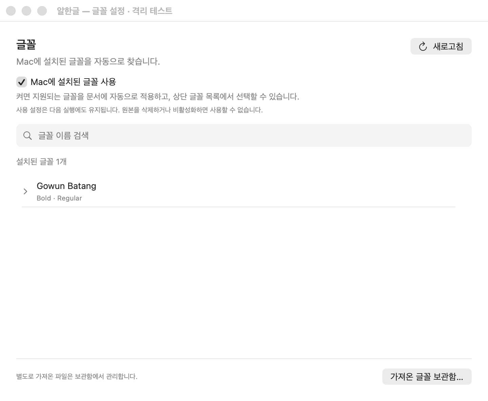
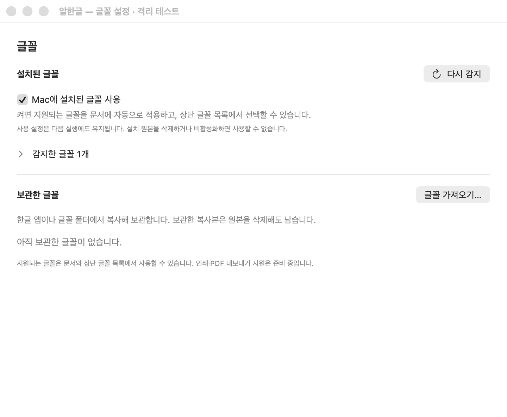

# Task #567 Stage 4 — 글꼴 변경 반영과 자동 사용 흐름

2026-10-07 사용자가 Stage 3.3을 테스트한 뒤 “테스트했어. 다음을 진행해줘.”라고 지시하여 Stage 4를 진행했다. `local/task567`의 `f287ab2`에서 시작해 설치/관리 변경 전파, 실패 복구, 새 프로세스 자동 사용, 설정 안내를 구현·검증했다. Stage 5·이슈 전체 완료·공개 배포는 남아 있다.

## 구현 결과

- 보관함 설정 UI가 Studio와 같은 `FontLibraryService.shared`를 사용한다. 기존에는 UI가 별도 서비스 인스턴스를 생성하여 가져오기·제거 뒤 열린 문서의 변경 구독에 알림이 도달하지 않을 수 있었다.
- 설치 catalog의 반복 `prepare()`는 준비된 metadata를 공유한다. 시작 시 저장된 읽기 거부를 재검사하고, 수동 새로고침은 읽기 실패를 재시도한다. 실제 bytes는 해당 face 요청까지 미리 읽지 않는다.
- 앱 활성화 시 권한 실패 재시도를 포함한 debounce 갱신을 요청한다. 이어지는 CoreText 알림이 재시도 의도를 지우지 않도록 누적하고 취소된 Task가 이를 소비하지 않도록 검사한다.
- 기존 native 공급·변경 observer에 동일한 서비스 주입 경계를 제공했다. 기본 제품 경로는 공유 서비스를 사용하며 격리 WK 시험도 같은 공급/observer를 사용한다. 현재 load token의 성공한 face 응답에서 ID·PS·검증 hash만 관찰하는 선택적 검증 callback을 추가했다.
- 설치 사용 checkbox를 설정 상단에 표시하고 실제 문서 적용·기존 상단 목록 선택·재실행 유지 안내로 수정했다. 원본 삭제/비활성화 시 사용할 수 없음을 표시한다. 신규 기본값 `false`와 기존 저장값을 보존했다.
- 보관함 안내는 화면 표시·편집 지원과 아직 준비 중인 인쇄·PDF 지원을 구분한다.

Stage 3.3의 앱 소유 메뉴 어댑터, 정식 upstream source, core pin, WASM 및 Studio bundle은 수정하지 않았다. v0.8.7의 기존 host 변경 처리와 renderer 리소스 갱신이 이번 실제 검증에서 동작하여 추가 upstream 수정은 필요하지 않았다.

## 검증 결과

| 검증 | 최종 결과 / 근거 |
|------|------------------|
| `scripts/test-font-library.sh` | native 104개, JS 24개 통과. 새 native 회귀 4개는 준비 공유·새 서비스 권한 재검사·debounce 재시도 유지·UI 수동 복구를 확인한다. [로그](assets/task_m020_567_stage4/font-library-tests.log) |
| HostApp Debug | macOS 12 target compile/link 성공. `build.noindex/task567/stage4-host-build.log` |
| 실제 WK native 변경 시험 | Canvas2D/CanvasKit 합계 31항목 통과. [결과](assets/task_m020_567_stage4/changes-result.json) · [로그](assets/task_m020_567_stage4/changes-run.log) |
| 관리 복사본 새 프로세스 | 원본 없음·설치 사용 꺼짐 상태에서 Regular/Bold 자동 적용 등 5항목 통과. [결과](assets/task_m020_567_stage4/reopen-result.json) |
| 설치 원본 새 프로세스 | 관리 복사본 없이 저장된 켜짐 설정·설치 원본만으로 두 face 자동 적용 4항목 통과. [결과](assets/task_m020_567_stage4/installed-reopen-result.json) |
| HWP/HWPX 저장·재열기 | 두 형식에서 본문, Regular/Bold와 돋움 구간, 7개 언어 이름, 내부 alias 미유출을 대조했다. [6개 위치 증거](assets/task_m020_567_stage4/changes-saved-proof.json) |
| 실제 SwiftUI/Studio lifecycle | 문서 전환·편집·저장·종료 및 WebKit 전송 43항목 통과. [로그](assets/task_m020_567_stage4/studio-lifecycle.log) |
| Studio provenance | v0.8.7 checkout commit·Cargo.lock·메뉴 adapter receipt·정적 자원 검증 통과. [로그](assets/task_m020_567_stage4/studio-assets.log) |
| 경계·문법 | `check-no-appkit.sh`, Node 문법, Python AST, `git diff --check` 통과 |

열린 문서에서 사용 끄기/켜기, 실제 전용 복사본의 읽기 거부/복구, 같은 PS 이름의 bytes 변경, 설치 후보 제거/복귀, 관리 가져오기/제거/재가져오기를 확인했다. catalog와 renderer resource generation 변경, Canvas2D 측정 session의 loaded/pending, CanvasKit의 local Typeface 수·pending·렌더 완료를 대조하여 이전 리소스와 실패 캐시가 남지 않는지 검사했다. 늦은 읽기를 gate로 대기시킨 상태에서 여러 문서로 전환한 후 오래된 성공 응답이 게시되지 않음도 확인했다.

bytes 변경은 유효 SFNT 뒤에 4 bytes padding을 더했다. 이름·스타일·glyph를 유지하면서 hash가 `466c593e…`에서 `70304f96…`로 바뀌었으며 실제 native 응답의 hash를 확인했다. 시각적으로 다른 글꼴 버전의 metrics 정확성을 이 시험으로 주장하지 않는다. [face 공급 증거](assets/task_m020_567_stage4/change-face-proof.json)에 원본·변경본·관리 출처를 보존했다. 변경만으로 문서 `dirty`가 켜지지 않고 원래 이름/스타일이 유지되는 것을 확인했으며 undo stack 자체는 별도 검사하지 않았다.

## 실제 화면과 직접 조작

설정 창 “알한글 — 글꼴 설정 · 격리 테스트”와 문서 창 “알한글 — 글꼴 변경 연동 · 격리 테스트 문서”를 열어 두었다. 설정 checkbox를 껐다 켜면 같은 문서의 글꼴 리소스와 상단 목록이 바뀐다. 펼친 family에서 Bold/Regular를 확인하고 기존 상단 글꼴 목록에서도 선택할 수 있다. 보관함 버튼은 같은 격리 관리 서비스의 UI를 연다.

- [권한 실패 표시](assets/task_m020_567_stage4/settings-permission.png)
- [새 프로세스 설치 글꼴 적용](assets/task_m020_567_stage4/studio-installed-reopen.png)
- [재현·검증 경계](assets/task_m020_567_stage4/REPRODUCE.md), [증거 SHA256](assets/task_m020_567_stage4/checksums.json)

앱은 `build.noindex/task567/stage4/final/StudioFontIntegrationProbe.app`이며 실제 제품 Coordinator·설정 View·서비스·v0.8.7 Studio를 사용한다. 사용자 앱 preferences·글꼴 보관함은 사용하지 않는다. 활성 설치 목록만 전용 복사본으로 주입했고 파일 bytes·stamp·읽기 거부·삭제는 실제 파일에서 검증했다. OS에 고운바탕을 지속 설치하거나 새 폴더 권한 bookmark를 허용받은 시험은 아니다.

## 중간 실패와 정리

최초 JS WebKit transport 관찰이 실제 응답을 수집하지 못하여 hash 검증이 실패했다. 현재 frame/token 검사 뒤의 native 검증 callback으로 바꾼 후 최종 시험을 통과했다. NSView 캐시 캡처는 검은 이미지를 만들었고 외부 `screencapture`도 실패했다. 해당 이미지는 증거로 채택하지 않고 현재 프로세스 창만 대상으로 하는 ScreenCaptureKit 캡처로 해결했다. 최초 linker 옵션 오류도 수정했다. 최종 보존한 PNG는 실제 창을 확인한 결과다. 다른 앱 화면 조회나 전역 화면 권한 변경은 하지 않았다.

이번 lifecycle smoke의 소유 앱 등록 해제는 성공했다. HostApp Debug 경로의 등록 해제 요청은 `-10814`를 반환했으며 이를 전역 등록 정리 성공으로 집계하지 않았다. 전역 check-only의 기존 개발 등록 문제는 이번 화면/편집 시험과 분리하고 다른 작업의 앱·등록을 변경하지 않았다. 이전 Stage 4 체험 프로세스만 실행 경로를 확인한 뒤 종료했다. 최신 체험 창은 유지하며 닫으면 해당 probe 경로만 등록 해제한다. Quick Look/Thumbnail 개발 등록이나 전역 cache reset은 수행하지 않았다.

## 잔여 검증과 다음 단계

CoreText 알림·앱 활성화·수동 새로고침 및 실제 읽기 시 원본 검사에 의존한다. 알림 없이 외부에서 바뀐 파일이 즉시 모든 창에 반영된다고 보장하지 않는다. 이번 GUI 시험은 arm64 개발 환경에서 수행했고 최소 macOS 실제 실행·Intel 실제 실행·signed sandbox bookmark 복원·다중 제품 창과 대규모 성능 수용은 남는다. 설정 screenshot helper만 macOS 14.4 이상이 필요하며 제품 target은 macOS 12를 유지한다.

다음 Stage 5는 실제 문서·signed sandbox·cold/warm 필요 bytes 읽기 및 다중 창 회귀와 #568/#569 인계다. OS 지속 설치가 필요한 경우 시험 대상·위치·복구 범위를 제시하는 기존 승인 경계를 따른다. [운영 규칙](../../AGENTS.md)의 “각 단계 완료 후 승인 없이 다음 단계 진행 금지”에 따라 Stage 5는 다음 단계 지시 후 진행한다. 이번에는 push·PR 생성·이슈 close·릴리스를 하지 않았다.

## Stage 4.1 완료 — 2026-10-08

사용자가 설정 간소화 제안에 “그렇게 진행하고 싶어”라고 수락하고 실행마다의 탐색 비용 조사를 지시했다. `fb2f303`에서 시작하여 Stage 4.1로 계획을 보정했다. Stage 5·시작 정책 변경·OS 지속 설치·배포는 포함하지 않았다.

### 설정·가져오기 보정

- 제품의 설정 → 글꼴 안에서 사용 checkbox·다시 감지·감지 개수를 기본 표시한다. 설치 상세는 접어 두고 필요한 때만 검색·family/스타일·권한 복구를 표시한다. 폴더 bookmark 문제는 접힌 목록 밖에서도 복구 경로를 유지한다.
- 상세 content를 펼칠 때 생성하고 단일 바깥 ScrollView에서 긴 내용을 탐색한다. 화살표 간격·제목 행 전체 클릭·자식 들여쓰기·목록 오른쪽 여백을 유지한다.
- 같은 설정에 보관한 글꼴 요약/접힌 상세와 “글꼴 가져오기…”를 배치했다. 기존 “보관함 sheet → 가져오기 sheet”의 중첩을 제거했다.
- 보관함 준비 실패의 다시 시도와 펼친 보관 목록의 새로고침 경로를 유지했다. 가져오기 일부 결과의 재확인 문구도 새 진입 구조에 맞췄다.
- 가져오기 제목과 결과 안내도 지원되는 화면·상단 목록 사용, 미완료 인쇄/PDF 범위에 맞췄다. 설치 원본 참조와 삭제 후에도 남는 관리 복사본을 구분한다.
- 실제 sheet의 닫힘을 부모의 `onDismiss` 한 곳에서 처리하고, 이전 sheet의 늦은 닫힘 알림이 재개한 가져오기를 취소하지 않도록 보호했다. 내용 View의 중복 `onDisappear` 정리는 제거했다. 새 회귀는 느린 탐색 중 이전 닫힘 알림과 현재 sheet의 실제 닫힘을 구분한다.
- 가상 28개 UI probe는 새 output·ID·저장소로 실행할 수 있게 했다. 기존 Stage 3/4 체험 앱 파일을 덮어쓰지 않았다. 사용자 글꼴·설정·추가 권한은 변경하지 않았다.

### 시작 지연 조사 결과

매번 새 프로세스에서 metadata를 재검사하며 저장 JSON은 실제 설치 상태 재검사를 대체하지 않는다. 사용 꺼짐에서도 시작 준비가 실행되고, 첫 앱 활성화는 별도 refresh를 요청한다. 같은 프로세스의 반복 준비는 공유된다. 전체 font bytes를 직접 선읽지는 않지만 catalog actor를 기다리는 글꼴 공급에 비용이 전파될 수 있다.

실제 Mac의 809 faces / 232 families를 새 CLI 프로세스 5개에서 조사했다. 최초 준비 471.03ms, 저장 목록을 복원한 준비 중앙값 382.33ms, 전체 metadata scan 중앙값 378.97ms였다. 시작 준비 후 최초 활성화를 순서대로 재현하면 각 프로세스에서 scan 2회, 같은 프로세스의 준비 20회는 추가 scan 0회, 직접 font bytes 요청은 0회였다.

전체 앱 시작 시간·OS cold 상태·signed sandbox 성능은 측정하지 않았다. CoreText 내부 I/O도 0이라고 주장하지 않는다. 최초 활성화의 중복 탐색을 합치는 것이 우선 개선 후보이며, 사용 꺼짐의 지연 준비는 관리 복사본·실패 의미를 보존하는 별도 정책 보정이 필요하다. 이번에는 해당 시작 정책을 변경하지 않았다. [호출 경로·실측·권고](../tech/task_m020_567_startup.md)와 [집계 원본](assets/task_m020_567_stage4_1/startup-summary.json)을 참조한다.

### 검증·직접 조작

| 검증 | 결과 |
|------|------|
| 글꼴 회귀 | native 105개 / JS 24개 통과. 기존 104 + 늦은 sheet 닫힘 회귀 1개. [로그](assets/task_m020_567_stage4_1/font-library-tests.log) |
| 실제 WK | 열린 문서 변경 31 + 관리 복사본 새 프로세스 5 + 설치 원본 새 프로세스 4항목 통과. 실제 sheet 표시/종료를 기다린 뒤 같은 공급/렌더러 경로를 검증 |
| HWP/HWPX | 저장·재열기 6개 위치의 원래 본문·이름·굵기·alias 미유출 대조 통과. [증거](assets/task_m020_567_stage4_1/changes-saved-proof.json) |
| HostApp | 최종 소스 Debug/macOS 12 target compile/link 성공. [로그](assets/task_m020_567_stage4_1/host-build.log) |
| 실제 문서 lifecycle | sheet 닫힘 보정 뒤 독립 재실행 43항목 통과. [로그](assets/task_m020_567_stage4_1/studio-lifecycle.log). 마지막 오류 재시도/목록 새로고침 UI 보정은 HostApp 빌드·native 회귀로 확인 |
| 실제 설정 UI | 28개 가상 family의 접힘/펼침·검색 표시·권한 상세·스크롤·직접 가져오기·닫기 복귀를 Cua로 조작하고 실제 화면을 확인. [조작 기록](assets/task_m020_567_stage4_1/ui-checks.json) |
| 경계/provenance | Studio 자원·메뉴 receipt·공식 checkout 대조, no-AppKit, 변경 shell 문법 및 diff 검사 통과. core/Studio bundle은 무변경 |

“알한글 글꼴 — 가상 글꼴 28개 · 테스트” 창을 기본 접힘 상태로 열어 두었다. 가상 목록의 화면 조작용이며 문서 공급 성공의 증거는 별도 고운바탕 WK 시험으로 구분한다. “알한글 — 글꼴 설정 · 격리 테스트”/문서 창은 설치 사용 toggle의 실제 변경 연동을 확인할 수 있다. 제품 자체가 별도 글꼴 관리 창을 항상 여는 구조는 아니다.

### 중간 실패·한계

권한 시험은 목록 무효화 중의 일시적인 count=0을 완료로 오인하여 먼저 실패했다. native 두 face의 실제 실패 게시를 기다리도록 보정했다. UI를 inline으로 옮기면서 실제 가져오기 sheet가 나타나므로 모델만 즉시 조작하던 기존 시험도 native sheet의 표시·종료를 기다리도록 보정했다. 이후에도 재개한 탐색이 취소되는 실패를 확인하여 중복 View 사라짐 정리를 제거하고 늦은 닫힘 보호를 추가했다. 최종 native/GUI 회귀가 통과했으며 [중간 실패 1](assets/task_m020_567_stage4_1/first-attempt-changes-result.json)·[2](assets/task_m020_567_stage4_1/second-attempt-changes-result.json)·[3](assets/task_m020_567_stage4_1/third-attempt-changes-result.json)을 보존했다.

최종 lifecycle 첫 실행은 저장 뒤 실제 창 닫힘 대기에서 실패했다. 그 코드는 이번 UI 보정에서 변경하지 않았으며 원인을 제품 회귀로 단정하지 않았다. [실패 로그](assets/task_m020_567_stage4_1/studio-lifecycle-first-failure.log)를 유지하고, 같은 소스를 다른 UI 조작 없이 독립 재실행해 43항목 통과를 확인했다. 성공으로 덮어쓰거나 최초 실패가 없었다고 주장하지 않는다. 화면 확인 도구의 앱 선택 응답에도 긴 지연이 있었으나 이후 실제 조작/화면 확인은 완료했다.

이번 소유 lifecycle 앱은 종료 시 해당 경로 등록 해제를 수행했다. HostApp Debug 경로 해제는 `-10814`를 반환했으며 전역 clean 성공으로 집계하지 않았다. 직접 조작 창은 유지하며 종료 후 각 probe의 소유 경로만 해제한다. 전역 등록 clean·최소 OS/Intel 실제 실행·signed sandbox 및 대규모 성능 수용은 이번 결과가 아니다. Stage 5와 시작 최적화 후속 범위는 다음 지시 후 보정한다.
