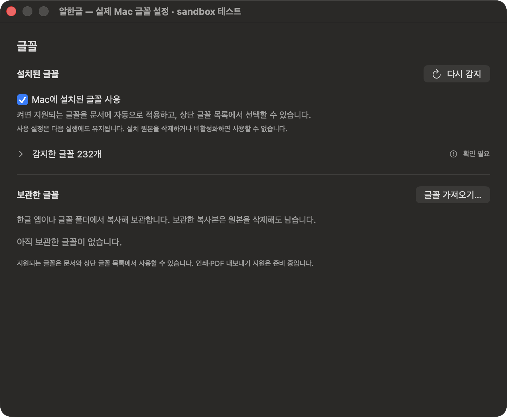
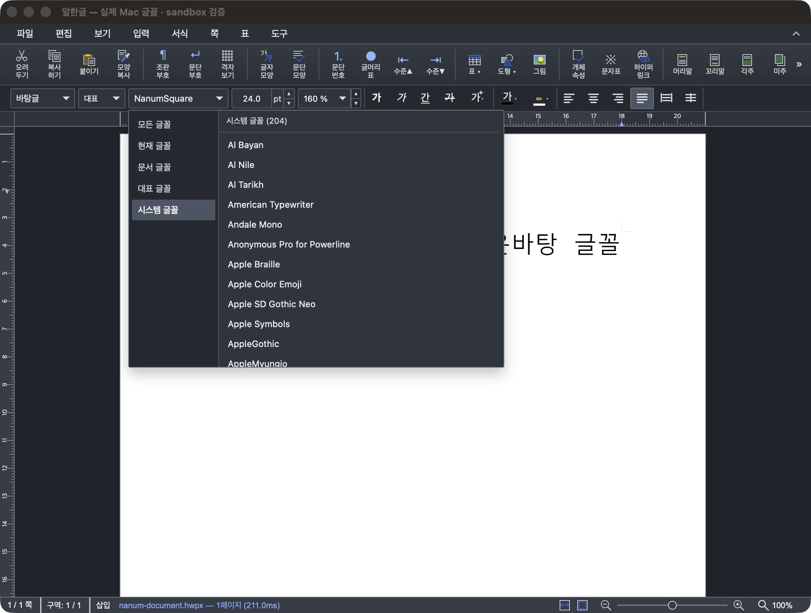

# Task M020 #567 Stage 5 — 실제 Mac 글꼴·문서·sandbox 수용과 인계

- 수행일: 2026-10-08, 단계 완료: 13:53 KST
- 승인: “다음 Stage 5를 진행해줘”. 기존 로컬 인증서의 키체인 접근도 작업지시자가 허용했다.
- 상태: Stage 5 완료. 최종 보고·PR 게시 단계 승인 대기. 이슈 close·push·배포는 수행하지 않았다.
- 기준: `local/task567`, 이전 단계 `8e0b6d8`, [구현계획](../plans/task_m020_567_impl.md).

## 1. 결과와 변경

실제 CoreText 활성 목록을 사용하는 로컬 서명 sandbox 앱에서 제품 catalog·bytes 공급·기존 글꼴 메뉴·Canvas2D/CanvasKit·native 저장 bridge를 연결해 검증했다. 가상 활성 목록을 주입하지 않았다. 이미 설치된 NanumSquare Regular/Bold를 사용했고 OS 글꼴 설치·삭제나 사용자 원본·제품 설정·관리 App Group 변경은 없다.

첫 프로세스 **20개**, 같은 앱의 새 프로세스 **17개** 검증이 통과했다. 저장한 HWP/HWPX는 공식 bundled WASM으로 **8개 위치**의 원래 family·굵기·본문과 내부 renderer alias 미유출을 확인했다. 새 프로세스에서도 사용 설정이 복원되고 두 실제 face가 재공급되어 저장 문서를 표시했다. native 저장은 제품 dispatcher → session guard → save bridge → payload 검증 → 실제 파일 쓰기 → 완료 동기화 경로다. 테스트 컨테이너의 저장 위치·합성 문서 변환 확인과 InputEvent만 주입했으며 물리 파일 패널·IME 조작으로 주장하지 않는다.

이번 단계의 변경은 `Tests/StudioFontAcceptanceProbe/`, `scripts/probe-studio-font-acceptance.py`, 문서와 fixture 도구의 선택 family/저장 검증 모드다. 제품 소스·core pin·framework·Studio bundle·Xcode 설정은 변경하지 않았다. 새 도구는 현재 소스/Studio/framework와 실행 파일의 hash 영수증이 일치할 때만 빌드를 재사용한다.

## 2. 실제 목록과 정확한 적용 증거

| 항목 | 결과 |
|------|------|
| 환경 | arm64, macOS 26.5.2 (25F84), macOS 12 target compile/link |
| 실제 목록 | **232 family / 809 face**, metadata 접근 실패·omitted 0, 가변 축 face 118 |
| 기존 시스템 메뉴 | **204 family**, NanumSquare는 Regular/Bold를 합쳐 한 번 표시 |
| Canvas2D | 검증한 Regular/Bold bytes 공급, FontFace loaded 2 / pending 0 / failed 0. 실제 `fillText`의 서로 다른 Regular/Bold host alias 기록 |
| CanvasKit | 실제 effective backend `canvaskit`, local Typeface 2 / pending 0 / failure 0, render 완료·오류 없음 |
| 글꼴 변경·입력·저장 | 기존 메뉴로 선택·한글 입력 후 native HWPX 저장 및 HWP로 다른 이름 저장 성공 |
| 새 프로세스 | 설정·metadata 복원, 실제 활성 목록 재검사, 두 face 재읽기, HWP/HWPX 본문·스타일 복원 |
| 설정 왕복 | 실제 목록의 제품 설정 View를 표시해도 문서 epoch/changeSeq/dirty 보존 |

232/809는 감지 정보이고 204는 메뉴에 노출된 family 수다. 파일을 선읽지 않으므로 메뉴 항목 전체의 bytes/renderer 지원 성공 수로 해석하지 않는다. 가변은 제한되며 TTC/collection은 필요한 읽기에서 `unsupported`로 거부할 수 있다. 이번 정확한 적용 수용은 static 한글 face 두 종에 대한 증거다. 초기 문서의 ‘돋움’ tail은 원래 글꼴의 정상 fallback 대조이며, NanumSquare 적용 성공과 구분한다.

| 검증한 face | bytes | SHA-256 |
|-------------|------:|---------|
| NanumSquareR | 723,640 | `5a51deae5237435d9a0bc0cc6cc30619a914b29801f895698cfdacadcad06e94` |
| NanumSquareB | 733,500 | `f737d58294faec9c632189af3a2a3e48e49c03c0256de09db61e879e2857bfbf` |

native 원본 검증과 Studio frame에 공급한 PS/hash를 대조했다. [첫 결과](assets/task_m020_567_stage5/first-result.json), [재실행 결과](assets/task_m020_567_stage5/reopen-result.json), [저장 재열기 증거](assets/task_m020_567_stage5/first-saved-font-proof.json)에 원본 경로나 bookmark는 없다.

## 3. 읽기·준비 비용과 권한

| 항목 | 첫 프로세스 | 설정·문서 복원 프로세스 |
|------|------------:|-----------------------:|
| metadata 탐색 | 1회 / 442.29ms | 1회 / 440.58ms |
| 서비스 최초 준비 | 454.73ms | 453.23ms |
| 목록 준비의 font bytes 읽기 | 0회 | 0회 |
| HWP 요청→document ready | 2,151.38ms | 1,006.46ms |
| HWPX 요청→document ready | 1,146.42ms | 1,161.35ms |
| 각 문서의 실제 face 읽기 | 각 2회 | 각 2회 |
| 반복 SVG 표시·기존 확대/축소 | 추가 읽기 0회 | 추가 읽기 0회 |
| 전체 메뉴 열기 | 추가 읽기 0회 | 추가 읽기 0회 |

동시 최초 준비 8회와 최초 활성화 호출이 실제 탐색 한 번을 공유했다. 같은 face의 8개 동시 요청은 native 읽기 한 번으로 병합했고, 서로 다른 Regular/Bold는 두 slot에서 공급했다. 완료 후 같은 face를 다시 요청하면 원본을 재검증한다. 테스트의 총 native 읽기 10/8회에는 직접 읽기 대조 4회와 문서 4회가 포함되며, 첫 프로세스에는 편집으로 리소스 세대가 바뀐 뒤 두 face 재읽기가 더 있다. 본문 두 face 외 모든 목록 bytes를 읽은 결과가 아니다.

native 읽기/검증의 측정 범위는 69.73–86.81ms다. 동시 요청 도착을 겹치게 하는 150ms의 테스트 지연은 `readMS`에서 제외한다. CoreText 알림 감시는 이 결정적 계측에서 끄고 활성화 호출을 재현했다. 제품의 실제 알림·활성화 전달은 기존 회귀와 구분한다. 전체 helper 6.43/5.24초에는 검증 대기·직접 읽기 대조·촬영이 포함된다. 전체 제품 시작 시간·OS font server cold·최적화 전후의 인과 비교로 사용하지 않는다. 이전 CLI 목록 528/180과 이번 앱 프로세스 809/232도 같은 조건의 속도 비교가 아니다.

#565의 기존 승인 폴더 `build.noindex/task565-stage4/installed-font-permission-fixture`는 동일 bundle ID/기존 서명 기준의 별도 앱으로 재실행했다. 두 새 프로세스 모두 `restoredEnabled=true`, bookmark 1, `bookmarkRead=true`, grant issue 0이었고 공용 NanumSquare PS/hash가 위 표와 일치했다. 폴더를 다시 선택하거나 새 Studio 앱으로 bookmark를 복사하지 않았다. 이 별도 앱의 레코드 810에는 프로세스에만 등록한 자체 fixture 한 개가 포함된다. [권한 첫 재검증](assets/task_m020_567_stage5/catalog-first.json), [두 번째 재실행](assets/task_m020_567_stage5/catalog-relaunch.json).

## 4. 회귀·재현·직접 조작

- 새 실행: 서명/entitlement·sandbox 문서 검증 20+17, 저장 위치 8개 대조, 기존 권한 두 새 프로세스, JS 25개, no-AppKit·문법·diff 검사 통과.
- 재사용: Stage 4.2의 native 109·WK 변경/복원 40·실제 Settings Scene 8·HostApp Debug 빌드와 이전 lifecycle 43개 성공 증거. 제품과 native 테스트 소스가 `8e0b6d8` 대비 그대로임을 검사했다. 이번 단계에 전부 다시 실행했다고 주장하지 않는다. [검증 범위](assets/task_m020_567_stage5/verification-scope.json).
- 원본 상실/비활성·권한 실패·동명 bytes 갱신, 독립 관리 복사본 유지/제거/재가져오기와 stale 응답 대조는 [Stage 4](task_m020_567_stage4.md)의 실제 bytes·private 활성 상태 주입 결과를 재사용한다. 이번 실제 OS 원본 삭제 실험으로 바꾸어 주장하지 않는다.
- 신규 probe의 optional error 문자열 처리·창 타입, private native view 참조 컴파일 오류를 수정하고 제품 공개 dispatcher를 사용해 최종 검증을 통과했다. 초기 실패 로그를 성공 증거와 분리 보존했다.
- 종료한 앱의 소유 경로만 등록 해제했다. Quick Look/Thumbnail 등록, 정식 앱 교체, 전역 LaunchServices 정리는 하지 않았다. 직접 조작 앱은 유지한다.

[재현 안내](../../Tests/StudioFontAcceptanceProbe/README.md), [빌드 영수증](assets/task_m020_567_stage5/build-receipt.json), [서명/entitlement](assets/task_m020_567_stage5/signature.log), `SHA256SUMS`를 함께 보존한다. 로그 복사본은 줄 끝 공백과 마지막 빈 줄만 정리했으며 원본은 `build.noindex/task567/stage5/`에 있다. font metadata 저장 파일·bookmark bytes·실제 font bytes는 Git에 넣지 않았다.

“알한글 — 실제 Mac 글꼴 설정 · sandbox 테스트”와 문서 창을 열어 두었다. 실제 목록 펼치기·검색·설치 사용 toggle·다시 감지·가져오기와 기존 시스템 글꼴 메뉴를 조작할 수 있다. 테스트 설정은 제품과 별개다. 프로세스 ID는 체험 실행 로그에 기록하며 모든 창을 닫으면 helper가 소유 경로만 정리한다.

## 5. #568/#569 인계와 한계

| 후속 | 인계 / 완료 조건 |
|------|------------------|
| #568 PDF·인쇄 | 같은 공급 service와 source 우선순위를 사용하고 출력용 snapshot/별도 WebView에 provider를 연결한다. 목록 준비와 실제 face 준비를 구분해 출력 전에 기다린다. 출력 중 generation·문서 변경/취소·실패 fallback을 처리하고 화면과 PS/style/hash를 대조한다. 화면 연결을 출력 완료로 합산하지 않는다. |
| #568 native·Quick Look·Thumbnail | HostApp bookmark나 App Group 존재를 다른 프로세스 원본 접근 허가로 취급하지 않는다. 소비자별 권한·snapshot/lease 수명·정확한 face/스타일을 검증하고 Finder 수용은 표준 smoke로 수행한다. 현재 미연결이다. |
| #569 Mac 수용·안내 | 기존 메뉴 선택 → Studio 환경설정의 Mac 글꼴 설정 버튼 또는 앱 설정의 글꼴 탭 → 필요할 때만 ‘글꼴 가져오기…’를 안내한다. 설치 참조와 원본 삭제에도 남는 독립 보관을 구분한다. 실제 한컴 설치본/제거·macOS 12/Intel·다른 볼륨·제품 배포 후보 수용을 취합한다. |
| #566/#569 Windows | ZIP 입력/검증/보관과 Windows 안내는 별도 진행한다. 이번 Mac Studio 성공만으로 상위 마이그레이션 전체를 완료하지 않는다. |

공개 공급 계약은 [adapter](../tech/task_m020_567_adapter.md)와 [공통 계약](../tech/font_library_integration.md)에 반영했다. 경로·bookmark를 JS에 주지 않고 ID+generation/session, 최대 두 전송 slot, 취소·stale·busy 재시도, 명시적 관리 선택 우선·유일 설치 후보·기존 fallback, 문서 원래 이름 보존을 유지한다.

현재 수용은 한 Mac 환경·static 두 face에 대한 로컬 서명 sandbox 증거다. 공증된 제품 배포, 제품 App Group 서명 수용, 실제 신규 권한 패널 제출, 한컴 원본 삭제, 영구 OS 활성화/비활성화, 최소 OS·Intel·볼륨 이동, TTC/가변 지원 확대는 확인하지 않았다. 이전 권한 복원 성공을 이 경계들로 확대하지 않는다. 설치 사실·fsType·사용 체크를 사용/재배포 라이선스로 간주하지 않는다.

다음 절차는 이슈 전체 최종 결과보고와 PR 게시다. 그 단계는 Stage 5 완료 승인 후 진행한다.
