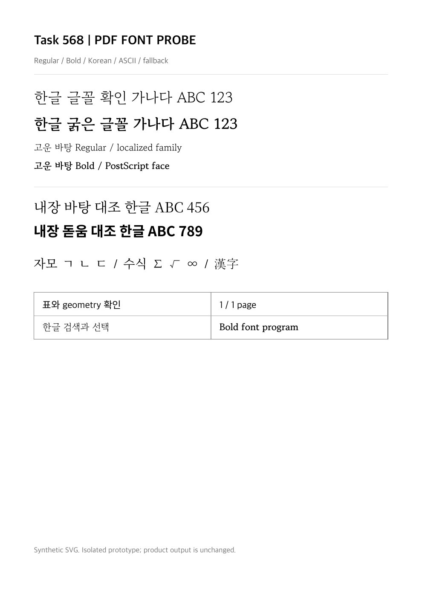

# Task M020 #568 Stage 1 — 출력 계약 조사와 격리 PDF 실험

- 이슈: [#568](https://github.com/postmelee/alhangeul-macos/issues/568), 상위 #562, M020 / v0.2.
- 승인: 2026-10-08 작업지시자의 “진행해줘”로 구현계획·Stage 1 진입 승인.
- 작업: `local/task568`, 제품 기준 `db8a94d1eb03f5a14f265621191f85f0ddf149cb`; 수행/구현계획 커밋 이후 Stage 1 소스·문서를 한 커밋으로 묶음.
- 판정: **계약 조사와 최소 실험 완료, Stage 2 승인 대기**. 제품 연결·Noto 결함 수정·인쇄/B 수용 완료 판정이 아니다.

## 1. 단계 목적

공식 host-font matcher와 현재 PDF·인쇄·native/Finder 경계를 조사하고, 실제 두 face의 공급이 독립 PDF WebView에서 가능한지 확인했다. exact face 적용, Noto 보정, font program·ToUnicode·본문 추출, 잘못된 token/읽기 실패를 각각 분리했다. 후속 구현의 문서/글꼴 identity·seal·임베딩 정책·초기 한도를 [출력 계약](../tech/task_m020_568_output_contract.md)에 정했다.

## 2. 산출물과 본문 변경

| 파일 | 산출물 |
|------|--------|
| `Tests/StudioOutputFontProbe/main.swift` | 제품 renderer와 inspector를 컴파일하는 합성 PDF native probe, 5종 대조군 |
| `Tests/StudioOutputFontProbe/matcher.mjs` | pinned 공식 matcher 원본을 실행하는 10개 조건·collection·읽기·stale 검사 |
| `Tests/StudioOutputFontProbe/inspect_pdf.py` | PDF font program·한글 ToUnicode/ASCII encoding 독립 검사 |
| `Tests/StudioOutputFontProbe/README.md` | 실행 전제·시험 handler와 제품의 차이·성공 판정 범위 |
| `scripts/probe-studio-output-fonts.py` | 입력 SHA/commit 검증, 고유 ad-hoc 앱 생성, 실행·Poppler 측정·소유 등록 해제 |
| `mydocs/tech/task_m020_568_output_contract.md` | 소비자·선택 adapter·identity·seal·한도·실패/임베딩 계약 |
| `mydocs/working/assets/task_m020_568_stage1/` | 정규화 증거 JSON, baseline/naive/custom PNG. font/PDF bytes 미포함 |
| 수행/구현계획·오늘할일 | Stage 1 완료와 Stage 2 구체 범위/승인 상태 반영 |

`Sources/`, RustBridge, core lock, Studio resource/adapter, project.yml, 설치 앱과 원본 사용자 문서는 변경하지 않았다. 제품 renderer·FontFileInspector 등을 그대로 별도 실행 파일에 컴파일했다. 합성 SVG는 자체 작성했고 original fixture font bytes는 수정하지 않았다. 내부 CSS alias는 시험 DOM에만 썼다.

## 3. 실행 환경·입력 provenance

- 실제 실행: Apple Silicon arm64, macOS 26.5.2 (25F84), Apple Swift 6.3.3, Swift 5 language mode, **macOS 12 deployment target compile**. macOS 12 runtime·Intel 실행을 뜻하지 않는다.
- 공식 원본: v0.8.7 / `1a76570e833917d15817415a53c09ad61ab3203f`, `build.noindex/task567/stage3-2/upstream-v087`. matcher 관련 4개 파일을 HEAD와 hash 대조했고 실행 전후 동일했다.
- Font: Google fonts commit `c1eda9233c33ad7775b27efd794f931095cf6133`, Gowun Batang Version 2.000 Regular/Bold, OFL. 기존 승인으로 다운로드한 입력을 재사용했다.
- Regular: PS `GowunBatang-Regular`, weight 400, fsType 0, 8,433,296 bytes, SHA-256 `466c593e7147412e748af4856d5ad14709b5a860bdf62b9c2546f2c5874e9849`.
- Bold: PS `GowunBatang-Bold`, weight 700, fsType 0, 8,178,712 bytes, SHA-256 `dbfcaa646e5831e7478524924f02906f550285a5050699b4e38c9950b3ec4b94`.
- OFL: SHA-256 `49a57cc769fa9affd6eefb9070a61e3d3f6b757c97cafb15848bc6d1c81acc78`; provenance의 METADATA.pb도 hash/크기를 대조했다.
- 새 프로세스의 CoreText 목록에 두 고운바탕 PS 및 NanumSquareR/B가 없었다. 설치 경로 대조군은 **미수행**이며 새 OS 등록도 하지 않았다.
- 출력 앱은 고유 bundle ID·ad-hoc, 비-sandbox다. Developer ID 인증서·키체인·새 사용자 폴더 접근·App Group·Finder 등록·프린터 전송은 사용하지 않았다.

## 4. 실제 검증 명령과 결과

```bash
scripts/probe-studio-output-fonts.py \
  --upstream-dir build.noindex/task567/stage3-2/upstream-v087 \
  --font-dir build.noindex/task567/fonts/gowun-batang \
  --output-dir build.noindex/task568/stage1/run-09 \
  --node /Users/melee/.cache/codex-runtimes/codex-primary-runtime/dependencies/node/bin/node

scripts/verify-rhwp-studio-assets.sh \
  --upstream-dir build.noindex/task567/stage3-2/upstream-v087 \
  --tag v0.8.7 --commit 1a76570e833917d15817415a53c09ad61ab3203f

pdfinfo build.noindex/task568/stage1/run-09/custom/sample.pdf
pdffonts build.noindex/task568/stage1/run-09/custom/sample.pdf
pdftotext -layout build.noindex/task568/stage1/run-09/custom/sample.pdf build.noindex/task568/stage1/run-09/custom/text.txt

/Users/melee/.cache/codex-runtimes/codex-primary-runtime/dependencies/python/bin/python3 \
  Tests/StudioOutputFontProbe/inspect_pdf.py \
  build.noindex/task568/stage1/run-09/custom/sample.pdf \
  build.noindex/task568/stage1/run-09/custom/programs.json
```

최종 실험은 `status: passed`이며 다음 측정으로 범위를 제한한다. 원본 asset 검증은 upstream HEAD·Cargo.lock·Studio adapter receipt·전체 assets 모두 OK다. Python AST parse, Node `--check`, `git diff --check`도 통과했다. 제품 소스 변경이 없어 전체 HostApp/native/확장 빌드를 반복하지 않았다.

### 공식 matcher

family Regular/Bold, fixture 지역화 alias 두 style, exact PS/fullName, 지원하지 않는 italic, 없는 이름, 충돌 family/alias의 10개 조건 통과. group/clipRect·textRun/charOverlap에서 중복을 제거해 두 ID를 수집했다. metadata/collection의 bytes 읽기 0, 같은 Regular의 동시 8요청 실제 읽기 1, 그 뒤 재요청은 새 읽기, 이전 revision reference는 bytes 읽기 없이 null이다. completed bytes 영구 cache가 아님을 확인했다.

### PDF 대조군

| 모드 | 사용자 읽기 / 유지 bytes | 한글에 쓰인 face | 결과 |
|------|------------------------|-----------------|------|
| baseline | 0 / 0 | Noto | 표시는 정상, target 본문의 공백 추출 결함 재현 |
| naive | 2 / 16,612,008 | Noto; 고운바탕은 ASCII subset | target 본문 추출은 정상이나 선택한 한글 face는 아님 |
| custom | 2 / 16,612,008 | 고운바탕 Regular/Bold | target 본문 exact 추출·선택, 두 face program과 한글 ToUnicode 확인 |
| missing Bold | 1 / 8,433,296 | 완료되지 않음 | handler 404 → 준비 실패, PDF 미생성 |
| wrong-token Bold | 1 / 8,433,296 | 완료되지 않음 | handler 403 → 준비 실패, PDF 미생성 |

세 성공 렌더는 한 페이지·794×1123 pt, PDFKit “한글” 검색 5건이다. custom PDF SHA-256: `adbca1884455e5dd9e7d4cec94dc1fe5c8a854ab0f5ef8f3958d3422c04e3ce6`. 미래 재실행은 생성 시각/subset prefix에 따라 PDF hash가 달라질 수 있으므로 semantic 결과와 입력 source/hash를 함께 대조한다.

custom의 한글 subset은 두 PS 모두 TrueType·embedded/subset/Unicode yes이며 `/FontFile2` stream이 있었다. ASCII MacRoman subset은 embedded/subset yes·Unicode no지만 실제 ASCII 추출은 정상이다. subset program hash가 원본 SFNT hash와 다름은 정상이며 동일 hash를 요구하지 않았다. `CGPDFFontResourceInspector`의 in-memory 기록과 저장 PDF의 subset prefix는 PDFKit 재직렬화로 달라질 수 있어 PS·program/encoding·본문 증거를 결합했다.

독립 pypdf 6.10.0 검사는 두 face의 program·ToUnicode stream을 확인했다. offset 0의 일부 object를 무시한다는 경고가 발생했다. Poppler는 같은 PDF의 읽기·텍스트·PNG를 완료했다. 이 경고를 임베딩 부재로 취급하지 않았고, PDF 형식 전반의 모든 reader 호환성 검증으로 확대하지도 않았다.

### 시각 검토와 텍스트 제약

Poppler로 PNG를 생성해 최종 baseline/custom 페이지를 직접 검토했다. 고운바탕 Regular/Bold의 차이, 기존 serif/sans 대조군, 자모·Hanja·수학 기호, 표 선·페이지 geometry를 확인했고 clipping·겹침·상자 glyph가 보이지 않았다. 실제 표/수식 renderer와 모든 glyph coverage의 검증은 아니다.



Noto의 `내장 바탕 대조 한글 ABC 456`은 세 모드 모두 `내장#바탕#대조#한글#ABC#456`으로 추출됐다. PDFKit header에서 `fallback`→`falback`도 관찰됐으며 Poppler header는 정상이다. custom 대상 줄은 정상이어도 **전체 페이지 copy fidelity 통과는 아니다**. 원인과 수정은 제품 준비/출력 경계에서 Stage 2에 다룬다. prototype 전체를 출시 가능한 출력으로 판정하지 않는다.

### 실험 도구 보정과 정리

초기 실행에서 global `hash`와 NSObject hash 이름 충돌, 없는 esbuild dependency, shell sandbox의 LaunchServices 접근, accessory windowless launch, WebKit handler 교체 금지가 드러났다. 같은 단계의 probe를 수정해 Node 24 직접 module 실행·명시 app 초기화·시험 configuration으로 보정했다. 제품은 고치지 않았다. 기존 Noto exact 추출 assertion 실패는 숨기지 않고 별도 fidelity 항목과 다음 단계 수정 대상으로 기록했다.

최종 명령은 원본 fixture SHA/commit 대조를 포함해 5모드가 모두 실행됐다. 각 자식 앱은 종료했으며 해당 앱 경로의 LaunchServices unregister도 exit 0이었다. Quick Look/Thumbnail 등록은 하지 않았다. 사용자의 이전 #567 테스트 창/앱은 조작하지 않았다. 실패/중간 실행의 재생성 가능한 앱·module cache는 정리하고 최종 PDF/PNG/JSON과 필요한 진단 기록만 `build.noindex/task568/stage1/`에 유지한다.

## 5. 확정한 후속 계약과 잔여 위험

- matcher 선택은 기존 source module을 재사용하는 앱 전용 adapter로 전달한다. 기존 window API에 없는 결과를 API가 이미 제공한다고 취급하지 않는다.
- 출력 job은 설치/관리 세대·선택·관리 lease와 문서 lock을 소유한다. custom alias는 출력 DOM에만 적용하고 문서의 임의 표시를 신뢰하지 않는다.
- 초기 한도: 64 face, 2,048 고유 요청, 개별 64 MiB, native 유지 128 MiB, 화면+출력 읽기 slot 2. 2-face 실측이며 전체 WebKit/PDFKit 메모리 상한 시험은 남는다.
- 사용 근거 unknown은 그대로 보존한다. 검증된 OS/2 version·fsType의 기술적 후보와 라이선스 확인 상태를 분리하며 명시 restricted·기술적 금지는 차단한다. 실패는 취소 기본·명시 대체 출력; 정상 흐름에 새 라이선스 승인 UI는 추가하지 않는다. [OpenType 명세](https://learn.microsoft.com/en-us/typography/opentype/spec/os2#fstype)를 기술적 조건의 근거로 쓴다.
- PDF는 쓰기 직전 재검증, print는 패널 직전 재검증·seal 이후 동일 PDF 유지. `run()`의 false는 오류/취소 공통이므로 성공과 분리한다. Apple 로컬 SDK header와 [API](https://developer.apple.com/documentation/appkit/nsprintoperation) 근거로 정했다.
- 실제 HWP/HWPX·edit epoch·관리 lease·동시 slot·취소/late callback·최소 OS·signed sandbox·설치 참조·실제 패널/인쇄·B·Windows 입력은 아직 미검증이다. 정규화 증거의 `actualPrint:false`, `sandbox:false`, `OSFontRegistration:false`를 유지한다.

## 6. 다음 단계 영향과 승인 요청

Stage 2는 A의 제한된 snapshot/resource route·준비 수명·공식 matcher adapter와 policy 모델·관련 테스트/CI를 제품에 구현한다. Noto 텍스트 매핑 결함을 함께 조사·보완하고 전체 fallback exact 조건이 미해결이면 Stage 3 진입 조건을 다시 보고한다. Stage 3의 실제 문서/패널/서명 수용과 B는 이후 별도 단계다.

이 보고와 출력 계약을 검토한 뒤 **Stage 2 진입 승인**을 요청한다. 저장소 [단계 승인 규칙](../manual/agent_code_hyperfall_rule_conflict.md)에 따라 승인 없이 제품 구현 단계로 넘어가지 않는다. issue close·push·PR·새 폴더 권한·Developer ID·설치 교체·실제 프린터 전송·배포를 이번 승인에 포함하지 않는다.
