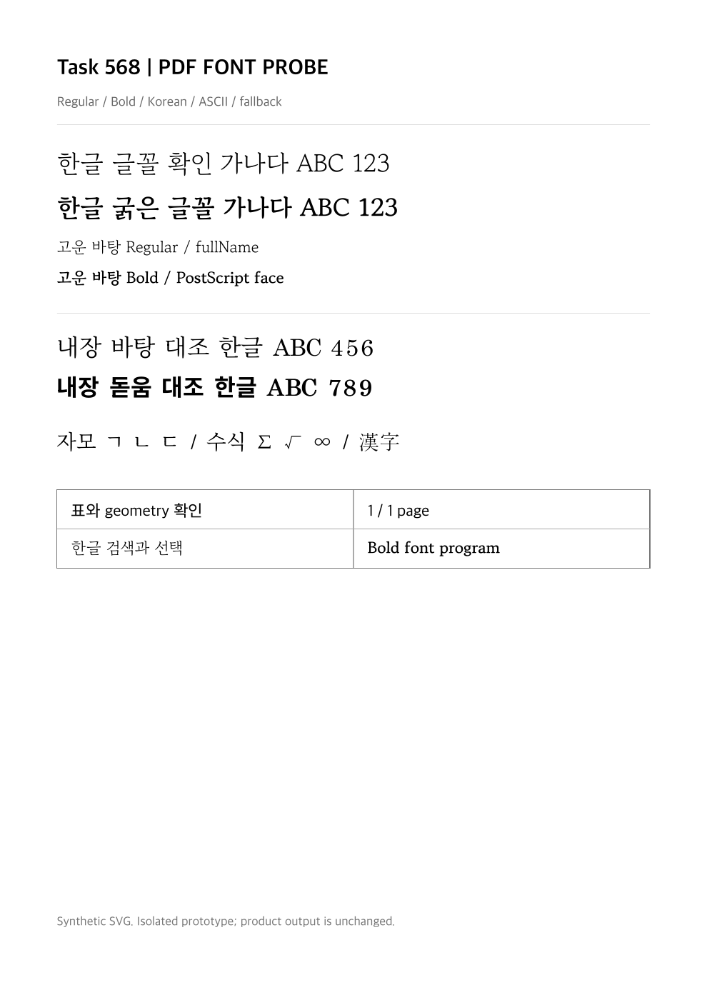

# Task M020 #568 Stage 2 — 출력 글꼴 공통 공급·준비·수명

- 이슈: [#568](https://github.com/postmelee/alhangeul-macos/issues/568), 상위 #562, M020.
- 승인: 2026-10-08 작업지시자의 “진행해줘”로 Stage 1 보고·출력 계약과 Stage 2 진입 승인.
- 작업: `local/task568`, Stage 1 커밋 `c1df40c` 이후 변경. 2026-10-09 단계 검증 완료.
- 판정: **Stage 2 공통 구현·검증 완료, Stage 3 승인 대기**. 실제 editor의 PDF 저장·인쇄 진입에 사용자 글꼴 job을 전달하는 작업은 아직 하지 않았다. #568 전체 완료가 아니다.

## 1. 구현 결과

`RhwpStudioOutputFontJob`은 화면 session과 독립된 snapshot, 문서 identity callback, 공식 matcher resolver와 관리 lease 종료 책임을 소유한다. 필요한 face만 읽고 실제 동일 bytes를 다시 검사해 PS·SFNT face·weight/slant·원본 hash와 metadata를 대조한다. 같은 작업의 중복 읽기는 합치고 종료 후 영구 bytes cache를 남기지 않는다. 준비와 PDF callback 후 문서·글꼴 현재 상태를 다시 검사한다.

사용자 resource는 작업 UUID와 resource UUID의 exact URL만 허용한다. query/fragment/user/port, 다른 작업·만료 route는 거부한다. WebKit handler는 준비된 bytes만 제공한다. 화면+출력 두 read slot을 공유하며 취소를 무시한 I/O와 검사 작업이 실제 끝날 때까지 slot/lease를 유지한다. 성공한 renderer의 해제는 저장/인쇄 소유자가 보유한 job의 lease를 조기 해제하지 않는다. `seal()`은 route를 만료시키면서 panel 소유자의 close까지 lease를 유지한다.

한도는 face 64, 고유 요청 2,048, 파일 64 MiB, native 유지 사용자 bytes 128 MiB다. 읽기 전 최대 파일 크기를 예약하고 실제 cache 크기를 포함한다. SVG text/tspan 수집과 Noto가 만드는 run은 각각 65,536개로 제한한다. 이는 전체 문서 payload·WebKit/PDFKit 메모리의 상한 검증은 아니다.

`RhwpStudioOutputFontPolicy`는 동일 bytes의 OS/2 version·fsType으로 기술적 후보를 확인한다. 단독 0/4/8, version별 상위 bit, restricted·no-subsetting·bitmap-only·예약/혼합 선언을 구분하고 명시 restricted 근거는 우선 차단한다. unknown 근거는 그대로 보존한다. 허가 상태나 라이선스 검증 완료를 새로 만들어 넣지 않는다. TTC·가변·400/700 이외 선택·stroke 효과·각도 지정 oblique 등 현재 exact 지원 밖의 요청은 실패한다.

## 2. matcher와 출력 준비

앱 소유 source adapter에 `resolveHostOutputFonts`를 추가했다. 기존 공식 `resolveRendererLocalFont`를 호출해 선택 ID/PS/style·provider revision/generation만 반환한다. native 이름 matcher를 복제하지 않았다. `window.rhwpStudio.fonts.resolveOutputRequests`와 native catalog identity를 묶는 bridge script를 준비했으나 Coordinator의 실제 호출은 Stage 3 범위다.

`StudioFontProviderScript`는 제외된 이름을 catalog 생성 때 한 번 계산한다. 출력마다 최대 2,048요청×24,096행을 다시 순회하지 않는다. 없는 family와 충돌·미지원으로 제외된 family를 구분하며, 사용자가 설치 글꼴을 비활성화한 경우에는 기존 fallback을 허용한다. native catalog에는 경로/bookmark 대신 snapshot identity만 추가했다. 사용 근거는 native bytes 공급에 보존하며 화면 DTO에 허가 상태를 추가하지 않았다.

출력 준비는 `.defaultClient`에서 CSS family quoting/escape, 실제 text/tspan의 style·stroke를 수집한다. native가 승인한 UUID alias와 URL만 FontFace로 준비하고 private Map/WeakSet으로 해당 node를 Noto 처리에서 제외한다. 문서의 data-*·가짜 alias는 승인 근거로 쓰지 않는다. nonpersistent WebView·content JS 차단·기존 CSP와 navigation/resource 차단을 유지했다.

공식 v0.8.7 checkout 소스는 변경하지 않았다. 변환한 4개 소스를 pinned TypeScript compiler로 검사해 Studio를 재빌드하고 receipt·manifest/hash·chunk를 갱신했다. core release tag/commit, Cargo.lock·WASM bytes와 기존 overlay/font 자산은 동일하다.

## 3. Noto 텍스트 보정과 남은 reader 제약

같은 Noto를 ASCII까지 포함하는 새 FontFace로 선언하는 것만으로는 공백→`#`·구두점 오류가 해결되지 않았다. 최종 준비는 직접 text node를 한글과 나머지 문자 run의 tspan으로 나눠, 한글은 같은 내장 Noto·그 외는 원래 fallback stack을 사용한다. 원래 문자 순서·SVG 위치/anchor 속성을 유지하며 수학·Hanja 범위를 Noto에 추가하지 않는다. 내부 Noto alias도 page마다 무작위로 생성해 문서 CSS의 동명 face와 구분한다.

Noto와 custom 대조군의 `한글 글꼴 확인 가나다 ABC 123`, Bold, `내장 바탕 대조 한글 ABC 456`, 공백·구두점·자모/수학/Hanja가 PDFKit 문자열·영역 선택 및 Poppler에서 정확히 추출됐다. CI의 mixed run/tspan·대소문자·중앙 anchor·수식 회귀도 통과했다. 최종 PNG에서 글꼴 차이, 표 선·수식·page geometry를 직접 확인했고 잘림·겹침·상자 glyph를 발견하지 않았다. 실제 모든 문서의 glyph coverage와 복잡한 SVG 효과 수용은 아니다.

**기본 시스템 영문 header의 `fallback`→`falback`은 PDFKit 문자열·영역 선택에서 남았다.** Poppler는 같은 저장 PDF에서 `fallback`을 정확히 추출했다. 이 부분은 Stage 1부터 존재한 별도 reader 제약이며 Noto 본문의 공백 결함 해결이나 전체 페이지 exact 성공으로 합산하지 않는다. Stage 3의 실제 문서·reader 수용 기준에 포함한다. bitmap·OCR·숨긴 중복 텍스트로 우회하지 않았다.

## 4. 실제 검증

실행 환경은 arm64, macOS 26.5.2 (25F84), Swift 6.3.3 / Swift 5 mode다. HostApp은 macOS 12 target compile/link를 통과했다. macOS 12·Intel runtime 수용은 미수행이다. XCTest SDK의 macOS 14 링크 경고, 기존 async 테스트의 Swift 6 `wait` 경고, AppIntents metadata 생략 경고를 구분하며 새 제품 소스의 컴파일 오류는 없다.

| 검사 | 결과 |
|------|------|
| `scripts/test-font-library.sh` | Swift 120개·JS 29개·fixture SHA/App Group 설정 검사 통과 |
| `scripts/test-studio-output.sh build.noindex/task568/stage2/host` | 72개 통과: 출력 준비 2, renderer 31, payload/state/export/인쇄 상태·방향/Spotlight |
| 실제 제품 준비 fixture | TTF/CFF, 같은 face 중복 읽기 1, tspan 보존·Noto 덮어쓰기 없음, renderer 성공 후 lease 유지, PDF callback 후 문서 변경 중단 |
| output job fixture | opaque route·중복/in-flight·취소 중 lease/slot·stale/generation·busy·부분 bytes·과대 입력/유지량·seal·embedding 선언 |
| 기존 출력 보안/수명 | script/event handler·외부 resource/file/frame/navigation 차단, data 이미지, geometry, timeout·late callback·재진입·exactly-once·취소 |
| 공식 module probe | 기존 10조건·collection/in-flight/stale, 변환 module의 9 출력 요청·metadata bytes 0 |
| `smoke-studio-document-lifecycle.py` | 격리 SwiftUI 앱의 실제 Studio 열기·편집·저장·닫기/종료·font bridge 43개 통과 |
| `probe-studio-font-provider.sh` | 실제 WKWebView↔native IPC, fixture 1,124 bytes·faceIndex 0 일치 |
| HostApp Debug build / shared 의존 검사 | 성공 / AppKit·UIKit 위반 없음 |
| Studio typecheck/build·asset receipt 검증 | 성공, 공식 commit·Cargo.lock·WASM pin 유지 |
| shell/Python/Node/YAML·diff 검사 | 통과 |

```bash
node scripts/build-rhwp-studio.mjs --upstream-dir build.noindex/task567/stage3-2/upstream-v087
scripts/verify-rhwp-studio-assets.sh --upstream-dir build.noindex/task567/stage3-2/upstream-v087 \
  --tag v0.8.7 --commit 1a76570e833917d15817415a53c09ad61ab3203f
scripts/test-font-library.sh
xcodebuild -project Alhangeul.xcodeproj -scheme HostApp -configuration Debug \
  -derivedDataPath build.noindex/task568/stage2/host CODE_SIGNING_ALLOWED=NO build
scripts/test-studio-output.sh build.noindex/task568/stage2/host
bash scripts/probe-studio-font-provider.sh
python3 scripts/smoke-studio-document-lifecycle.py --fixture samples/re-font-dotum-empty-hancom.hwp
python3 scripts/probe-studio-output-fonts.py --stage2 \
  --upstream-dir build.noindex/task567/stage3-2/upstream-v087 \
  --font-dir build.noindex/task567/fonts/gowun-batang \
  --output-dir build.noindex/task568/stage2/run-07 \
  --node /Users/melee/.cache/codex-runtimes/codex-primary-runtime/dependencies/node/bin/node
```

PR CI의 기존 Spotlight 전용 검사를 출력·인쇄 상태·Spotlight 검사로 확장했다. HostApp을 먼저 빌드한 같은 DerivedData를 사용하고 인증서 없는 ad-hoc XCTest로 실행한다. 아직 원격 CI를 돌린 결과는 아니다.

### 실제 고운바탕 PDF

Stage 1에서 승인해 확보한 OFL 입력을 재사용했다. Google fonts commit `c1eda9233c33ad7775b27efd794f931095cf6133`, 두 원본 hash·PS·weight·fsType는 [Stage 1](task_m020_568_stage1.md) 및 [정규화 증거](assets/task_m020_568_stage2/evidence.json)와 동일하다. 다운로드·OS 설치를 추가하지 않았다.

최종 원본 출력은 `build.noindex/task568/stage2/run-07/`이며 정규화 JSON/PNG만 커밋한다. job probe는 **제품 job·scheme·준비**를 사용하지만 native snapshot/current/lease·editor resolver는 fixture다. 별도 복사본에서 실행한 실제 공식 matcher+adapter의 결과를 주입했다. 실제 editor 호출·관리 App Group lease·사용자 설치 참조 경로 성공으로 확대하지 않는다.

| 항목 | baseline | 제품 job + fixture binding |
|------|----------|---------------------------|
| 사용자 font 읽기 / native 유지 | 0 / 0 | 2 / 16,612,008 bytes |
| PDF 페이지 / bounds | 1 / 794×1123 pt | 동일 |
| “한글” PDFKit 검색 | 5 | 5 |
| custom 본문·Noto 대조 exact | 통과 | 통과 |
| lease 종료 / close 후 유지 bytes | 해당 없음 | release 1 / 0 |
| PDF SHA-256 | `cc1fe8882e4e340916d5098af0d6c25dea032b154c4cee0b9c2f745514e28d83` | `af78dc17377c2a040b15b74dd631dc2e166ff731970ed1cf52de72e1ed6ba9ed` |

두 GowunBatang PS의 embedded/subset program과 한글 ToUnicode를 `pdffonts`·pypdf 6.10.0로 확인했다. ASCII MacRoman subset의 ToUnicode 부재는 실제 문자열 추출과 함께 판정했다. 원본 TTF hash와 subset program hash가 같다고 요구하지 않았다. pypdf의 일부 offset 0 object 경고는 남았고, PDFKit·Poppler의 읽기/PNG를 함께 확인했다. 모든 PDF reader 호환성 검증은 아니다.



### 실패 회복과 정리

초기 테스트 대상에 HostApp root를 source 경로로 추가하자 XcodeGen이 앱 Info.plist/NSPrincipalClass를 XCTest에 넣어 AppKit 중복 초기화가 발생했다. Services 경로로 한정하고 테스트에서 NSApplication을 초기화한 후 실제 출력 검사가 통과했다. 별도 테스트 DerivedData에 HostApp이 없었던 Spotlight 산출물 검사도 CI와 같은 위치에서 빌드해 회복했다. 변환 matcher와 collection은 같은 복사 module을 사용하도록 수정했다. Noto의 ASCII 확대 후보는 실패했고 run 분리 후보를 최종 검증했다. 실패 명령을 최종 통과로 바꾸어 기록하지 않았다.

Stage 1 원본 `nanumPresent`는 NanumSquareR/B 존재를 기록하고 있었다. “없었다”는 Stage 1 보고·계약 문장의 오기를 보정했다. 두 GowunBatang PS는 없으며 설치 참조의 bytes 공급·출력 대조는 미수행이다.

각 probe의 고유 앱 등록은 해제했다. 최종 HostApp 빌드 경로도 해제했으며, 중복 해제의 -10814는 등록 부재로 구분했다. extension registration hygiene의 check-only 결과 이슈는 없었다. 테스트 개발 산출물 존재 경고는 등록 여부와 구분했다. 기존 #567 사용자 창·원본 문서/글꼴·설치 앱을 조작하지 않았다. 중간 probe 앱·module cache·중복 test DerivedData는 정리하고 최종 비교에 필요한 산출물과 실패 진단만 남긴다.

## 5. 다음 단계와 승인 요청

Stage 3에서 실제 Coordinator의 출력 요청과 저장/인쇄 소유자에 job을 전달하고, 쓰기 직전 재검증·패널 직전 seal·종료 close를 연결한다. unsupported/공급 실패는 대체할 family를 설명하고 취소를 기본값으로 둔다. 실제 HWP/HWPX·설치/관리·편집/dirty/저장 상태, PDF 저장·패널 미리보기/취소와 reader 제약을 수용한다. 서명 sandbox·새 폴더 접근은 구체 앱/대상이 준비된 시점에 필요한 승인 범위를 확인한다.

이 보고와 [출력 계약](../tech/task_m020_568_output_contract.md)을 검토한 뒤 **Stage 3 진입 승인**을 요청한다. [저장소 단계 승인 규칙](../manual/agent_code_hyperfall_rule_conflict.md)에 따라 다음 단계는 승인 후 진행한다. B native/Finder·Windows ZIP·물리 프린터 전송·새 Developer ID 사용·push/PR·issue close·공개 배포는 현재 범위에 포함하지 않는다.
