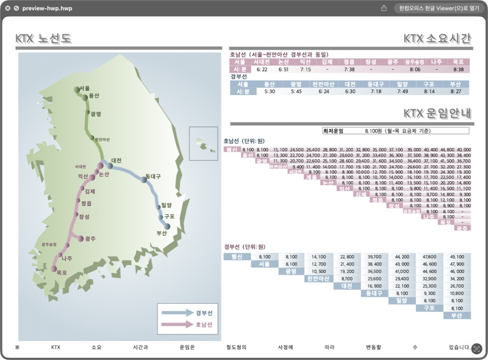
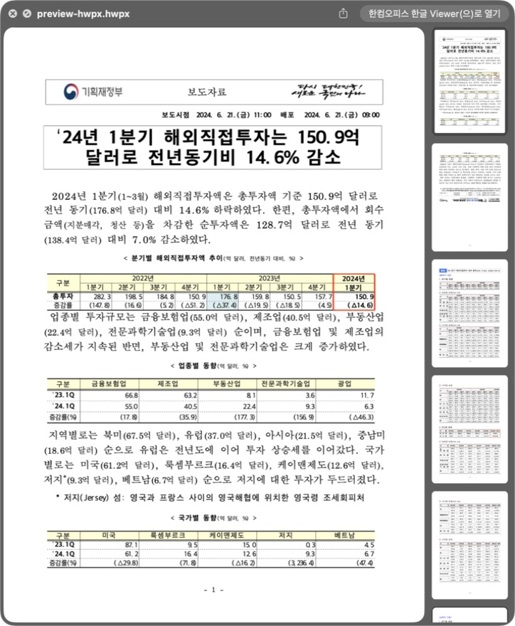
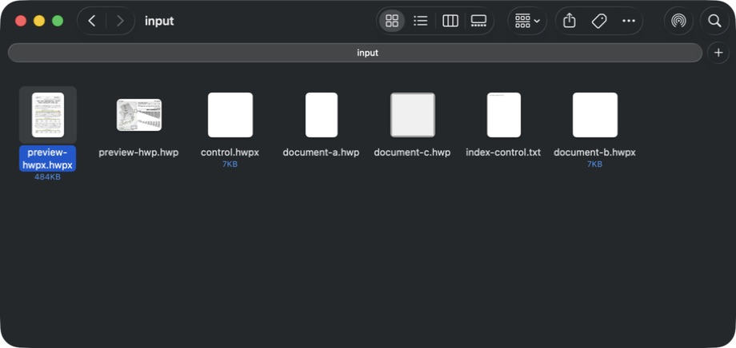
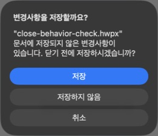
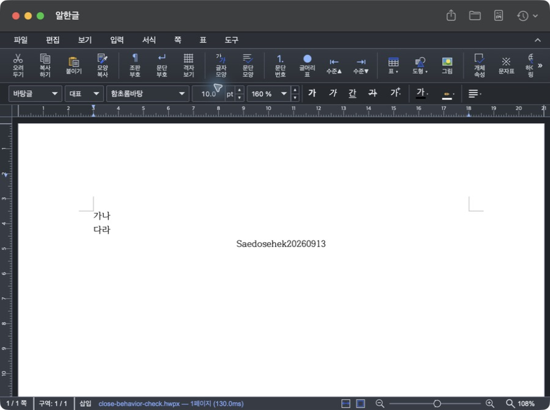
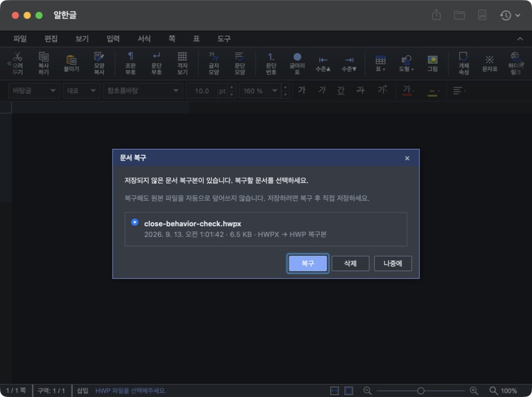
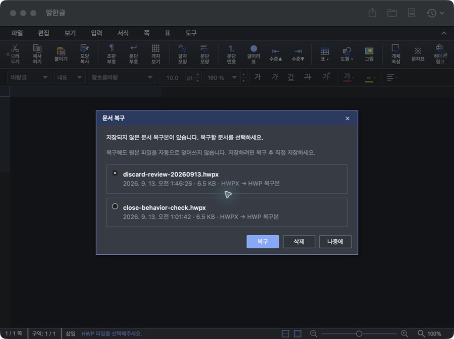

# Task M900 #520 Stage 4 — 공증 후보·실제 검증 진행과 승격 도구 보완

## 결과

Stage 4 전체 수용은 진행 중이다. PR #521 과 main PR #522 를 병합하고 불변 `v0.2.0` 후보를 만들었다. 이번 후속 변경은 실제 draft API에서 발견한 승격 도구 문제를 보완하며 앱이나 DMG를 다시 만들지 않는다. #520 / #513 / #337 은 열린 상태다.

| 항목 | 기준·결과 |
|---|---|
| 후보 tag / SHA | v0.2.0 / aa986e5ae59732a2423324eb3b415a06c67c8a68 |
| 버전 / 빌드 | 0.2.0 / 18 |
| core / Studio | rhwp v0.8.6, 기존 pin 유지 |
| 후보 생성 | [34699689421](https://github.com/postmelee/alhangeul-macos/actions/runs/34699689421), attempt 2 PASS |
| 원본 DMG artifact | 10300043814 |
| DMG SHA256 | 1fce404263d342de23f76f7b74485e56f87b783c976eba82eb041e329588e321 |
| Release / 크기 | ID 387608761, draft=true / prerelease=false, 192864126 bytes |
| 로컬 서명·공증·Gatekeeper·universal | PASS — 앱 실행 없이 확인, 검증용 mount 해제 |
| 새 VM 최초 설치 | [34701708901](https://github.com/postmelee/alhangeul-macos/actions/runs/34701708901), attempt 1·2: arm64 환경 검사 실패·Intel 전체 PASS; attempt 3 양 아키텍처·전체 verdict PASS |
| 사용자 직접 설치·기능 조작 | 설치/About·Spotlight/종료 후 검색·저장·내보내기 PASS, Finder PASS, 닫기 취소·저장·버리기 파일 보존 PASS 및 복구 후보 잔존 관찰 |

[기계 판정 요약](../report/assets/task_m900_520/candidate-validation.json)에 원본 후보 식별자와 조회 검증을 보존한다. 실행 중 결과는 성공으로 합산하지 않는다.

## 실패와 원인 구분

1차 후보 생성은 Release 앱 빌드와 Developer ID 서명 preflight 후 Apple 공증 제출의 `NSURLErrorDomain -1009 / No network route`로 실패했다. 유효한 submission ID와 DMG/draft가 없음을 확인하고 같은 소스에서 새 runner로 재시도했다. 2차 실행은 서명·공증·DMG와 draft/artifact 생성을 모두 통과했다. 실패 당시 빈 JSON을 submission ID처럼 다룬 추가 로그 조회 오류도 원본 기록에 남겼으며 공증 심사 거절과 구분한다.

최초 설치 arm64 VM은 Indexing enabled 및 GUI 세션이 있어도 일반 TXT가 180초 내 검색되지 않아 `ENVIRONMENT_UNAVAILABLE`로 종료됐다. 앱 설치 이전 실패이고 시험 TXT 정리는 확인됐다. 2026-09-12 사전 환경 조사 양 runner PASS가 이후 모든 새 VM의 상태를 보증하지 않는다는 실제 사례다. Intel은 동일 후보의 첫 실행·앱 종료 후 검색·33개 lifecycle·cleanup 및 require_complete를 모두 통과했다(총 652.63초). 전체 verdict는 양 아키텍처 성공 조건을 충족하지 못해 실패다. 1차 증거를 보존하고 동일 run의 attempt 2에서 모든 job을 재실행했다. 2차도 arm64는 같은 TXT 사전 검사 실패, Intel은 전체 PASS(445.63초)였다. 동일 arm64 이미지의 별도 사전 환경 조사는 32.41초에 PASS했던 이력이 있어 제품/검사 기준 변경 없이 3차의 모든 job을 새 VM에서 재실행했다. 3차는 같은 회차의 arm64 347.11초·Intel 376.85초에 전체 PASS이고 두 원본 상태의 require_complete도 재확인했다. 환경 대조는 각각 24.56초·16.12초였다. 최종 증거 ID는 arm64 10301451917, Intel 10300562792이다. 이전 회차의 PASS를 섞지 않는다.

## Stage 4.1 승격 도구 보완

인증된 `releases/tags/v0.2.0`은 실제 draft에 대해 404를 반환했지만 Release 목록/ID 조회는 성공했다. `find_release`는 모든 페이지에서 정확한 tag의 유일한 ID를 찾고 ID로 최신 draft/public 자산을 읽는다. 후보 부재로 간주해 자산을 생성하거나 덮어쓰지 않는다.

기존 tag 안의 도구를 고치려고 불변 tag를 이동하지 않는다. 승격 workflow를 검토·병합된 main에서 실행할 때 선택 입력 `source_sha`로 기존 후보를 고정한다. checkout/도구 SHA, 후보 tag/SHA, 후보→도구→main 포함 관계, 4개 version/build를 확인한다. 후보 이후 `.github/`, `scripts/`, `mydocs/` 밖의 변경은 거부하므로 앱·의존성·공개 Pages 변경을 기존 DMG와 섞지 않는다. 공개 직전 원격 tag·VM 최신 회차·Release bytes 재검사는 유지한다. 후보와 도구 SHA는 source-proof.json으로 구분한다.

## 보완 검증

- `python3 scripts/ci/test-release-promotion.py`: 14 tests PASS. 실제 Git 후보/도구 분리, 임의 branch·틀린 SHA/build·제품/Pages/dependency/유사 경로 변경 거부, 페이지 분할 draft ID 탐색·중복 거부 및 tag endpoint 없는 CLI 왕복 포함.
- `python3 scripts/ci/test-release-install-smoke.py`: 11 tests PASS.
- Python 구문, actionlint release-promote, git diff --check: PASS.
- 보완한 find_release로 실제 draft ID 387608761을 읽어 검증: PASS. 같은 자산 ID/DMG hash이고 공개 변경 없음.
- [PR #524](https://github.com/postmelee/alhangeul-macos/pull/524)의 head 6bb10e5 CI는 스크립트·Release helper PASS, 앱 소스 변경이 없어 macOS build는 분류에 따라 SKIPPED다. 최초 설치 FAIL/미실행과 사용자 GUI 대기를 위 단위 테스트 결과로 대체하지 않는다.

## 직접 테스트 인계

현재 macOS 26.5.2 arm64의 v0.1.11(17) / v0.1.8(14)을 build.noindex 아래에 별도 백업하고 원본 파일 일치를 확인했다. 기존 Quick Look/Thumbnail 등록 경로도 기록했다. Documents의 별도 input/results 폴더에 합성 HWP3/HWP5/HWPX와 화면 확인용 HWP/HWPX 복사본을 준비했다. 사전 기준에서 TXT는 검색됐으며, 설치 직전 전용 본문 단어는 미검색이고 알한글 importer/실행 프로세스는 없었다.

사용자가 교체 대화상자에서 앱 없는 상태의 설치 검증을 요청했다. 복사를 취소하고 두 원본과 백업의 전체 파일 hash/symlink 일치를 재확인했다. 기존 두 앱/확장만 등록 해제한 뒤 build.noindex의 별도 격리 폴더로 원본을 이동했다. 두 Applications 경로 부재, Preview/Thumbnail 조회 no matches, 알한글 importer 부재를 확인했다. 문서·설정·과거 색인 이력은 보존했다. 이는 앱 없는 상태의 재설치이며 깨끗한 OS 최초 설치와 구분한다. 사용자가 DMG에서 다시 복사하고 DMG를 꺼낸 뒤 직접 실행해 버전을 확인하도록 인계했다. 이후 Spotlight·저장·내보내기는 사용자가 직접 확인했고, 닫기·Finder는 사용자의 별도 위임에 따라 Computer Use로 확인했다. 원본 앱 복원과 공개 후 실제 Sparkle 업데이트는 남아 있다. macOS 12 환경은 없고 공개 승인은 아직 받지 않았다.

## 실제 Mac 사용자 확인 — 2026-09-13

| 항목 | 관찰·판정 |
|---|---|
| 설치·About | 사용자 확인 PASS, `/Applications`의 0.2.0(18) 실행 경로와 서명/Gatekeeper PASS |
| 설치 DMG 분리 | 첫 실행 시 DMG가 남아 있어 실행 경로를 확인한 뒤 정상 eject. 최초 실행 전 분리한 시험으로 기록하지 않음 |
| 초기 Spotlight | 사용자 영문/한글 모두 미검색, CLI도 미발견·미검색 |
| 자동 발견·본문 검색 | 첫 실행 00:42:38, 앱의 재색인 접수 로그 00:45:07, CLI 관찰 00:46:20에 영문 3개/한글 2개. 첫 성공 관찰 222.53초, 대조 문서 제외. 수동 등록·재색인 없음 |
| Spotlight 화면·앱 종료 후 | 사용자 재검색 PASS, 앱 완전 종료 후에도 두 검색 유지 PASS |
| 검색 결과 열기 | 기본 앱인 Hancom Viewer로 열림. 기본 앱 변경 없음. 알한글로 결과를 열었다는 판정과 구분 |
| 실제 importer 선택 | 자동 검색 성공 후 mdimport -t 진단에서 HWP3/HWP5/HWPX 모두 `/Applications/Alhangeul.app` 내부 importer 선택. 한컴뷰어 UTI 공존 확인 |
| 새 문서 저장 | 사용자 HWP/HWPX 저장·재열기 내용 유지 PASS, 두 결과 파일 생성 확인 |
| 내보내기·취소 | 사용자 Word/HTML/PDF 생성·본문·취소 후 원래 문서 유지 PASS, 세 파일 생성 확인. 실제 Word 앱 배치 검증은 별도 미확인 |
| 미저장 닫기 | 사용자 위임에 따라 Computer Use로 테스트 복사본 검증. 취소·저장·재열기·저장하지 않음 후 저장본 hash 보존 PASS. 이후 복구 후보 잔존은 아래 별도 관찰 |
| Finder 미리보기·썸네일 | Computer Use의 실제 Space/아이콘 보기에서 HWP·HWPX PASS. 후보 Preview 실행 경로와 qlmanage -t -x의 두 PNG 생성 확인 |
| 전체 등록 위생 | MISS — 실제 파일이 없는 과거 개발 앱 LaunchServices 경로 41개 잔존. 현재 provider root는 /Applications의 후보. 경로별 -u는 -10814 반환, 전역 reset 미실행 |

[직접 검증 요약](../report/assets/task_m900_520/manual-validation.json)에 사용자 진술과 CLI/앱 로그를 구분해 보존한다. 현재 Mac의 설치·색인 이력을 초기화하지 않았으므로 이 결과로 깨끗한 arm64 OS 최초 설치 gate를 대체하지 않는다. 기본 앱이나 사용자 설정을 바꾸지 않았다.

## 저장하지 않음 이후 복구 후보 관찰

기존 사용자 결과를 복사한 `close-behavior-check.hwpx`에서만 수정했다. 닫기 버튼 → 취소에서 새 본문이 유지되고, 닫기 → 저장 이후 재열기 화면과 XML에서 추가 본문이 확인됐다. 다시 본문/문단을 변경하고 닫기 → 저장하지 않음을 선택한 뒤 파일 전체 SHA256은 저장 직후와 같았다. 그러나 Computer Use가 앱 상태를 다시 조회하며 나타난 새 문서 화면에서 같은 복사본의 복구 후보가 표시됐다. `나중에`로 닫았으며 복구 후보나 사용자 데이터를 삭제하지 않았다.

[DocumentCloseConfirmationController](../../Sources/HostApp/Services/DocumentCloseConfirmationController.swift)의 저장하지 않음 분기는 `clearUnsavedChanges()` 후 닫기 완료를 전달하고, [DocumentViewerStore](../../Sources/HostApp/Stores/DocumentViewerStore.swift)는 native 미저장 bool만 해제한다. 최초 관찰 당시에는 복구 저장소 정리와의 연결 부재를 원인 후보로 남겼으며, 아래 Stage 4.2에서 추가 재현했다. 제품 코드는 수정하지 않았다. 복구 안내에 폐기 의사가 반영돼야 하는지 별도 수용 판단/후속 수정 대상으로 남긴다. 원본 저장 내용 손실이나 Spotlight 실패로 분류하지 않는다. 자동화의 ⌘W 입력은 닫기를 실행하지 못해 창 닫기 버튼으로 판정했으며 단축키 통과를 주장하지 않는다.

## Stage 4.2 — PR 검토·수용 기준 보강과 복구 재현

2026-09-13 작업지시자 진행 승인 후 #524 전체 승격 경로를 검토했다. 공개 전 필요한 코드 수정 사항은 추가로 발견하지 않았다. 후보 tag/SHA와 도구 SHA 분리, clean checkout, 보호 경로 이동의 차단, 원격 tag·main 포함 재검사, 최신 단일 검증 회차의 양 VM 원본 판정, draft asset hash/ID 고정과 공개 직전 재검사가 연결돼 있다. 허용 경로에 있는 도구 자체의 정당성은 코드 리뷰 책임이며 경로 검사만으로 자동 보증하지 않는다.

`gh release edit`의 draft 지원도 확인했다. 현재 gh 2.89.0의 [FetchRelease](https://github.com/cli/cli/blob/v2.89.0/pkg/cmd/release/shared/fetch.go)는 published tag REST와 draft GraphQL/ID 조회를 함께 사용한다. 실제 `gh release view v0.2.0`도 ID 387608761 / draft=true / prerelease=false를 반환했다. 조회 회귀 해결과 실제 공개 명령의 성공은 구분하며 `publish`는 실행하지 않았다. GitHub의 두 COMMENTED review는 Copilot 할당량 초과 알림으로 실질 코드 검토가 아니었다.

- 승격 회귀 14개, 최초 설치 회귀 11개, release-promote actionlint PASS. 이 변경은 문서/증거만 추가하며 후보 앱을 다시 빌드하지 않았다.
- runbook Gate 4·6·8과 최초 설치/배포 가이드에 두 경로를 필수 수용 조건으로 명시했다. 공개 URL 신규 다운로드와 hash 동일성, 실제 Sparkle 발견·다운로드·설치·재실행 후 버전/검색/확장을 따로 기록한다. 미실행 경로가 있으면 릴리스 전체 완료로 쓰지 않는다.
- 기능 안내·릴리스 본문 후보에 첫 실행 중 대기 안내와 지속 미검색의 진단을 보강했다. 222.53초는 한 번의 성공 관찰이며 보장 시간이 아니다. 공개 Pages 설치 문단은 #523 과 공개 후 정렬하고 현재 후보 이후 docs 변경 금지를 유지한다.

### 복구 재현 판정

`build.noindex/release-v020-validation/discard-review-20260913.hwpx`라는 독립 시험 복사본을 열어 문단 줄 간격 160% → 190%를 AX에서 확인한 뒤 창 닫기 → 저장하지 않음을 선택했다. 텍스트 입력 자동화가 문단 서식을 바꿨으므로 본문 입력 재현으로 주장하지 않는다. 이후 Computer Use의 앱 상태 조회가 연 새 문서 화면에서 해당 이름/시각(01:46:26)의 복구 후보가 나타났다. 최초 `close-behavior-check.hwpx` 관찰과 별개 파일에서 재현한 결과다. 앱의 완전 종료 시점 자체는 측정하지 않았다.

시험 파일 전체 SHA256은 닫기 전후 `b73c163cb9a0874528b0bb31d4382ba7fdee1868199c6aadbc6d9a2fafe89ead`로 같다. 복구 화면은 원본 자동 덮어쓰기 없이 직접 저장해야 한다고 안내한다. 복구는 실행하지 않고 `나중에`로 닫았다. 사용자 원본·다른 복구 후보는 보존했다.

[#525](https://github.com/postmelee/alhangeul-macos/issues/525)에 재현·원인 후보·수명/경쟁 처리·다른 문서 보존·회귀 수용 조건을 등록했다. 현재 증거에 따라 P2 후속 수정으로 분리하는 것을 권고한다. 저장 파일 손상이나 Spotlight 실패를 확인한 것은 아니지만 폐기 의사와 복구 안내의 불일치는 버그이며 전체 닫기 PASS로 보정하지 않는다. release owner의 알려진 동작 수용 결정 전 공개하지 않는다.

