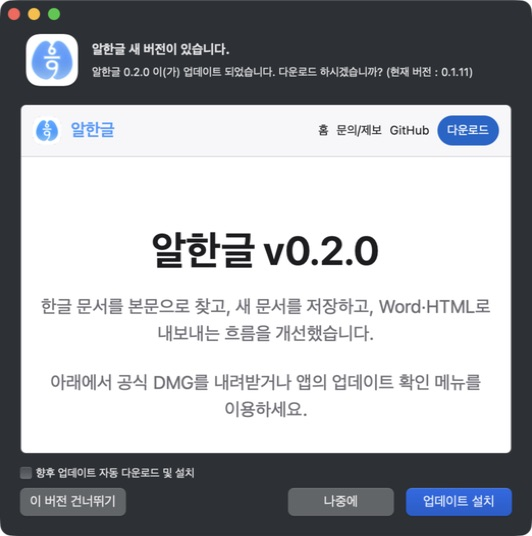
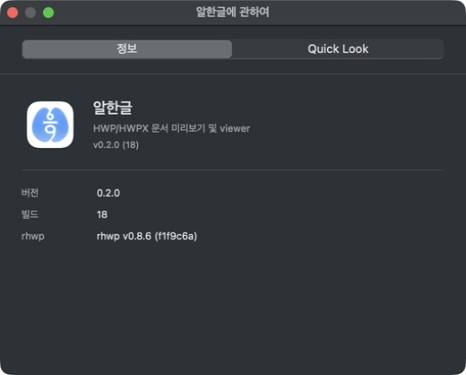
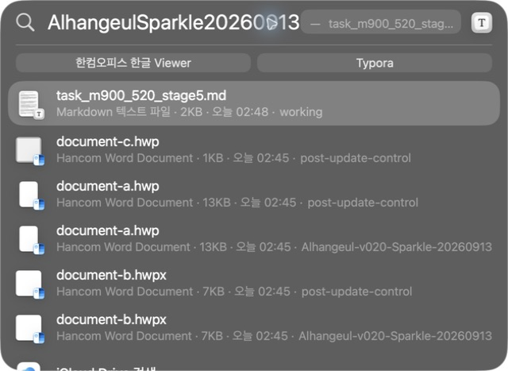
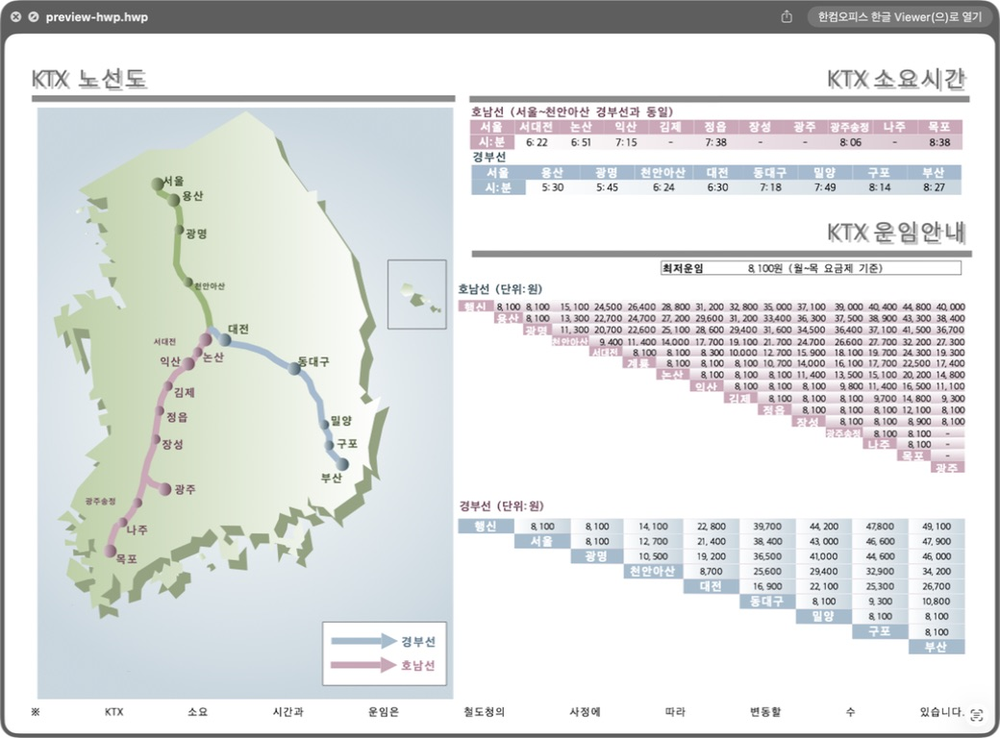
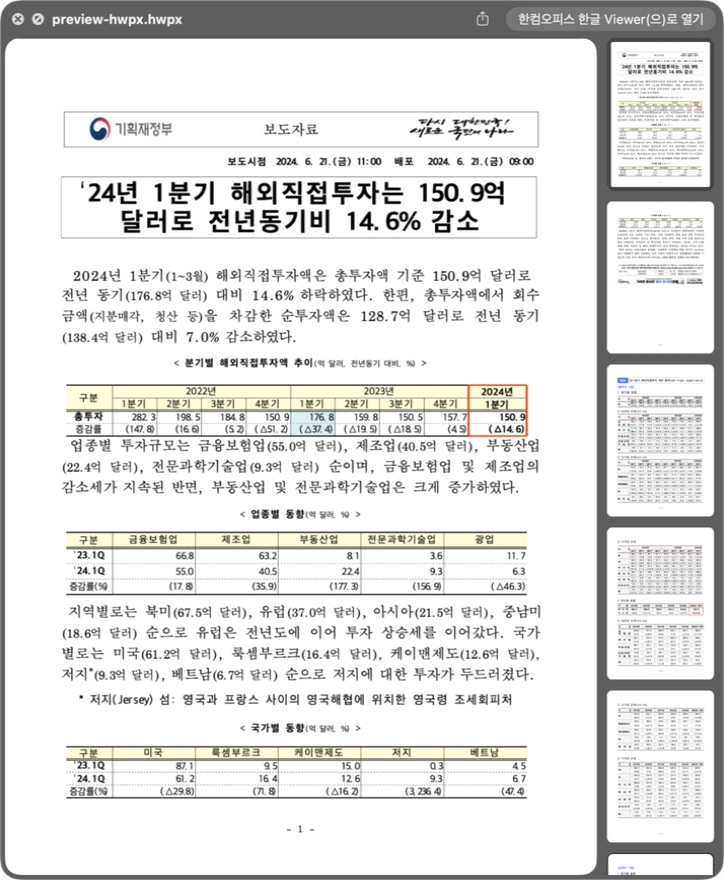
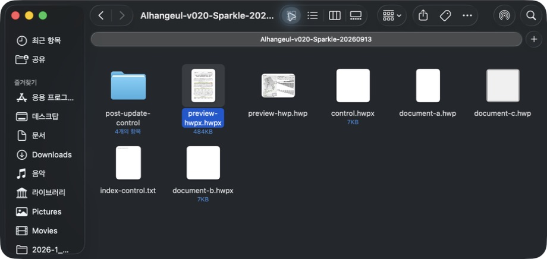

# Task M900 #520 Stage 5 — 공개 승격과 실제 업데이트 수용 진행 기록

## 승인과 불변 후보

2026-09-13 작업지시자가 #525 복구 후보 잔존의 후속 수정 분리와 최소 macOS 12 실행 미검증을 알려진 한계로 수용하고, 동일 v0.2.0(18) DMG 공개 및 Pages/Sparkle 배포를 명시 승인했다. 이 판단은 미검증을 PASS로 바꾸지 않는다. Homebrew 배포는 이번 승인에 포함하지 않는다.

후보 SHA `aa986e5ae59732a2423324eb3b415a06c67c8a68`, DMG SHA256 `1fce404263d342de23f76f7b74485e56f87b783c976eba82eb041e329588e321`, 크기 192864126 bytes를 유지했다. 검토된 배포 도구 main SHA는 `c942230b0625bc30eff894373fc3af5e205e8d8b`이며 source/양 VM 최신 attempt 3의 동일성 확인 후 승격했다.

## 공개 결과

[Release Promote Verified DMG 34709043904](https://github.com/postmelee/alhangeul-macos/actions/runs/34709043904)의 promote와 deploy-pages 모두 PASS다. Release ID 387608761은 2026-09-12 17:43:58 UTC(2026-09-13 02:43:58 KST)에 draft=false / prerelease=false로 공개됐다. 앱 재빌드·재서명·DMG 재업로드·Git tag 이동 없이 기존 자산을 공개했다.

인증 없는 공개 URL에서 새로 받은 DMG/checksum의 hash와 길이가 후보와 일치했다. 공개 appcast의 version/build 0.2.0/18, enclosure URL/length와 EdDSA 서명을 확인했다. appcast SHA256은 `e2ae654de6acd5e56db769e4e5415fa30beed2756f588b3d9a0aa1947d0ae48b`이다. Pages 홈과 v0.2.0 문서 접근도 확인했다. 초기 로컬 검사에서 version/build가 enclosure 속성이라고 잘못 가정한 assert는 실제 XML의 item 자식 요소로 수정한 뒤 통과했다. 공개 feed 오류가 아니다.

## 실제 Sparkle 업데이트

이전 0.1.11(17) 백업 148개 파일의 hash/symlink를 확인하고 현재 후보 앱을 build.noindex에 별도 보존한 뒤 /Applications에 복원했다. 사용자 문서·설정·기본 연결을 유지하고 수동 등록은 하지 않았다. 새 합성 corpus는 이전 앱만 설치된 02:45:16 KST에 만들었다. 영문 `AlhangeulSparkle20260913`과 한글 `나비`는 업데이트 전 미검색이며 같은 폴더의 txt 대조는 검색됐다. 이전 앱에는 importer가 없다.

Computer Use로 About 0.1.11(17), 실제 업데이트 제안, 다운로드, 설치 준비 화면을 순서대로 확인했다. `설치 & 재실행` 클릭 뒤에는 앱 상태 조회 도구를 호출하지 않고 CLI로 새 프로세스를 먼저 확인했다. 이전 PID 72949가 교체되고 02:49:46 KST에 0.2.0/18의 새 PID 73422가 확인됐으므로 도구의 자동 실행을 Sparkle 재실행으로 오인하지 않았다. 이후 About 0.2.0(18), HWP/HWPX 한글 본문 열기, 설치 앱 codesign/Gatekeeper가 PASS다.

| 이전 설치본 | 실제 업데이트 제안 | 업데이트된 앱 |
|---|---|---|
|  |  |  |

## 첫 시험 — 동일 후보 설치 이력이 남은 상태

| 관찰 | 결과 |
|---|---|
| 업데이트 전 | 영문/한글 미검색, 동일 폴더 TXT 검색 |
| 자동 재실행 뒤 02:50:12 / 02:54:18 | TXT만 검색; 본문 미검색 |
| 02:58:10 | 앱에서 연 HWP5/HWPX가 영문·한글 검색됨. 열지 않은 HWP3 원본은 미검색 |
| 실제 importer 진단 | `mdimport -t`에서 세 형식 모두 /Applications의 새 importer 선택·본문 반환. 테스트 모드이므로 색인 저장 없음 |
| 03:02:17 새 사본 생성 → 03:02:53 조회 | 별도 post-update-control의 같은 bytes가 영문 3개·한글 2개 자동 검색. 원래 HWP3는 여전히 미검색 |
| 03:06:38 앱 종료 | CLI 프로세스 없음, 기존 2개·새 사본 3개 검색 유지. 원래 HWP3는 계속 누락 |
| 추가 일반 앱 재실행 | 원래 HWP3 미검색 유지; 첫 자동 재실행의 결과와 별도 관찰 |
| 실제 Spotlight 화면 | 고유 영문 검색에서 기존 2개·새 사본 3개 표시. 문서명·상위 폴더로 두 집합 구분 |

현재 Mac은 같은 0.2.0 후보를 이미 설치했던 환경이다. 이전 앱 bytes만 복원했고 설정을 유지했으므로 대상 버전 이력이 없는 일반 0.1.11 업그레이드 환경으로 간주하지 않는다. 제품은 importer 경로·빌드 식별자·변경 시각이 같은 재색인 요청을 중복 제출하지 않는다. 같은 receipt는 제품의 중복 요청 생략 조건이다. 업데이트 직전 sandbox receipt를 확보하지는 않았으므로 최초 실행의 분기 자체를 로그로 증명한 것은 아니다. 실제 sandbox 설정 조회가 지연됐으나 03:05 기록에서 경로·빌드·시각이 현재 후보와 정확히 같은 receipt를 확인했다. 기본 도메인의 과거 Debug receipt는 현재 sandbox 앱의 증거로 쓰지 않는다. 아래의 키 하나만 분리한 대조에서 누락이 회복됐다.

02:53:51의 sandbox 안 mdfind는 TXT도 못 찾았으므로 제품 판정에서 제외하고 권한이 있는 동일 읽기 전용 조회와 구분했다. HWP5/HWPX가 앱에서 열린 뒤 검색됐다는 시점만 확인했으며 열기가 원인이라고 확정하지 않는다. 최초 자동 검색 수용을 위해 남겨 둔 HWP3 원본은 열기·touch·수동 색인을 하지 않았다. 새 사본 성공이나 추출 성공으로 기존 문서 전체 색인 PASS를 대체하지 않는다.

## Finder 및 확장

업데이트된 /Applications 안의 Preview/Thumbnail 0.2.0이 활성 경로였다. Computer Use로 Finder Space의 HWP 첫 페이지 KTX 지도·표, HWPX 첫 페이지 한글·표와 페이지 목록, 아이콘 보기의 두 썸네일을 확인했다. `scripts/smoke-sparkle-extension-refresh.sh --expected-version 0.2.0 --expected-build 18` 기본 모드도 PASS이며 registration repair는 0이다. 표준 helper는 자체의 별도 미리보기 샘플에 mdimport를 실행하므로, 이 결과는 Spotlight 합성 corpus의 자동 색인 증거로 사용하지 않는다.

| HWP Quick Look | HWPX Quick Look | Finder 썸네일 |
|---|---|---|
|  |  |  |

## 첫 시험 당시 판단과 다음 수용

- 공개 DMG·Pages/Sparkle 배포, 실제 다운로드·설치·자동 재실행, 문서 열기·Finder 검증은 완료했다.
- 기존 문서 자동 색인 조건은 미완료다. #513 / #337 / #520 을 닫지 않으며 본 기록은 Stage 5 진행 보고다. 오류 관찰을 완료 승인으로 바꾸지 않는다.
- 먼저 정상 이전 버전 상태와 동일 후보 재설치 상태를 분리하고 재색인 요청의 생략/실패 여부를 확보한다. 실제 설정 조회 없이 동일 receipt 문제를 확정해 제품을 수정하지 않는다.
- 원본 corpus와 새 대조군, 이전/후보 앱 백업을 보존해 재현에 사용한다. 현재 /Applications는 실제 Sparkle로 설치한 0.2.0/18이며 기존 Hancom Viewer 기본 연결을 유지한다. 전체 전역 색인·등록 초기화는 하지 않았다.
- #525 와 macOS 12 실행 미검증은 공개 전에 수용한 별도 한계다. 새 색인 누락을 그 승인에 포함시키지 않는다. Homebrew는 별도 배포 범위이고 #523 / PR #527 의 Pages 문구·구조 변경은 해당 작업에 둔다.

공개 가능한 요약 증거는 [public-sparkle-validation.json](../report/assets/task_m900_520/public-sparkle-validation.json)에 보존한다. 로컬 전체 원본 로그와 복원 앱은 build.noindex/release-v020-validation 아래에 두고 공개 PR에는 설정·사용자 문서 원문을 포함하지 않는다.

## Stage 5.2 대조 — 동일 후보 요청 기록 분리

03:15:18 KST에 앱 정상 종료를 CLI로 확인하고, 실제 sandbox의 0.2.0-18 요청 기록을 백업한 뒤 해당 키 하나만 제거했다. 나머지 설정은 전체 dictionary 비교로 동일함을 확인했다. 앱을 일반 실행하자 원래 HWP3를 열거나 touch·수동 색인하지 않고도 영문 검색 결과에 나타났고, 03:16:19에는 앱이 같은 요청 기록을 다시 작성했다. 현재/이전 후보 importer의 변경 시각도 810918478.0으로 같았다.

이는 동일 후보 반복 설치 시 중복 요청 기록의 영향을 뒷받침하는 대조 결과이며, 설정을 그대로 둔 최초 Sparkle 시험의 PASS로 바꾸지 않는다. 0.1.11에 없던 대상 버전 키만 분리해 이전 버전 상태를 재구성하고, 새로운 corpus와 실제 Sparkle 다운로드·설치·재실행을 다시 검증한다. 사용자 문서·다른 설정·파일 연결은 유지한다. 전체 Spotlight나 LaunchServices 초기화는 하지 않는다.

## Stage 5.2 실제 Sparkle 재시험 결과

기존 공개 0.1.11/17 bytes를 다시 복원하기 전에 현재 앱과 설정을 백업하고, 위 대조에서 재작성한 대상 0.2.0 요청 키 하나만 제거했다. 0.1.11에는 importer가 없으며 대상 키도 없다는 사전 상태를 확인했다. 다른 설정·문서·기본 연결은 유지했고 수동 등록은 하지 않았다. 새 corpus는 03:17:50에 만들었고 03:18:41의 영문·한글은 미검색/TXT는 검색이었다. 이미 0.2.0을 설치한 Mac에서 이전 버전 상태를 재구성한 것이며 깨끗한 OS로 표시하지 않는다.

실제 Sparkle UI가 0.1.11→0.2.0을 제안했고 다운로드·설치 & 재실행을 수행했다. 03:20:28에 이전 PID 3524 → 새 PID 3848과 0.2.0/18을 CLI로 먼저 확인했다. 03:20:40은 TXT만 검색됐지만 **03:21:51에는 영문 3개·한글 2개와 대조군 제외가 모두 PASS**였다. 관찰한 자동 재실행부터 최초 검색 성공까지 82.80초다. 앱에서 corpus 문서를 열지 않았고 원본 5개 파일의 hash·mtime_ns가 모두 보존됐다. 앱이 자체 요청 키를 기록했고 목록과 mdimport 테스트에서 설치 importer 선택을 확인했다.

**03:24:31에는 앱 프로세스가 없는 상태에서도 같은 검색 결과와 원본 보존이 PASS**였다. 두 번째 표준 Sparkle 확장 helper도 기본 모드 PASS/registration repair 0이다. About의 0.2.0/18도 다시 확인했다. 동일 공개 앱의 실제 문서·Finder·Spotlight UI와 기본 Hancom Viewer 열기는 첫 시험에서 확인했다. 재시험 corpus의 Spotlight 화면은 마지막 CLI 검증 후 Mac이 잠겨 반복하지 않았으며, 해당 캡처를 확보했다고 주장하지 않는다.

### 최종 구분과 인계

- 새 VM arm64/Intel 최초 설치 + 동일 공개 다운로드 hash 연결은 PASS다.
- 대상 버전 요청 기록이 없는 이전 버전 상태의 실제 Sparkle 업데이트·자동 기존 문서 검색·종료 후 검색은 PASS다. 검증 설정을 어떻게 재구성했는지 함께 보존한다.
- 동일 버전 재설치에서 과거 요청 기록이 남은 경우에는 별도 대조가 필요하다. 첫 시험의 누락과 키 하나만 제거한 회복을 지우지 않는다. #513 / #337 은 이 재설치 범위를 정리하기 전까지 유지하며 #520 도 전체 종료로 표시하지 않는다.
- README와 지원 안내를 공개 0.2.0으로 정렬하고 ‘최초 실행 후 색인 준비에 시간이 걸릴 수 있음’을 안내한다. 동일 버전 재설치의 남은 조건을 일반 신규 버전 업데이트 실패로 확대하지 않는다.
- #520 준비/배포에서 생성된 PR은 #521(준비), #522(main 후보), #524(실제 API·배포 도구 보완), #526(main 도구 인계)와 이번 공개 기록 PR이다. #523 / PR #527 은 별도 페이지 구조 작업이다. 재발 방지는 runbook의 이전 버전 상태·같은 후보 이력 분리와 Release 본문 변경 후 identity 재조회에 반영했다.

본 문서 PR의 검증은 공개 상태/증거/링크/본문 정합성 검사다. 기록 검증 통과를 남은 재설치 수용 완료로 확대하지 않는다.

## 공개 문구와 문서 검증

GitHub Release 본문에 같은 버전 제거·재설치 시 이전 요청 기록의 영향을 알려진 제한으로 추가했다. 수정 후 Release ID/tag/draft/prerelease/published_at와 자산 ID/name/size/digest/state가 모두 그대로이고 요청한 본문과 일치함을 확인했다. release note template와 GitHub 참조 토큰 검사, 변경 문서의 실제 로컬 링크·JSON/버전/hash/검색 결과 정합성과 `git diff --check`가 PASS다. 초기 링크 검사에서 매뉴얼 예제의 `[...](URL)`을 실제 파일로 오인한 것은 검사 대상을 보정했다. 이미지들은 직접 캡처한 About·업데이트 UI·소유 합성 문서와 저장소 샘플이며 사용자 문서 원문은 게시하지 않는다.

PR #528 최초 CI의 release wording 검사가 `GitHub Release 본문 구조 후보`라는 기존 섹션 제목을 고정 참조해 실패했다. 제목을 계약대로 유지하고 공개 여부는 상태 절에서 설명하도록 보정했다. 앱·workflow·배포 자산 변경 없이 문서 계약만 복원했다.
