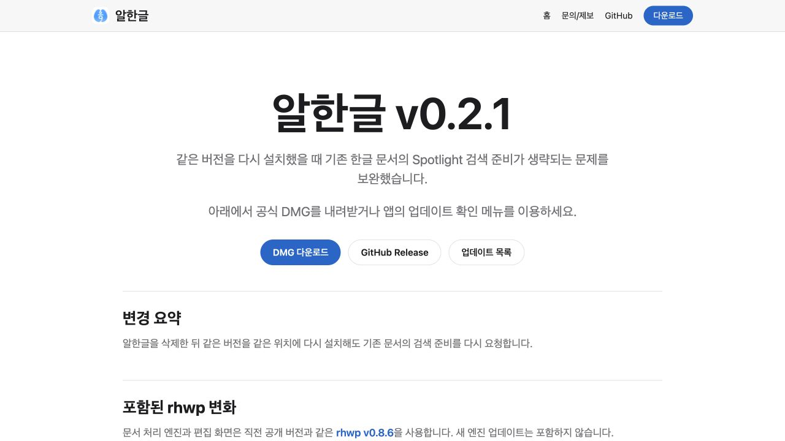
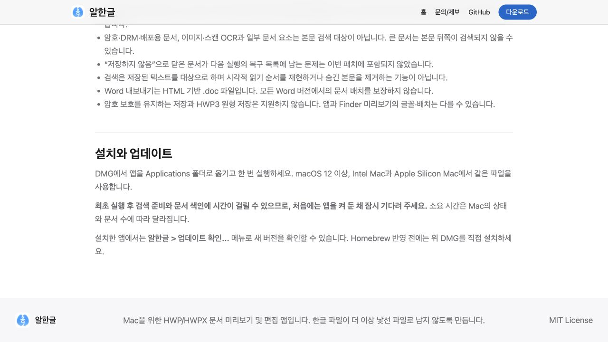

# Task M900 #532 Stage 2 — 릴리즈 문구·Pages 후보

v0.2.0 이후 5개 merge와 각 본문/보고서를 대조해 재설치 검색 보완(#530)만 사용자 앱 변화로 요약했다. 배포 도구·기록과 검증(#531)은 운영 항목이며 미해결 #513 / #337 을 해결 목록에 넣지 않았다. rhwp v0.8.6 유지, macOS 12 미검증, #525 복구 후보 잔존과 새 후보 수용 표를 기록했다.

Pages에 v0.2.1 릴리즈 페이지·최신 다운로드/안내를 준비하고 이전 버전 안내는 표준 helper로 정렬했다. 새 버전의 공개 DMG가 없으면 docs-only 배포 gate가 보류하므로 현재 공개 사이트는 유지된다. 기존 appcast/Cask/README 공개 상태를 바꾸지 않았다. 공개 승격 전에 이 후보 문구를 다시 대조한다.

검증: 릴리즈 본문 생성·템플릿·GitHub body PASS(검증용 가상 hash 사용), release version notices check PASS, Pages artifact 준비 PASS, actionlint·diff PASS. 실제 Browser DOM과 1280×720 화면에서 제목·변경 요약·설치 후 대기 안내·링크를 확인했다. fullPage 캡처의 중복 렌더 결과는 사용하지 않고 일반 viewport 상단/하단 화면으로 대체했다.

이는 로컬 문서 후보 화면이며 새 앱 설치/검색 또는 공개 사이트 배포 성공이 아니다. 다음 단계에서 준비 보고서와 PR을 게시하고 최종 head CI를 확인한다.
