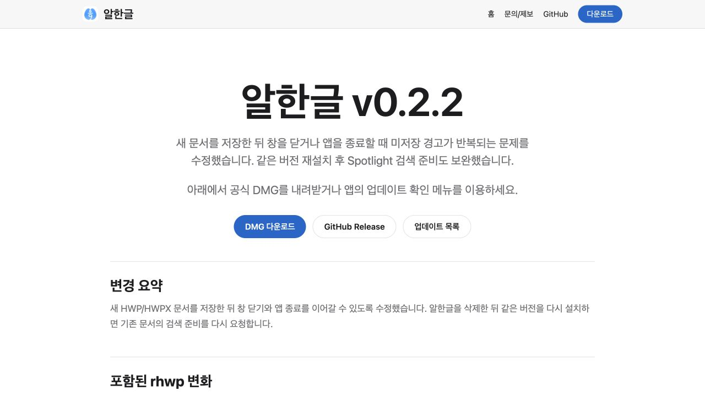
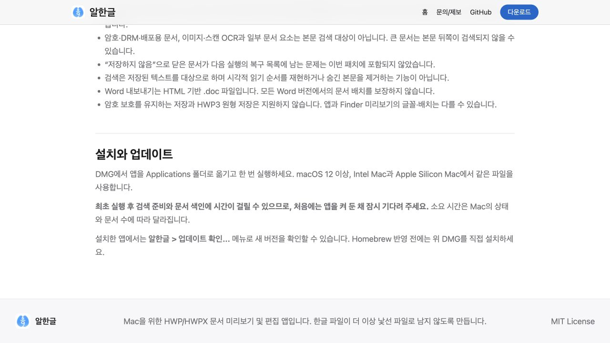

# Task M900 #539 Stage 2 — 문구·페이지·이전 후보 정리

직전 공개 v0.2.0 이후 PR/이슈/보고서를 대조하여 사용자 변화는 #538 저장 후 종료와 #530 재설치 검색으로 정리했다. #536 검증 도구는 제품 기능으로 나열하지 않았다. 해결 이슈는 병합된 #537 만이며 #513 / #337 수용은 남겼다.

v0.2.2 페이지·최신 안내·기존 버전 배너를 준비했다. v0.2.1은 공개되지 않은 후보 안내만 남겨 존재하지 않는 DMG 링크가 다음 Pages 배포를 막지 않도록 했다. 이전 실패/실제 Mac 부분 수용과 원래 DMG/tag는 보존했다. 공개 사이트 전환은 새 v0.2.2 public asset gate 뒤다.

릴리즈 본문 생성/template/body(검증용 가상 hash), version notices check, Pages artifact 준비, bundle 계약 회귀 5개, workflow actionlint·diff 검사가 통과했다. Browser DOM·1280×720 화면에서 새 버전·저장 종료 설명·색인 대기 안내와 링크를 확인했다. 아래는 로컬 문서 후보이며 실제 앱이나 공개 배포 검증 화면이 아니다.

