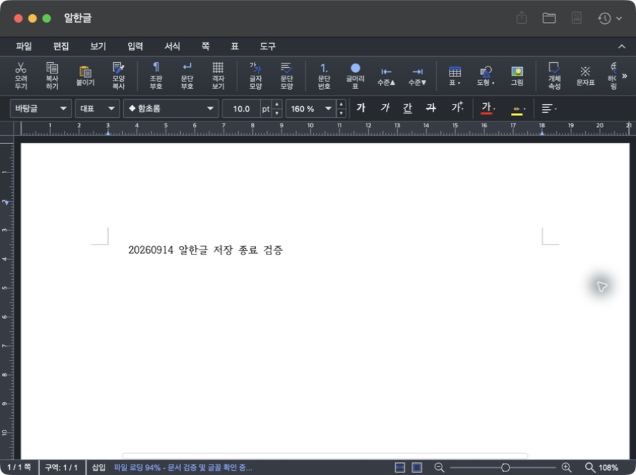
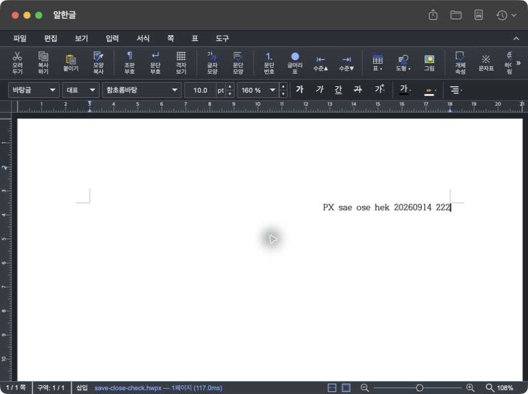
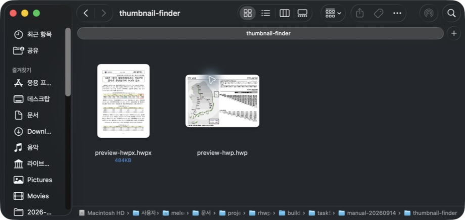

# Task M900 #539 Stage 4.1 — 불변 후보와 실제 Mac 수용 중간 기록

## 판정

v0.2.2(20) signed/notarized draft DMG의 양 VM 재시험, 실제 Mac 저장 후 종료·취소·내보내기·Finder 미리보기/썸네일·명령 본문 검색을 확인했다. **Spotlight GUI의 이번 후보 검색 화면·결과 열기, 공개 배포와 실제 Sparkle 업데이트는 아직 완료하지 않았다.** Stage 4 전체 완료나 릴리즈 완료 보고가 아니다.

## 불변 후보와 새 VM

- source/tag: `64ed89f881438efdbaec8bb33a6b52d66b83746d` / `v0.2.2`.
- [DMG builder 34777048199](https://github.com/postmelee/alhangeul-macos/actions/runs/34777048199), artifact `10323358774`, draft Release `388010212`.
- SHA256: `8d8b8cbd24376fcd2c7ebd48343be44edc1f0f154a1e75282714798806ed4b90`, 192,864,948 bytes. 네 bundle 버전·서명·seal·공증·staple·Gatekeeper·universal·법적 고지 PASS.
- 첫 [실행 34778130781](https://github.com/postmelee/alhangeul-macos/actions/runs/34778130781)은 Intel PASS, ARM 재설치 요청 기록 조기 판정/cleanup FAIL로 보존한다.
- #542/#543 에서 검토·병합한 도구 `bcdcd72cbda642af052b6ae985f2aa5fdae0fd06` 으로 같은 DMG를 검사한 [34780410801 attempt 1](https://github.com/postmelee/alhangeul-macos/actions/runs/34780410801)은 ARM/Intel 및 verdict PASS. artifact는 ARM `10324414484`, Intel `10325031688` 이다.
- 두 VM 모두 macOS 15.7.9, schema 3 / release_eligible=true. 최초 설치·동일 버전 재설치·종료 후 검색·lifecycle 33개·cleanup PASS. 재설치는 둘 다 `maintained`이며 복구 인과 증거가 아니다. ARM의 새 요청 기록은 약 5.59초/6회 관찰 후 확인했다.
- fixture source는 후보 SHA다. 도구만 다른 main descendant의 source proof와 live run/artifact/draft DMG를 `release-promotion.py verify`로 다시 대조해 PASS. publish는 실행하지 않았다. [후보·VM 증거 요약](../report/assets/task_m900_539/candidate-acceptance.json).

## 실제 Mac

macOS 26.5.2의 기존 설치·반복 등록 이력이 있는 Mac에서 동일 DMG를 `/Applications/Alhangeul.app` 에 설치했다. 최초 관찰에서 시스템 Spotlight가 `Index is read-only`였고 새 TXT도 검색되지 않았다. 작업지시자가 `sudo mdutil -i on /System/Volumes/Data`를 실행한 후 Indexing enabled를 확인했다. 활성화 후 첫 10분에는 일부 문서만 검색됐고, 약 16시간 뒤 다음 관찰에서는 재설치 실행 전부터 영문 3개·한글 2개·TXT 1개가 검색됐다. 사이의 정확한 색인 완료 시점은 측정하지 않았다.

같은 위치/빌드/importer mtime와 기존 요청 기록을 유지한 재설치에서 importer inode가 `114341832` → `114438306`으로 바뀌었고 새 installationIdentifier의 자동 요청 기록을 확인했다. 문서 hash/mtime는 보존했다. 실행 전·후·앱 종료 후 검색은 모두 3/2/1로 `maintained`다. 최초 설치 자동 복구나 반영 시간 보장으로 해석하지 않는다. 이후 `mdimport -t -d3` 진단에서 HWP3/HWP5/HWPX 모두 설치본 importer 선택과 본문 추출을 확인했다. Hancom Viewer 기본 연결은 유지했다.

| 항목 | 실제 결과 / 범위 |
|---|---|
| HWP 저장 후 종료 | 기존 문서 열기 → Studio 새 문서 → 편집 → ⌘Q 저장 → 파일 생성 및 실제 프로세스 종료, 재열기 한글 확인 |
| HWPX 저장·닫기·종료 | 새 문서 저장/재열기, 수정 후 Cancel 유지, Save 후 재열기, 마지막 `333` 저장 후 실제 앱 종료 확인 |
| 종료 판정 | sandbox 밖 `pgrep -x Alhangeul` 사용. 앞선 제한된 셸의 미검출은 판정에서 제외 |
| PDF/HTML/Word | UI로 각각 내보내기, 파일 생성·한글 본문 확인. Word 앱에서 시각 검증은 미실행 |
| 내보내기 취소 | PDF 대화상자 Cancel 후 원래 문서 유지 |
| Finder Quick Look | HWP/HWPX 첫 페이지 한글 표시 확인 |
| Thumbnail | 표준 KTX.hwp / hwpx-01.hwpx에 `qlmanage -t -x -s 768` 출력 생성, 이미지 시각 확인 및 복사 샘플 Finder 아이콘 확인 |
| 제공자 위생 | 설치본 Preview/Thumbnail 경로 확인. 오래된 개발 산출물과 중첩 Sparkle Updater 등록만 정리 후 표준 hygiene `--check-only` PASS |
| Spotlight GUI | 닫힌 검색창은 Computer Use timeout. 창 열기 요청 상태이며 이번 후보의 화면·결과 열기는 미판정 |
| 실제 저장 실패 주입 | 미실행. 실패 시 문서 유지 계약은 #538 자동 회귀 테스트의 범위 |

실제 Mac은 순정/깨끗한 OS나 무보정 최초 설치 검증을 대체하지 않는다. macOS 12 미검증, #525 복구 목록 잔존, Homebrew 별도 범위도 그대로다.

## 화면과 증거 보존

| 앱 버전 | HWP 재열기 |
|---|---|
|  |  |

| 취소 후 HWPX 편집 유지 | Finder 썸네일 |
|---|---|
|  |  |

로컬 원시 로그는 `build.noindex/task539/`의 `manual-20260914`, `vm-retest-evidence`, `promotion-readonly`에 보존한다. 이전 실패 로그와 v0.2.1 tag/DMG도 유지한다. 공개 자산은 바꾸지 않았으며 0.2.0 원래 앱 백업은 이후 Sparkle 수용용으로 보존한다.

## 다음 판정

Spotlight GUI 확인 후 공개할 정확한 hash·수용 결과·한계를 제시해 별도 공개 승인을 받는다. 승인된 같은 DMG만 승격하고 공개 URL hash·Pages/appcast·실제 0.2.0 → 0.2.2 Sparkle 다운로드/설치/자동 재실행·검색/Finder를 확인한다. #539/#535/#532/#520/#513/#337은 각 종료 판단까지 열린 상태를 유지한다.
