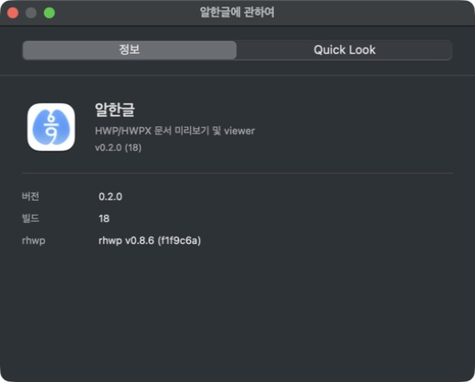
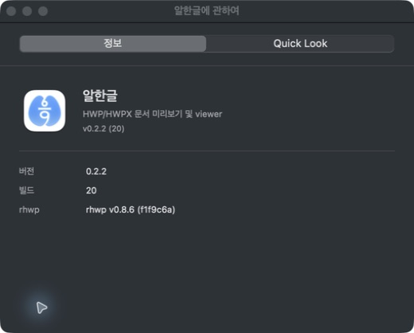
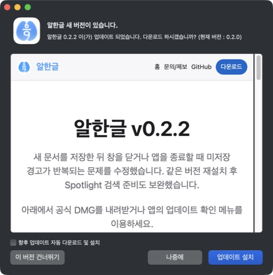
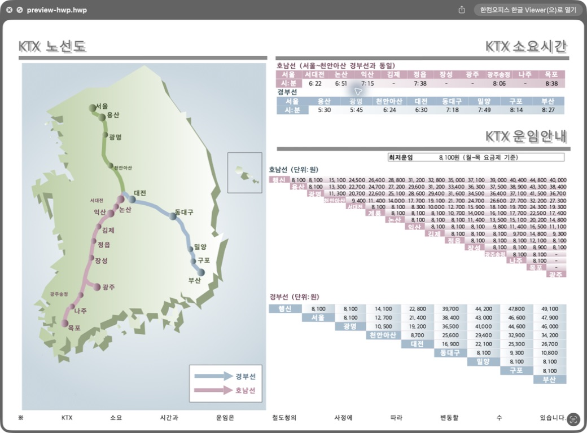
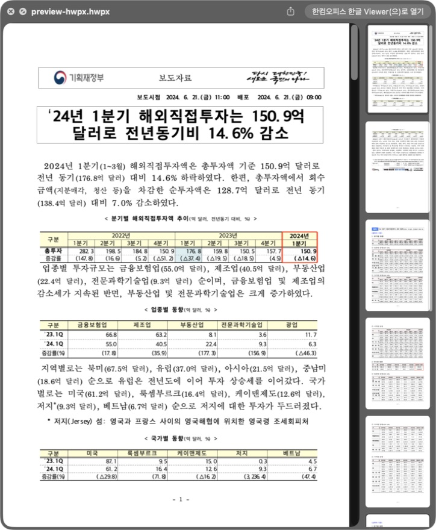
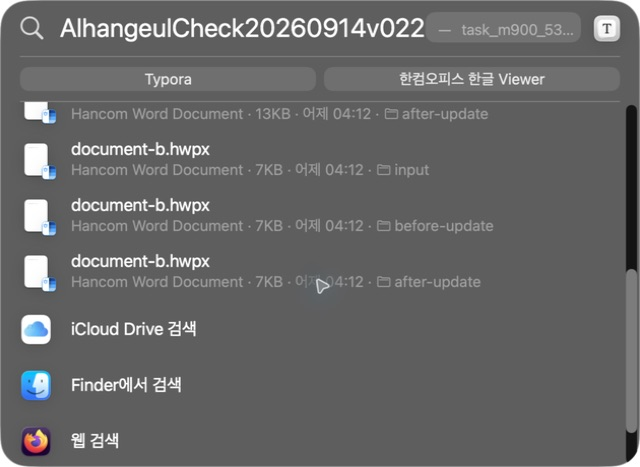
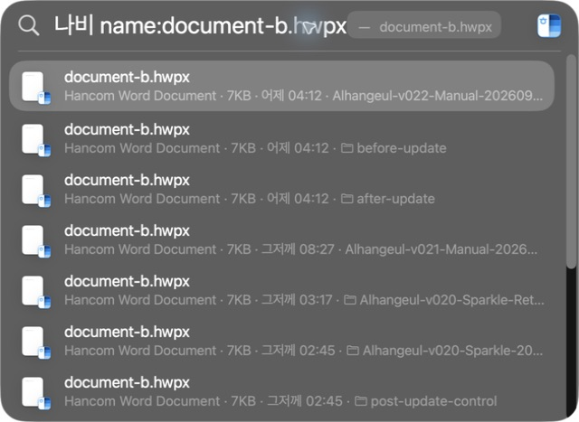
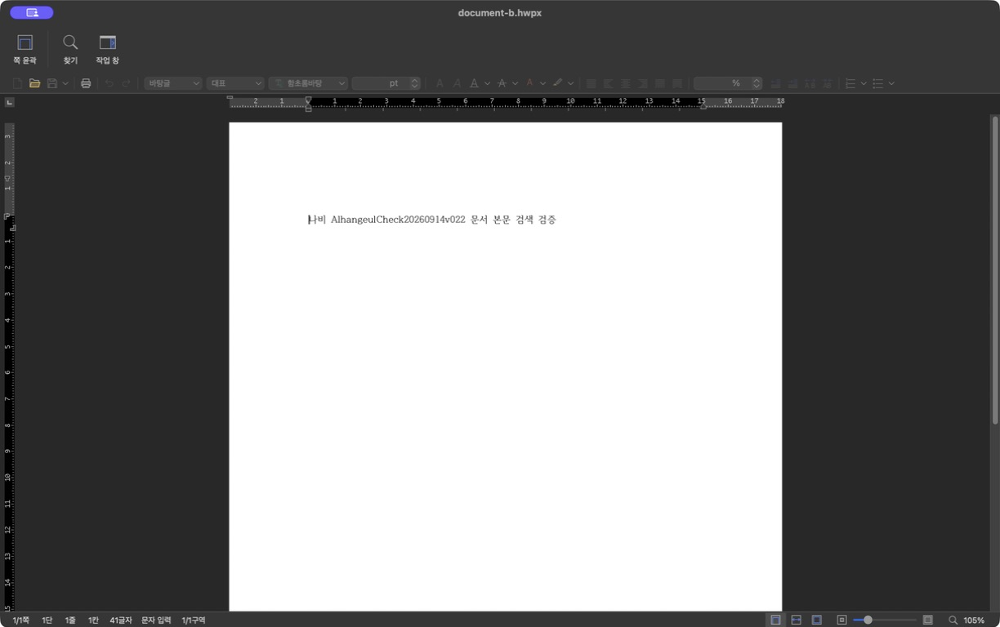

# Task M900 #539 Stage 5 — 동일 DMG 공개와 실제 Sparkle 수용

## 공개 결과

2026-09-14 작업지시자가 최종 후보 결과·버전 전환·한계를 확인하고 계속 진행을 승인했다. [승격 34848336828](https://github.com/postmelee/alhangeul-macos/actions/runs/34848336828)이 성공해 **22:18:49 KST에 v0.2.2(20)을 공개**했다. [GitHub Release](https://github.com/postmelee/alhangeul-macos/releases/tag/v0.2.2), [Pages](https://postmelee.github.io/alhangeul-macos/updates/v0.2.2.html), [appcast](https://postmelee.github.io/alhangeul-macos/appcast.xml)를 대조했다.

| 식별자 | 값 |
|---|---|
| 불변 source / tag | `64ed89f881438efdbaec8bb33a6b52d66b83746d` / v0.2.2 |
| DMG SHA256 | `8d8b8cbd24376fcd2c7ebd48343be44edc1f0f154a1e75282714798806ed4b90` |
| 공개 DMG 크기 | 192864948 bytes |
| 생성 run / artifact | 34777048199 / 10323358774 |
| 양 VM 수용 | [34780410801 attempt 1](https://github.com/postmelee/alhangeul-macos/actions/runs/34780410801), ARM 10324414484 / Intel 10325031688 |
| 검증 도구 SHA | `bcdcd72cbda642af052b6ae985f2aa5fdae0fd06` |
| 공개 직전 main / devel | `94ee7b7c927935ce45868e876763fc0da59de073` / `28b454a1e9f9ee8e71f7564af439ef4ce8201d1a`, 콘텐츠 동일 |
| 공개 Release / DMG asset | 388010212 / 561797412, draft=false / prerelease=false |

인증 없는 공개 URL에서 내려받은 DMG·checksum의 hash와 크기가 검증 후보와 같다. appcast의 버전 20 / 0.2.2, enclosure URL·길이·EdDSA 서명, Pages 제목과 다운로드 경로를 확인했다. 기존 파일을 재빌드하거나 자산을 교체하지 않았다. 공개 전 새 VM 설치 증거를 같은 공개 bytes와 연결했으며, 공개 URL로 새 VM 설치를 한 번 더 실행한 것은 아니다.

## 실제 Sparkle 업데이트

macOS 26.5.2(25F84)의 현재 0.2.2를 백업하고 보존한 공식 0.2.0(18)을 `/Applications/Alhangeul.app`에 복원했다. 사용자 문서·설정·기본 연결과 기존 재색인 요청 기록을 유지했다. 이미 대상 후보를 설치했던 Mac이므로 설치 이력 없는 업그레이드로 기록하지 않는다.

1. About에서 0.2.0(18), PID 38964를 확인했다. 업데이트 전부터 있는 시험 문서는 영문 3·한글 2·TXT 1개가 이미 검색됐다.
2. 앱의 업데이트 확인에서 공개 0.2.2를 발견하고 실제 다운로드·추출·설치 및 재실행을 수행했다. 공개 릴리즈 노트가 Sparkle 창에 표시됐다.
3. 설치 후 **UI 상태 조회에 앞서 새 PID 41039와 0.2.2(20)을 확인**했다(22:23:52 KST). 도구의 앱 실행으로 자동 재실행을 대신하지 않았다. 이후 About·설치 파일 fingerprint·strict 서명 검증이 통과했다.
4. 새 설치 객체에 대응하는 0.2.2-20 요청 기록을 확인했다. 기존 시험 문서는 검색 유지이며 인과적 복구로 세지 않는다. 자동 재실행 뒤 별도로 추가한 시험 문서는 최초 0/0/0에서 다음 관찰인 약 11.49초 후 3/2/1이 됐다. 이는 이번 관찰값이며 보장 시간은 아니다.
5. 이 자동 검색 전에 수동 importer 등록·색인, 요청 기록 초기화, corpus 열기·touch는 하지 않았다. 검색 관찰 후 `mdimport -t -d3` 진단으로 HWP3/HWP5/HWPX의 실제 `/Applications` importer를 확인했다.
6. 기존 저장 시험 HWP/HWPX를 알한글에서 열어 한글·저장 내용을 확인했다. 앱을 종료하고 프로세스 부재를 확인한 뒤 기존/새 corpus 모두 영문 3·한글 2·TXT 1개 검색 유지가 통과했다.

| 업데이트 전 | 업데이트 후 |
|---|---|
|  |  |

## 업데이트 후 Finder와 검색 화면

등록 보정 없이 Preview·Thumbnail의 활성 경로와 버전이 설치된 0.2.2를 가리켰다. Finder 아이콘 보기에서 두 썸네일, Space로 HWP/HWPX의 첫 페이지·한글·표를 확인했다. 실행 중 Preview 경로도 `/Applications/Alhangeul.app/Contents/PlugIns/AlhangeulPreview.appex`였다. HOP 충돌 안내는 나중에를 선택했고 OS 설정과 기본 연결을 바꾸지 않았다.

| HWP Quick Look | HWPX Quick Look |
|---|---|
|  |  |

`scripts/check-extension-registration-hygiene.sh --check-only` PASS. 자연 상태의 검색/Finder 확인 뒤 `scripts/smoke-sparkle-extension-refresh.sh --expected-version 0.2.2 --expected-build 20` 기본 모드도 PASS(Registration repair used: 0). 이 helper의 Quick Look 캐시 초기화와 별도 sample 색인은 앞선 corpus 자동 검색·실제 Finder 관찰 뒤 실행한 추가 진단이며, 최초 관찰의 전제에 포함하지 않는다.

**2026-09-15 12:46–12:48 KST, 업데이트 후 Spotlight GUI PASS.** 사용자가 연 창에서 `AlhangeulCheck20260914v022`로 before-update/after-update 각각 HWP3/HWP5/HWPX 세 문서를 확인했다. 한글 `나비 name:document`는 저장소 문서도 함께 검색돼 `나비 name:document-a.hwp`, `나비 name:document-b.hwpx`로 좁혔고 두 폴더의 HWP/HWPX가 모두 표시됐다. 검색 단어는 파일명에 없다.

앱 종료 상태에서 after-update의 HWPX 결과를 선택해 Return으로 기존 기본 한컴뷰어에서 열었고, `나비 AlhangeulCheck20260914v022 문서 본문 검색 검증`이 실제 페이지에 표시됐다. 이 GUI 관찰은 전날 자동 검색 명령·Finder·기본 helper 뒤 다음 날 이어서 한 검증이다. 최초 반영 시간이나 깨끗한 OS의 성공으로 확대하지 않는다. 관찰 전후 알한글 프로세스는 없었다.

| 영문 결과의 HWPX | 한글 본문 검색 |
|---|---|
|  |  |

## 완료 판정과 한계

공개·실제 Sparkle·최종 GUI 수용까지 통과하여 아래 이슈의 종료 조건을 충족했다. PR #547 의 최종 기록 검토·CI·병합과 main 인계 뒤 근거별로 종료한다.

| 이슈 | 종료 근거와 경계 |
|---|---|
| #535 | #536/#542/#543, 84개 회귀, schema 3 양 VM·cleanup·출처 검증·실제 공개 승격 완료 |
| #532 | 실패한 v0.2.1을 공개하지 않고 보존, 수정된 v0.2.2의 #539 로 대체. v0.2.1 수용 성공으로 바꾸지 않음 |
| #513 | #515/#530 구현과 새 VM 최초 설치·요청 유지 재설치·수정/삭제 lifecycle, 공개 업데이트 자동 요청·기존/새 문서 검색·확장으로 수용 |
| #337 | #338–#343 구현과 #513 의 실제 설치·공개 경로 수용을 연결해 평문 본문 검색 목표 완료 |
| #520 | v0.2.0 공개·실제 업데이트 완료에 남았던 재설치 조건을 #513/#539 에서 보완·수용 |
| #539 | 같은 hash의 새 후보 검증·공개·실제 업데이트 및 관련 이슈별 판단 완료 |

원래 요청 중복 방지 키가 같은 경로·빌드·mtime 재설치를 구분하지 못한 제품 문제는 #530 의 설치 객체 식별자로 보완했다. 현재 Mac의 `Index is read-only`와 TXT 미검색은 별도 시스템 상태였고, 양 VM의 사전 미검색 강제·비동기 요청 조기 판정·cleanup은 #535 의 검증 문제였다. 모든 과거 비동기 누락을 하나의 원인으로 확정하지 않는다. 원본 실패 실행과 새 성공 실행은 [Stage 4](task_m900_539_stage4.md)에서 구분한다.

macOS 12 실제 실행과 Intel 실기기 GUI, 실제 write-failure 주입은 미실행이다. 저장 실패 계약은 #538 자동 회귀 근거이며 실제 실패 주입 성공으로 확대하지 않는다. 재설치는 VM·현재 Mac 모두 `maintained` 관찰이고, 현재 Mac을 깨끗한 최초 설치로 표시하지 않는다. #525 복구 후보 잔존은 별도 후속, Homebrew는 0.1.11 그대로다.

공개 가능한 식별자·검색 개수·판정은 [결과 JSON](../report/assets/task_m900_539/public-sparkle-validation.json), 원본 명령 로그·전체 화면·복원용 앱은 ignored `build.noindex/task539/`에 보존한다. 사용자 문서와 기본 연결은 유지한다.
